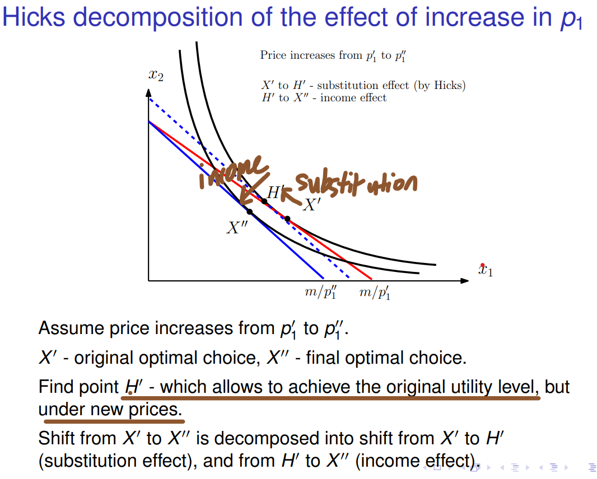
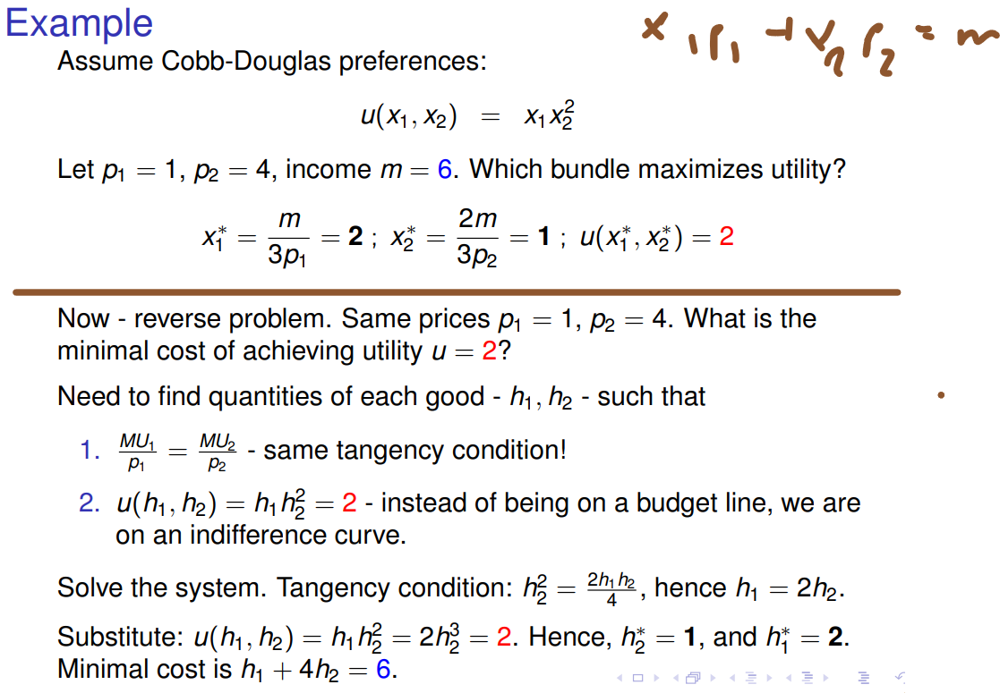
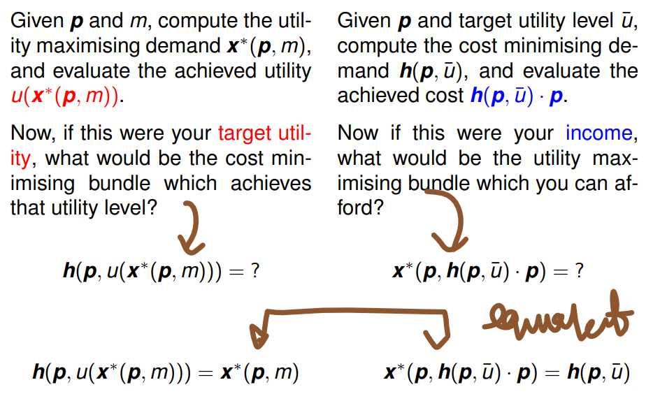

We are interested in the following: 
- Given prices and an indifference curve, what is the minimum cost of affording that utility level? 
- Then compare with an exercise of maximizing utility given fixed income

The red curve is classic utility maximisation with price and budget. The blue curve is cost minimization with price and utility achievment.

The same conditions hold for both scenarios for the optimal point. 

Given income m and prices p, find the bundle that maximizes utility. Two properties:
	1. Tangency condition (unless we have perfect complements!) 
	2. Be on the budget line x · p = m 

Given utility u and prices p, find the bundle that minimizes costs. Two properties: 
	1. Same tangency condition (unless we have perfect complements!). Otherwise, could increase utility without changing costs, and hence achieve u at lower costs. 
	2. Be on the indifference curve IC(u).

E.g.

Or more generally:

See: [microeconomics - Use of Slutsky equation - Economics Stack Exchange](https://economics.stackexchange.com/questions/12452/use-of-slutsky-equation#:~:text=You%20can%20calculate%20the%20substitution,s1%E2%88%82p1.)

Then generalizing for n dimensions:

