Readings: Hal R. Varian, *Intermediate Microeconomics*, Chapter 14. [R]

Figures: University of Cambridge, Part I Microeconomics lecture-slide extracts, with study annotations. Numerical examples in the slides are reported teaching examples [R].

## Quasi-linear preferences

Denoting by $w(n)$ the consumer’s maximum willingness to pay for n apples, her consumer surplus associated with holding n apples is $w(n) - pn$ where $p$ is the unit price of apples.

Such preferences are called **quasi-linear** and can be represented by a utility function:

$$
u(a,x)=v(a)+x
$$

in which x is interpreted as money (spent on all consumption other than good a).

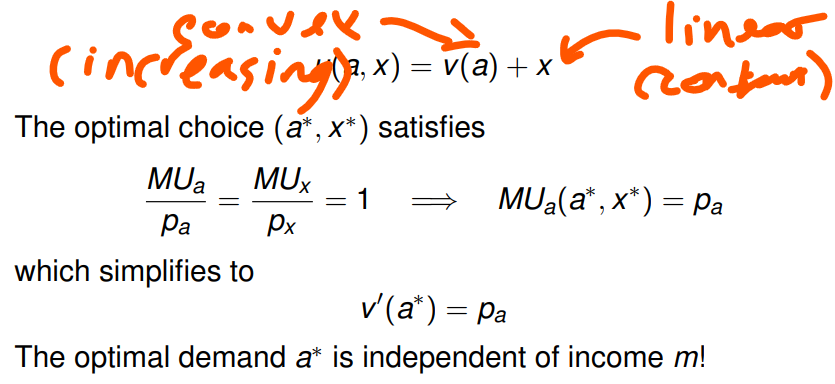

i.e. at an interior optimal choice, marginal utility per pound spent on each type of good (money, good a) is equal to one. It also means that the utility associated with another addition of good a is equal to the price of good a.

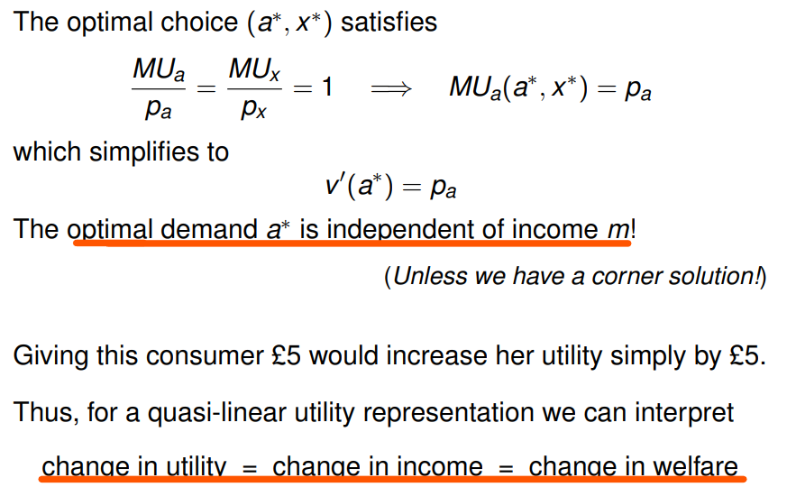

## Expenditure Function

For non quasi-linear preferences we consider the least amount of money required to move up to a new indifference curve as the size of the change in welfare.

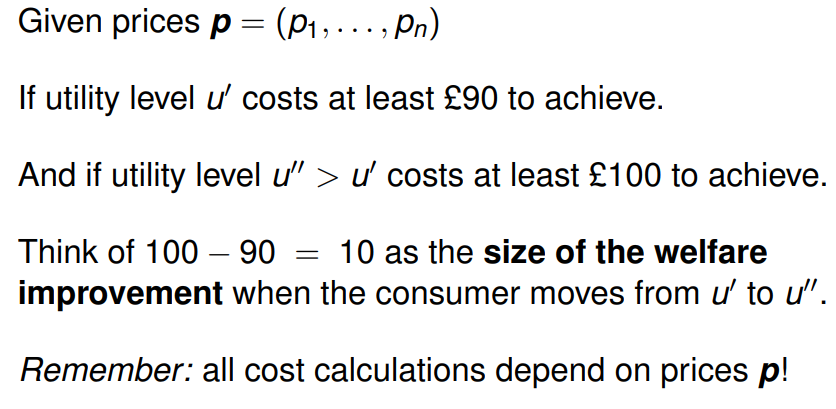

NOTE: Clearly the cost required to move from u' to u'' depends on the prices.
(visually)

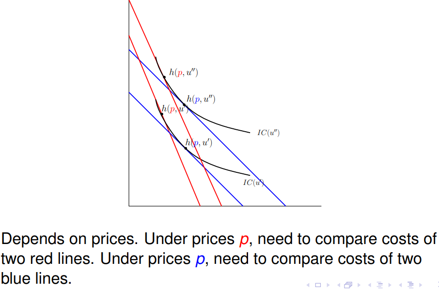

**Expenditure Function**, **e(p,u) where u is a utility to be met**

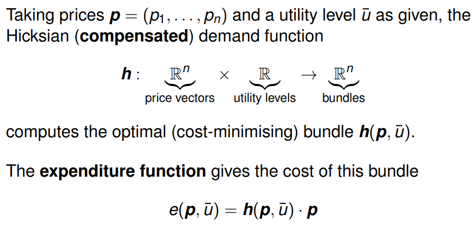

## Indirect utility function

$v(p,m)$ <--- not a normal utility function as it takes inputs price and income

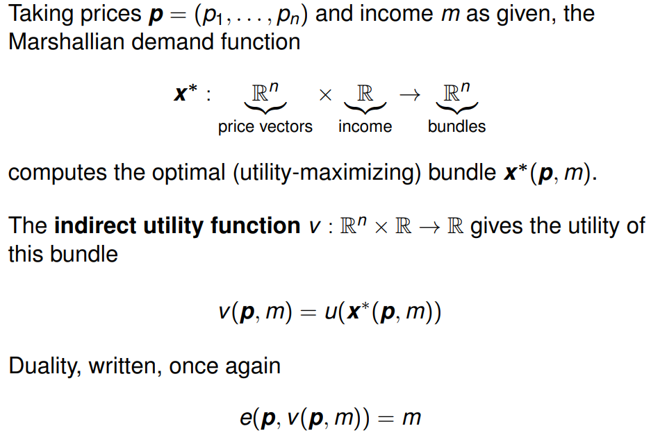

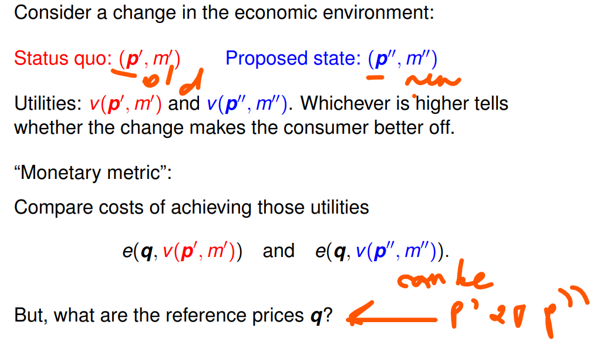

## EQUIVALENT VARIATION

(a view from the status quo)
i.e. To see the impact of a price change in monetary terms, we ask **how much money should have been given _before_ the price change** to **leave a consumer at the same utility level he attains _after_ the price change.**

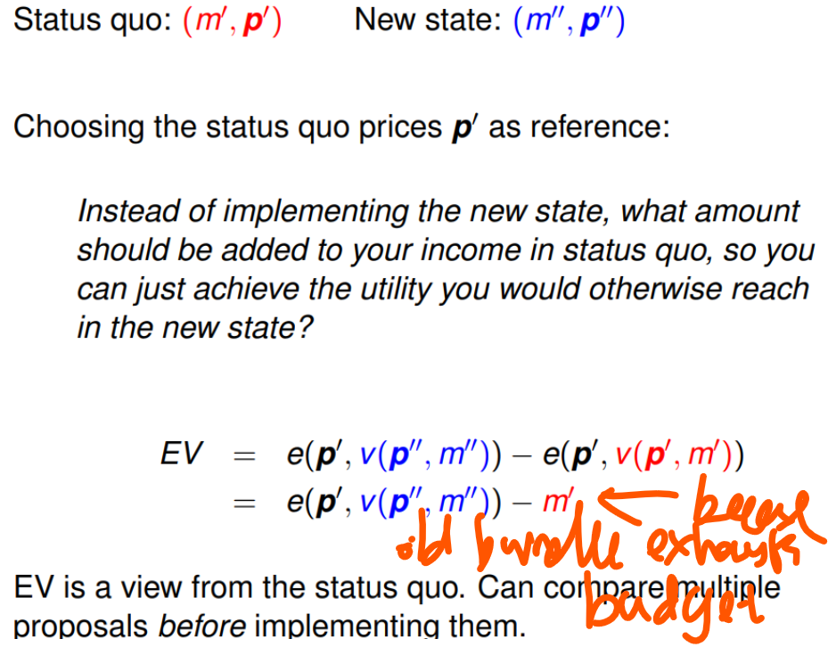

Varian — for a price increase, the maximum amount of income that the consumer would be willing to pay to avoid the price change.

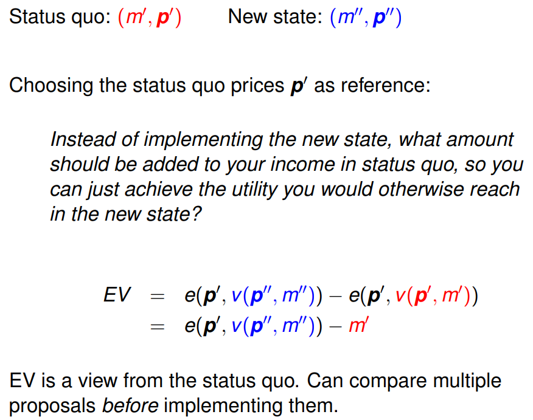

## COMPENSATING VARIATION

(a view at the new state)
i.e. measures the change in income that would be adequate to compensate the consumer for the change in price.

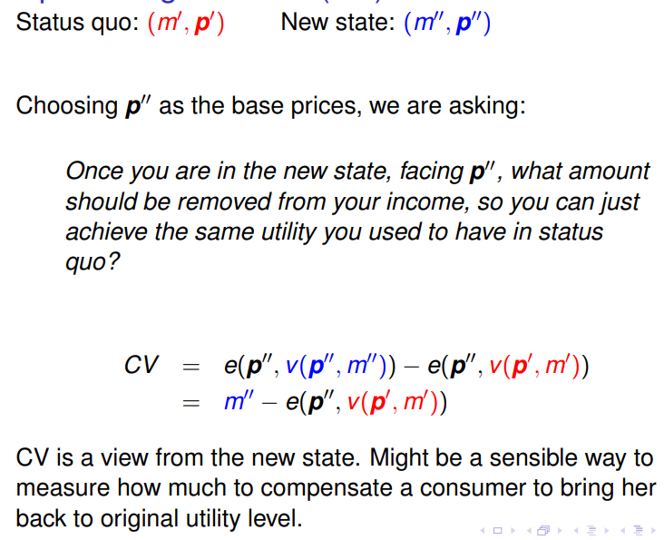

Varian — for a price increase, the amount of money that the consumer would have to be paid to compensate him for a price change

## Visually

Under equivalent variation we focus on the old prices, that is we consider a new theoretical budget line that is parallel to the old budget line and shift it up/down to the new indifference curve under the new utility level. Then the difference between the old budget line and the theoretical budget line gives the EV see:

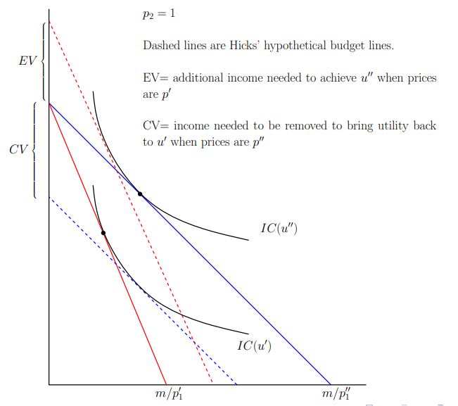

Now consider compensating variation, as this is based on new prices we create a new theoretical budget line that is parallel to the new (blue) budget line and shift it back onto the old indifference curve. The difference between the two curves gives the amount of income that needs to be removed to bring utility back to its old level.

E.g./

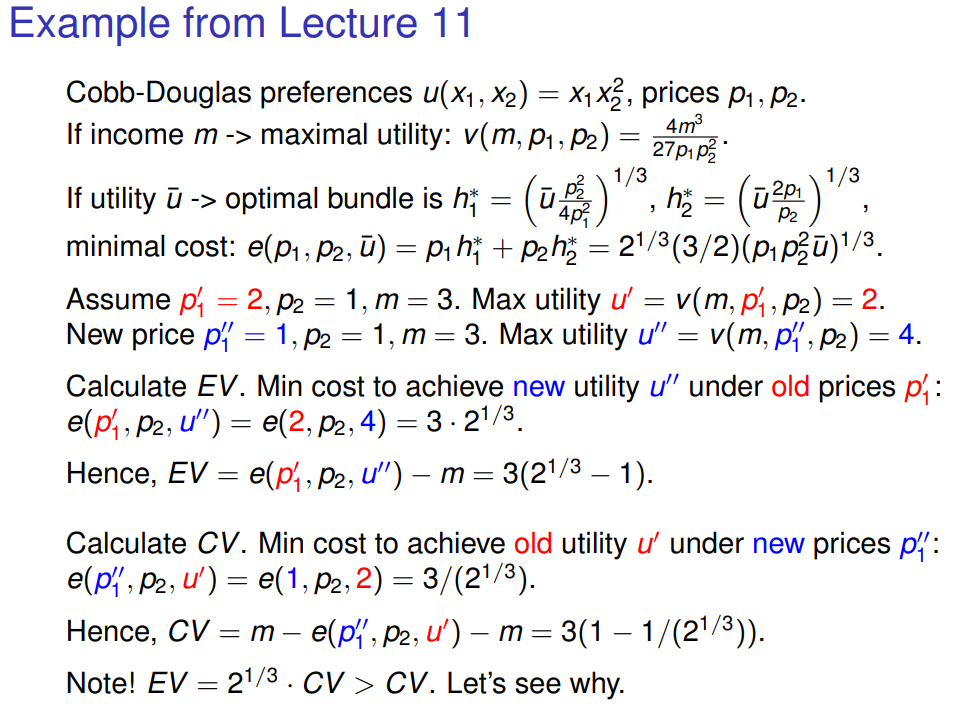

Correction to the slide: the CV line has an extra subtraction of $m$. It should read $CV=m-e(p_1^{\prime\prime},p_2,u^{\prime})=3(1-2^{-1/3})$. [C]

## Shephard’s Lemma

To interpret this in terms of Hicksian demand.

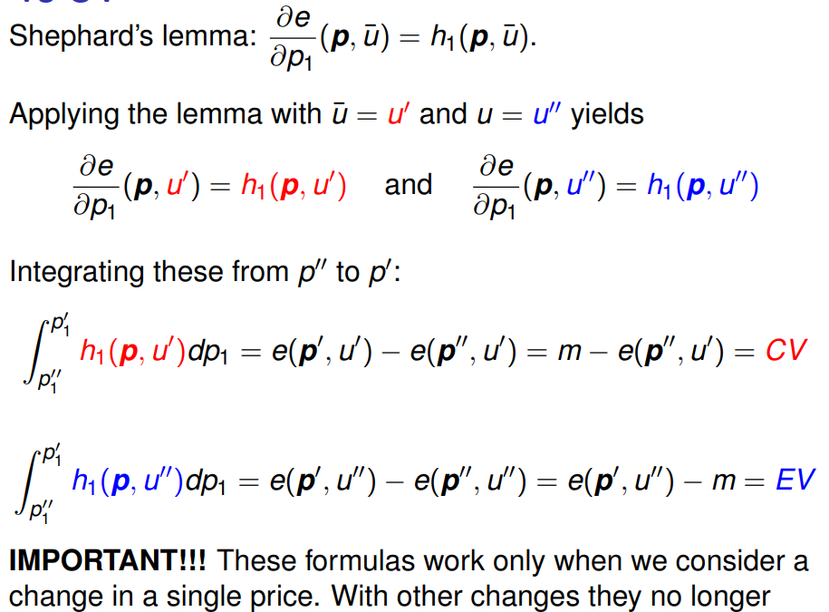

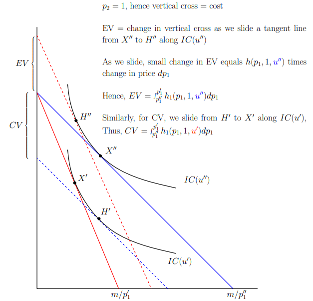

E.g/ Using the same example from above should yield the same result:

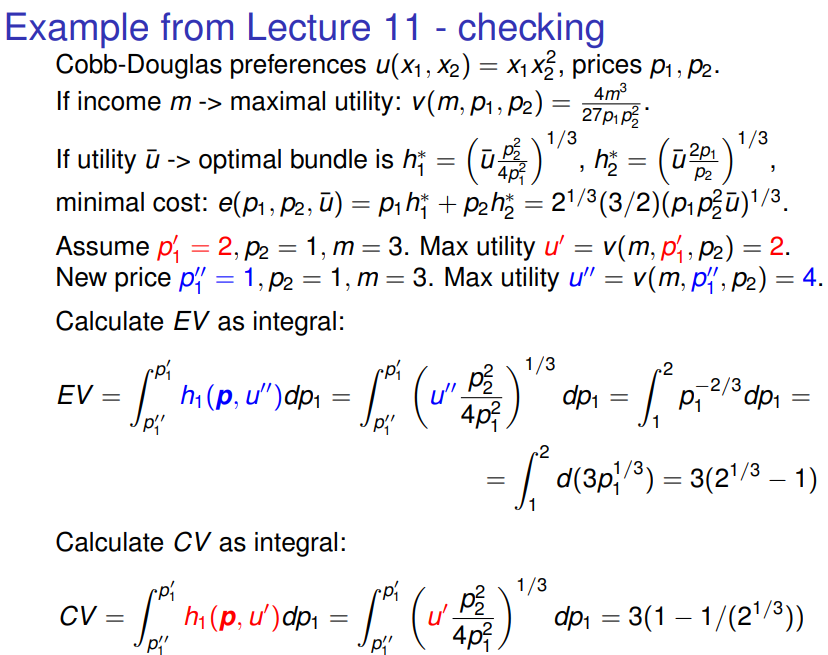

## Comparing Marshallian demand with Hicksian demand

For price changes:

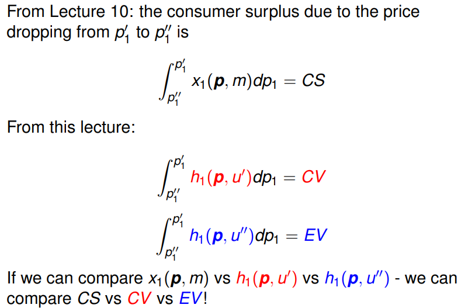

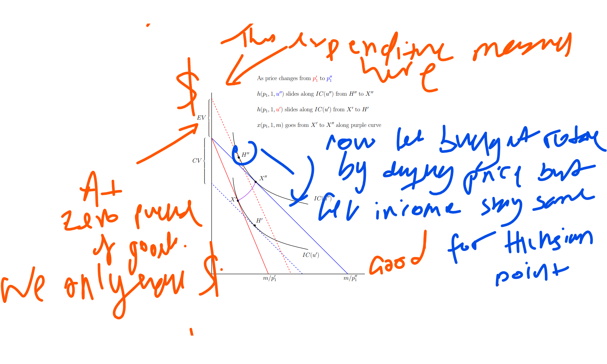

Important to recall that $p_2 = 1$. [R]
