Readings: Hal R. Varian, *Intermediate Microeconomics*, Chapters 18, 19 and 20. [R]

Figures and review questions: University of Cambridge, Part I Microeconomics lecture material, with study annotations. Numerical examples in the slides are reported teaching examples [R].

## Production function

The decision making unit is a firm which maximises:

Profit = Revenue - Cost of Production

Revenue received from sales of output. Cost of production based on factors/inputs

A consumer is defined by their preferences. A firm is defined by its production function. $f(x_1,x_2)$ where $f:\mathbb{R}_{\ge0}\times\mathbb{R}_{\ge0}\to\mathbb{R}_{\ge0}$

NOTE: Unlike utility functions which only mattered to the extent of their ordinal properties, *the specific form of the production function is important* (can't just take a monotonic transformation of it and see no change). i.e. doubling the production function would mean we would be working with a new technology.

## Typical Assumptions
- A safe assumption is that **f is weakly increasing in each input**. (Having more of some input doesn’t hurt production.)
- Concepts defined "globally" hold for all changes. Concepts defined "on the margin" hold for only small changes.
- Type of the returns to scale. Returns to scale concern scaling all inputs; marginal product concerns changing one input, holding the others fixed.

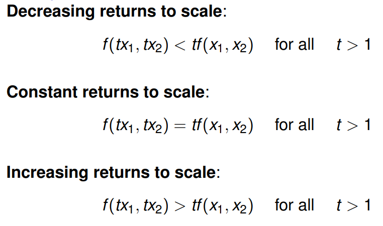

## Diminishing marginal product

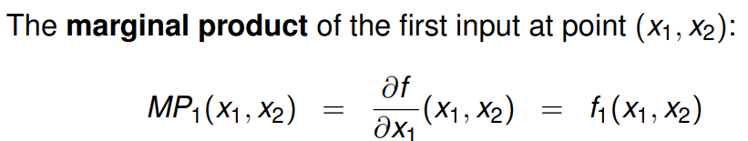

Means the marginal product of an input is eventually (beyond a certain level of production) is diminishing. If that’s the case, the function $f_1(x_1,x_2)$ is decreasing in $x_1$. i.e.

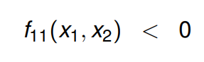

E.g. Cobb-Douglas Production Function:

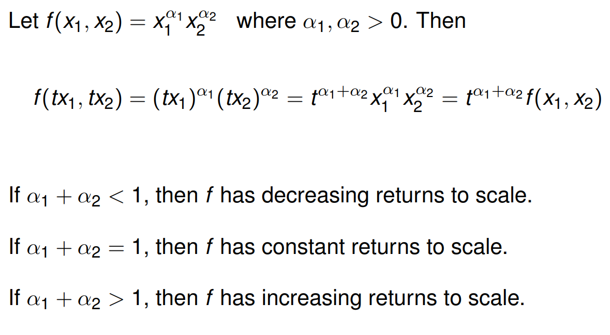

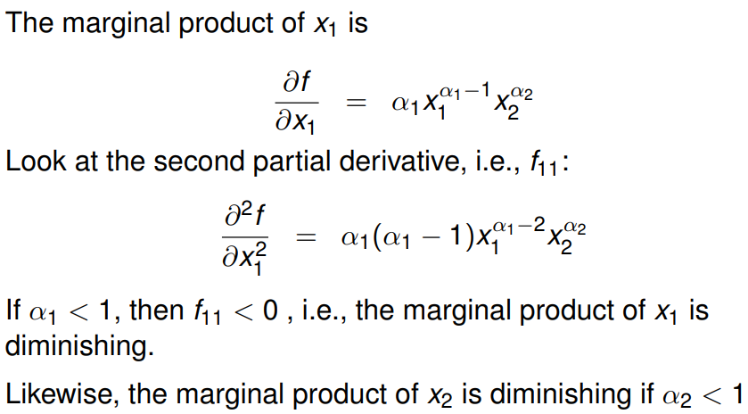

NOTE: This means both MPs can be diminishing even when production has increasing returns to scale.  *intuitively can be understood from the fact that returns to scale refers to scaling up both inputs at the same time whereas marginal products hold an input fixed*
E.g. consider $a = 0.4$, $b = 0.7$. Then $a+b = 1.1$, and yet both $a,b < 1$. [C]

## Isoquants
Analogous to indifference curves which show all bundles that provide a certain utility $u_0$. An isoquant shows all input bundles that produce a quantity of output $q_0$.

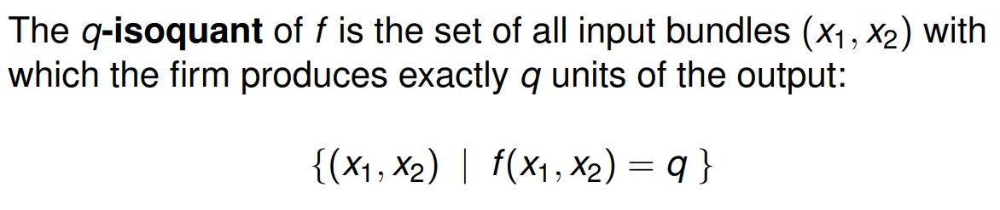

Visually:

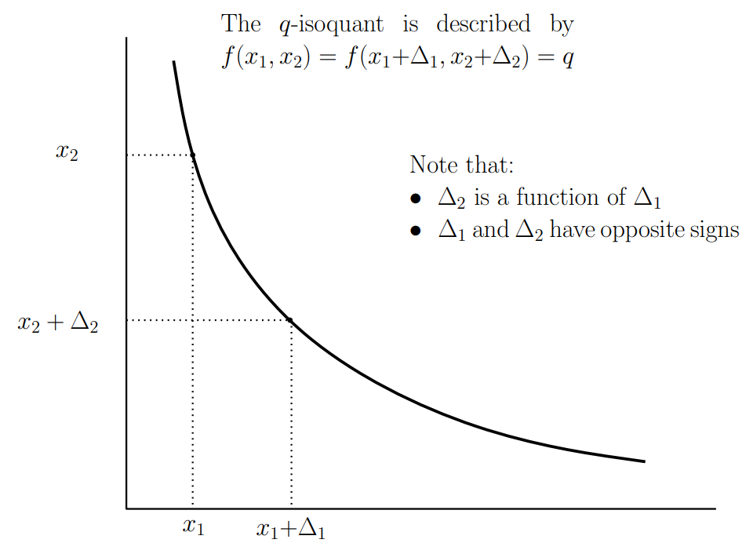

From this defining the **Technical Rate of Substitution**:

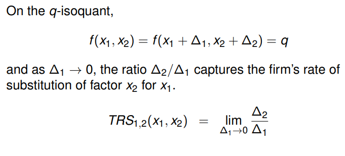

## Minimising the costs to produce required output q
The producer uses its optimal input combination (i.e. minimising costs to produce the required output q) at a smooth interior optimum, by using the input bundle that equates the marginal product per pound spent across all inputs i.e.

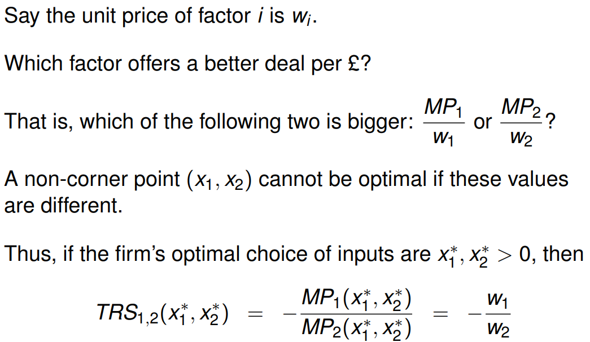

Tangency condition does not hold for all forms of the isoquant:

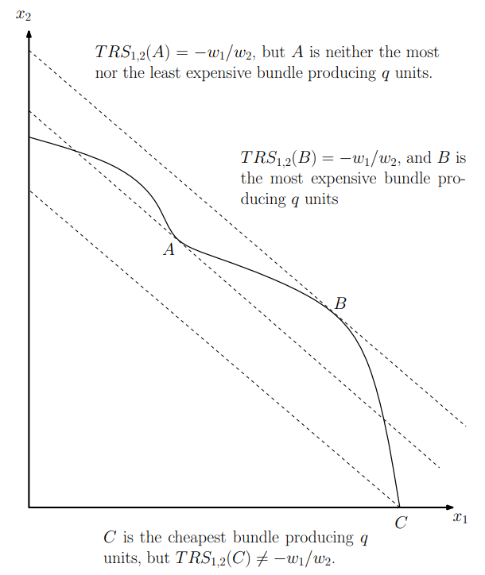

Here the corner point is the solution; this is not a convex curve.

## Profit Maximisation
Let $\pi = pf(x_1,x_2)-(w_1x_1+w_2x_2)$. Then, at an interior optimum, $\partial\pi/\partial x_i=pf_i(x_1,x_2)-w_i=0$.
In other words:

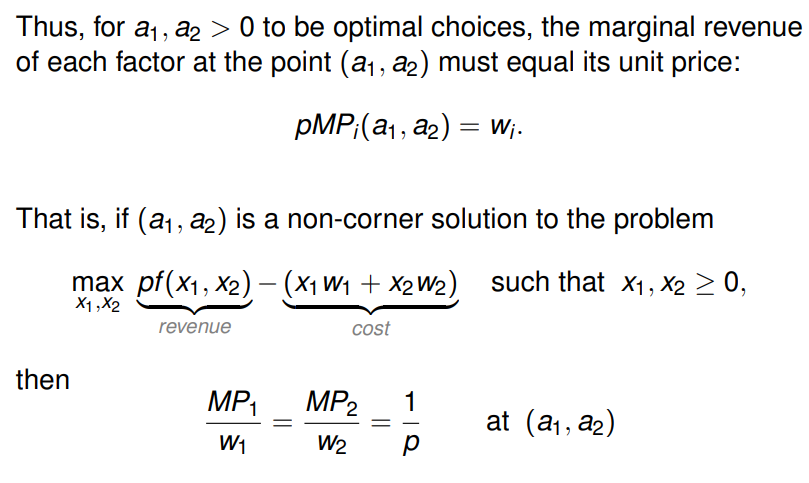

(the marginal revenue product from an additional unit of input equals the cost of hiring that unit of input)

## Profit maximisation as a two-step process
Think about profit maximisation in two steps.
Step one - using production technology, understand how to minimise costs:

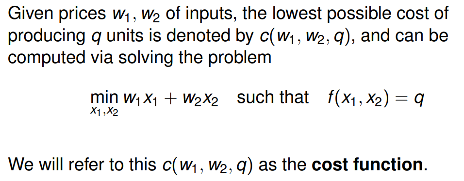

Step two - using knowledge on demand, find  optimal level of production, $q^*$

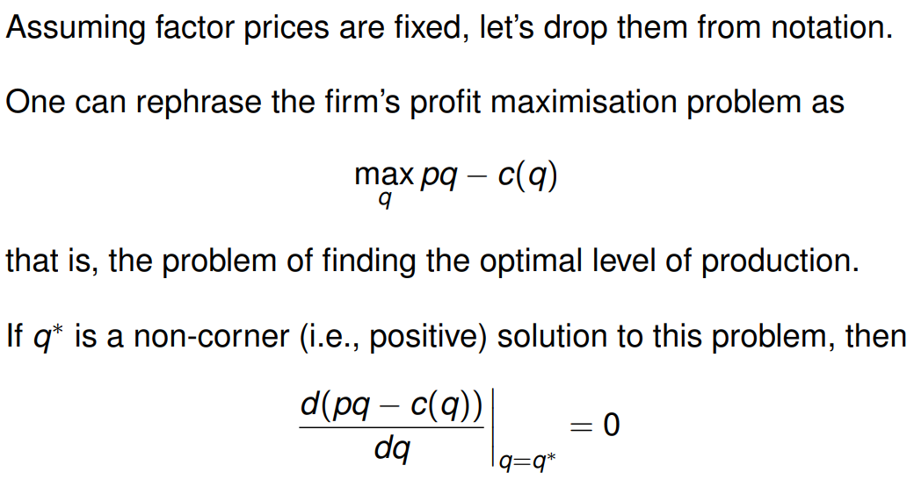

NOTE: (This process is equivalent to the consumer minimising expenditure [hicksian], then picking utility [other one])

So that, (by assuming that p is a constant does not vary with q):

$p-c'(q^*)=0 \Rightarrow p=c'(q^*)$ i.e. MR = MC

E.g./

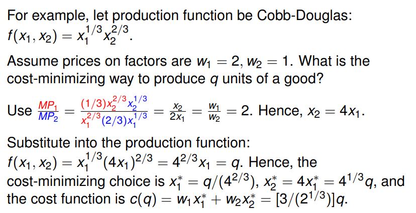

## Review questions
1. Why, do you think, in reality, many production functions exhibit decreasing marginal cost to begin with, but eventually have increasing marginal cost?
2. Construct an example of a cost function which has the above property.
3. Without appealing to algebra (or any formal model) evaluate the following statement: “If the marginal cost of a firm is decreasing in its output, then the firm will always have an incentive to increase its production.”
4. Past exam questions: 2014-15 Q3, 2008-09 Q5, 2006-07 Q13. [R]
