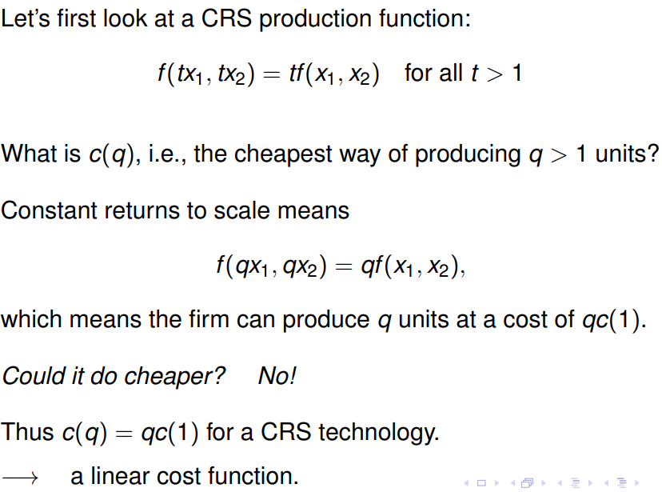
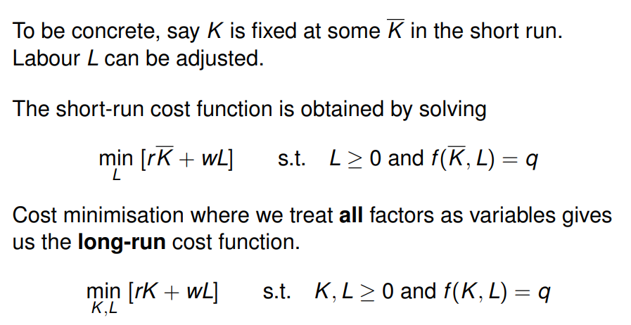

**Defining a cost function**
From a production function we get output, q. From prices of inputs w1, w2 we can define a cost function that minimises the cost required to achieve a level of output q.
![Worked example with Cobb-Douglas f(x1, x2) = x1^{1/3} x2^{2/3} and factor prices w1 = 2, w2 = 1: the tangency condition MP1/MP2 = x2/2x1 = 2 gives x2 = 4x1, and substituting into the production function yields x1* = q/4^{2/3}, x2* = 4^{1/3} q and a linear cost function c(q) = [3/2^{1/3}] q](../../assets/notes/year1/205aba9c7e5eebcbd6b8.png)

**Constant returns to scale**

**Short-run vs Long-run cost functions**

