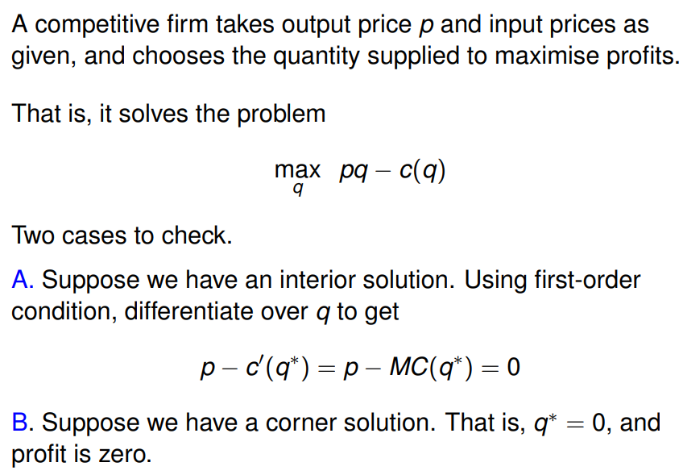
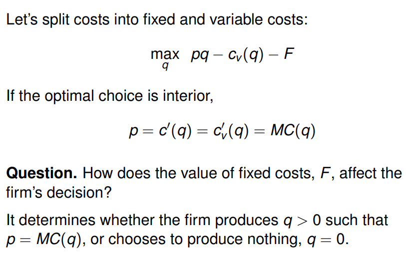
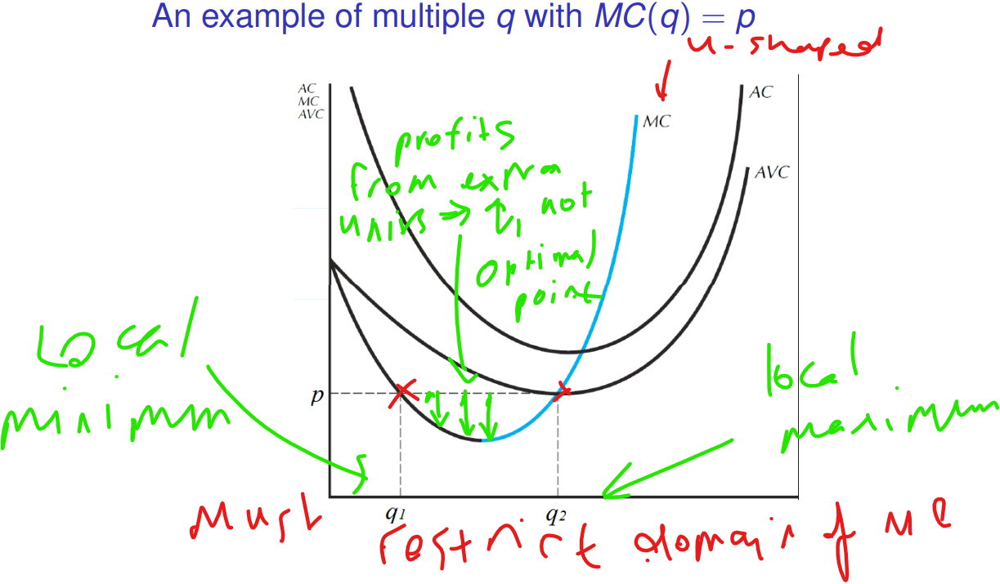
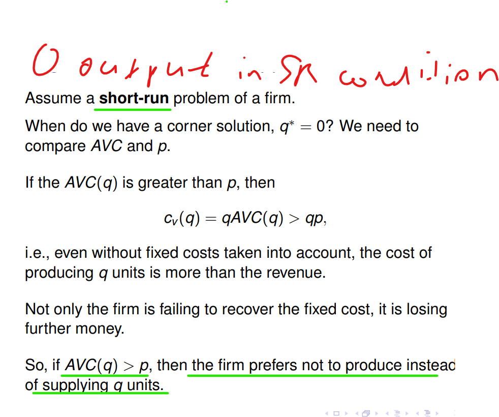
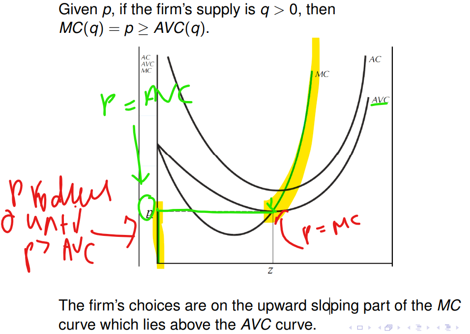
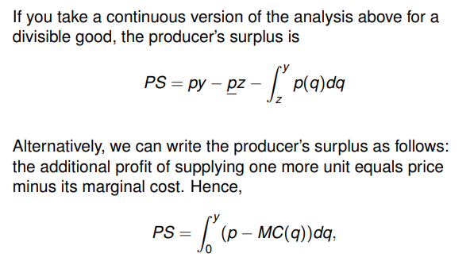
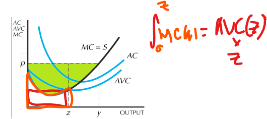
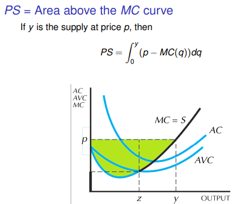
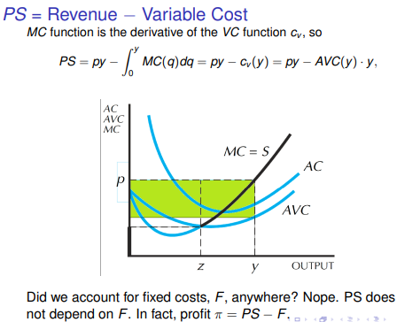

**Readings** - Varian, Chapter 22

**Competitive market** - one in which demand or supply decisions of an individual agent cannot change the prices of the goods bought and sold i.e. firms are *price takers*.

**Profit Maximisation**
A price-taker takes prices in both output and input markets as a given. The firm optimises profits under these conditions such that;
**Here fixed costs enters as the condition that determines the shut-down**

NOTE: We are in the long run so firm has the choice not to incur the fixed costs at q = 0.
Fixed costs can make it such that for all q the firm earns negative profits, P = MC is still the maximising condition for an *interior point* it gives the minimum loss it can incur.

**Supply Curve**
Given the firm is a price taker, we should express supply q as a function of p. That is, look for q(p) such that MC(q) = p. 
- Need to be cautious. What if, for some p, there are multiple q that satisfy MC(q) = p?
- Look at upward sloping part of the MC curve as that is where the profit max point lies

A slight increase in q1 leads to a decrease in MC, meaning an extra unit is cheaper to produce than its sale price p. The firm would rather increase production if q = q1. This logic implies the actual supply can be only on the upward sloping part of the MC curve.

NOTE: It is important to see that at price p, and quantity q2. The price (AR) < AC so the firm is running a loss at q2. q2 is thus the loss-minimizing position (in the short run).
Instead in the long run the firm should produce 0 units of output instead

**AVC and Supply** 
Drawn visually then:

(NOTE: Here p = AVCmin)

**Producer Surplus**

NOTE: Here I denoted P_ as Pmin

WHY? 
Hence the equivalence of:

