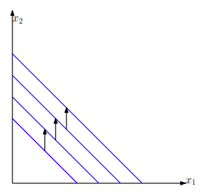
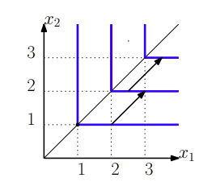
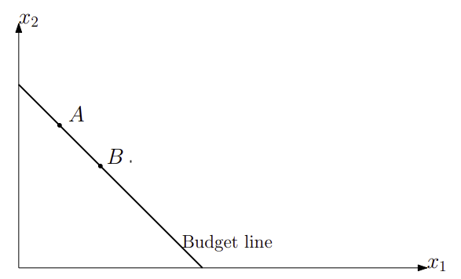
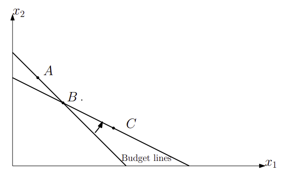
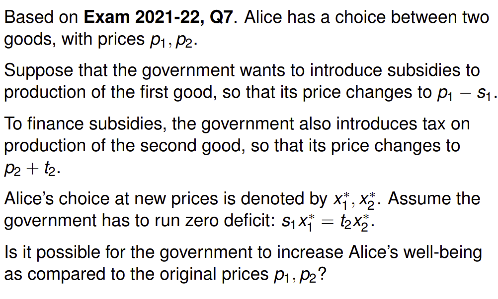
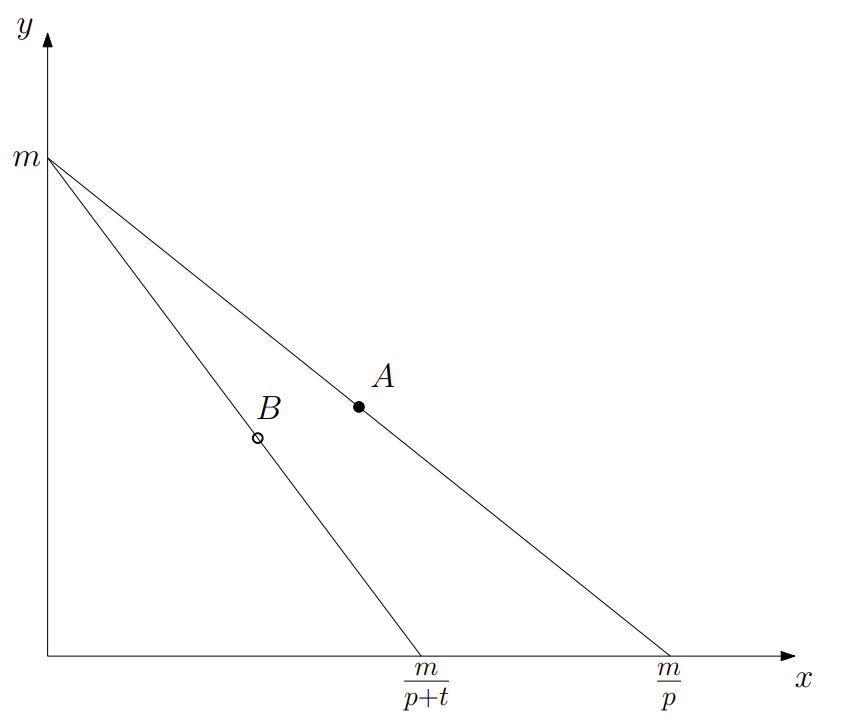
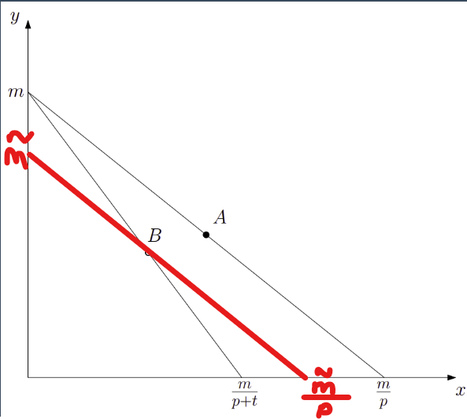
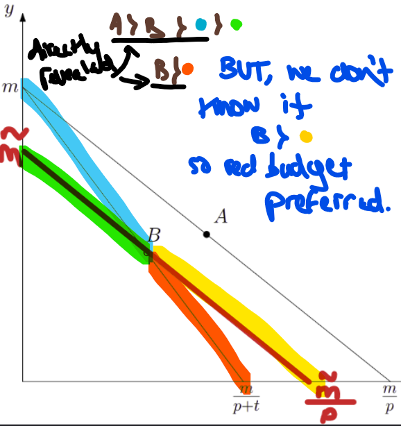

Lecture slides: [L2-notes-Micro-2023-24.pdf (cam.ac.uk)](https://www.vle.cam.ac.uk/pluginfile.php/15781531/mod_resource/content/6/L2-notes-Micro-2023-24.pdf)

**NOTATION:**

Bundle X is strictly preferred over bundle Y ⇒ (x1, x2) ≻ (y1, y2)

Indifferent between bundles X and Y ⇒ (x1, x2) ~ (y1, y2)

Bundle X is weakly preferred to bundle Y ⇒ (x1, x2) ≿ (y1, y2)

**INITIAL ASSUMPTIONS:**

Complete Preferences - Preferences are complete, if any two bundles (x1, x2), (y1, y2) satisfy either (x1, x2) ≿ (y1, y2), or (y1, y2) ≿ (x1, x2), or both. In the last case, the consumer is indifferent between the two bundles.

Transitive Preferences - If a consumer prefers x to y, and y to z, then the consumer prefers x to z.

i.e. If for any three bundles that satisfy (x1, x2) ≿ (y1, y2) and (y1, y2) ≿ (z1, z2), one has that (x1, x2) ≿ (z1, z2)

This also means that indifference curves never cross each other. (Consider two curves crossing each other, this means the upper curve (set of more preferred bundles) and lower curve (set of less preferred bundles) swap. This 'swap' breaks the assumption of transitive preferences)

**DEFINITIONS**

Perfect Substitutes - There is a constant rate of substitution. i.e. it is a line.

Perfect Complements - The consumer is indifferent to any additional units of x1 if there is no matching increase in x2 to go with it. E.g/ left and right shoes.

Directly Revealed Preferences -

Let’s assume that there is a unique most preferred bundle for the consumer, in any budget set.

Suppose (as on picture) that both bundles A and B are available, and the consumer chooses A. Then, the consumer must prefer A to B: A ≻ B. We say that A is **directly revealed preferred** to B.

Indirectly Revealed Preferences -

A is directly revealed preferred to B.

Assume that B is directly revealed preferred to C **(under a new budget constraint)**.

Then, it is natural to say that A is **indirectly revealed preferred** to C.

From this we can even deduce whether the change in the budget line made the consumer worse or better off. As the consumer switches from consuming at point A to point B, (and A is revealed preferred to B) we know that the budget change has made the consumer worse off.

Exercises to Review the Lecture:

Originally, Alice was consuming on the budget line (i): $$p_1(x_1) + p_2(x_2) = m $$

Now, Alice consumes on the budget line (ii): $$(p_1-s_1)x_1^* + (p_2+t_2)x_2^* = m $$

Now because, $$t_2x_2^*-s_1x_1^* = 0 $$ we can substitute this value in to eqn. above.

Yielding eqn (iii): $$p_1(x_1^*)+p_2(x_2^*) = m.$$ As (iii) is equivalent to (i) this implies x1*=x1 and x2*=x2 thus the consumer is no better off as they are consuming the same bundle of goods

**WARP Exercise**

There are two goods X and Y where Y captures all consumption other than X. We will measure Y simply as money spent on all else, and denote this amount by y. The amount of X is denoted by x. So we can set the unit price of Y as 1, and denoted by p the price of X.

Q1. Given income m, write the budget constraints before tax (p = p) and after introducing a tax of t (which implies p = p + t).
	$$ px + y = m $$
	$$ (p+t)x + y = m $$

Q2. Let A be the consumer’s chosen bundle before tax, and B be the chosen bundle after tax. How much would the bundle B cost if there was no tax? Call this amount m̃. What is difference in m and m̃.

A: (a1,a2). Meaning (i): $$ pa_1 + a_2 = m $$

B: (b1, b2). Meaning (ii): $$ pb_1 + tb_1 + b_2 = m $$

Then, $$ m̃ = p*b_1 + b_2. $$  And, $$ m = p*a_1 + a_2. $$ So, $$ m-m̃ = p(a_1-b_1) + (a_2-b_2). $$

Q3. Tax revenue = t*b1. So, (i)-(ii):

$$ p(a_1-b_1) + (a_2-b_2) = tb_1 $$

Thus, $$Tax Revenue = m-m̃ $$

Q4. Now, suppose that instead of introducing the sales tax t on good X, the government introduces a lump sum tax which would generate the same revenue as the sales tax. Draw the new budget set.

Lump sum tax of size m-m̃, shifts budget downward leaves gradient unchanged.

So now income goes from m to m - (m-m̃) = m̃

Point B will lie on this new curve, because we can rearrange (ii) such that: p*b1 + b2 = m - t*b1 = m̃

Q5. Of these two revenue-equivalent tax policies, which one does the consumer prefer? Explain why.

1.From budget line 1 to 2, the consumer reveals that they prefer bundle A to B.

Now by picking bundle B the consumer reveals that they prefer bundle B to all other bundles in the budget set 2.

Notably, this means that the consumer prefers B to all the bundles to the left of it (blue highlight). From monotonic preferences this must necessarily means it also prefers them to the bundles below it on budget set 3 (green highlight).

So the consumer reveals: A ≻ B ≻ Blue set. And by monotonicity (**we can literally see that the points on the green set are below the blue set**), Blue set ≻ Green set

The bundles after B under the new budget set lie **above** the previous bundles to the right of B. So it has not been revealed whether the consumer prefers B to those bundles yet. Thus the new budget set is better for the consumer. i.e. lump sum tax > sales tax.

**Past Exam Questions**:
Exam 2015-16, Q2, Q3.

**Reading**:
Varian, chapter 3, problems 1,2,4.
Varian, chapters 3,7.
