Lecture slides at: [L3-notes-Micro-2023-24.pdf (cam.ac.uk)](https://www.vle.cam.ac.uk/pluginfile.php/15802831/mod_resource/content/7/L3-notes-Micro-2023-24.pdf)

**Assumptions for well-behaved preferences:**

1. Monotonic Preferences (more over less)

If the consumer strictly prefers more to less, then we say her preferences are **monotonic**.

That is, (x1, x2) ≻ (y1, y2) whenever:

	x1 ≥ y1, and
	x2 ≥ y2, and
	At least one of these inequalities is strict

This ensures that indifference curves are 'downward sloping'.

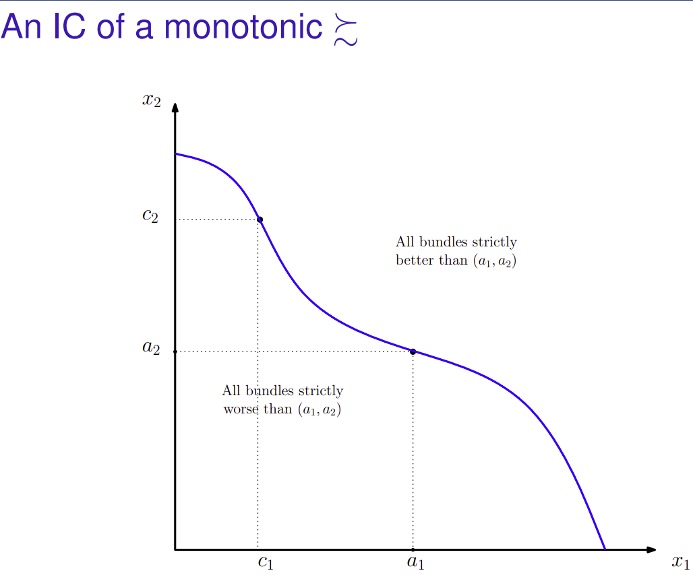

NOTE: This has nothing to do with convexity which is instead informally speaking to do with the fact that the consumer 'prefers averages to extremes'.

Again not all preferences are actually monotonic. Somtimes there is a 'bliss' combo:
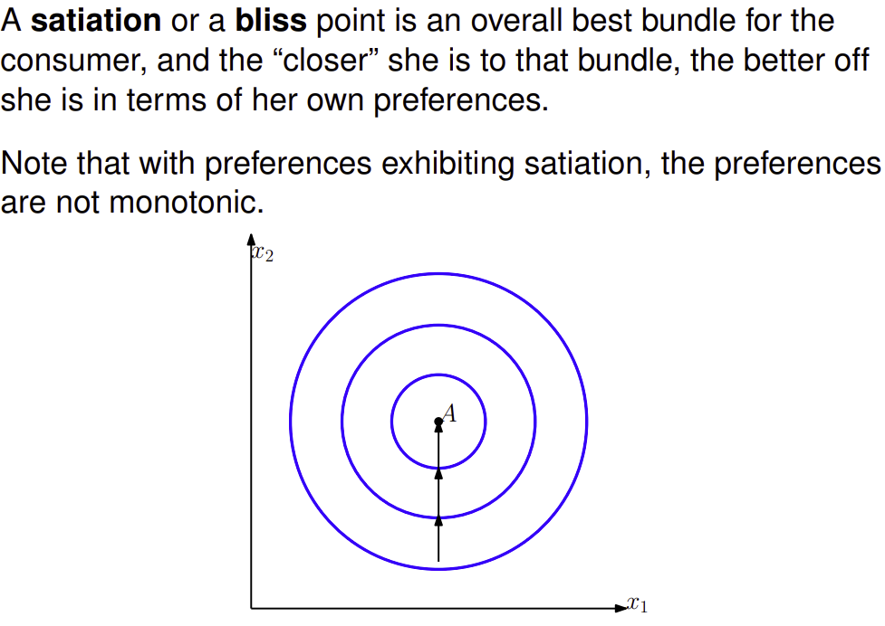

2. Convex Preferences (average preferred to extreme)

Preferences are convex, if for any two equivalent bundles, (x1, x2) ∼ (y1, y2)

And for any weight t between 0 and 1: (tx1 + (1 − t)y1, tx2 + (1 − t)y2) ≿ (x1, x2)

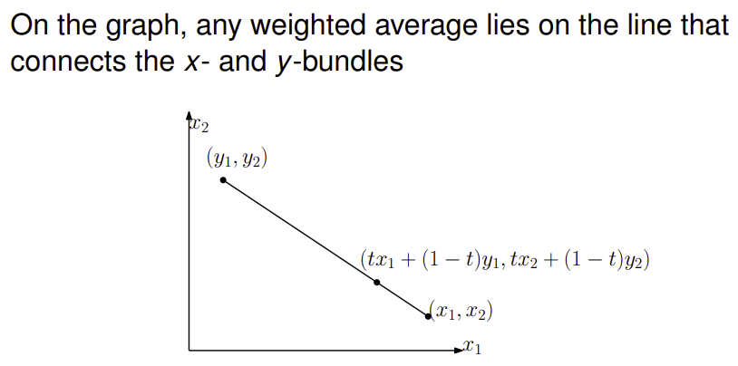

NOTE: As t increases from 0 to 1. The weighted averages gets closer to bundle X than bundle Y. [At t = 0, we simply get the relation that (y1,y2) ≿ (x1, x2)]

Of course not all preferences are convex, consider beer and milk which don't 'mix well together'.

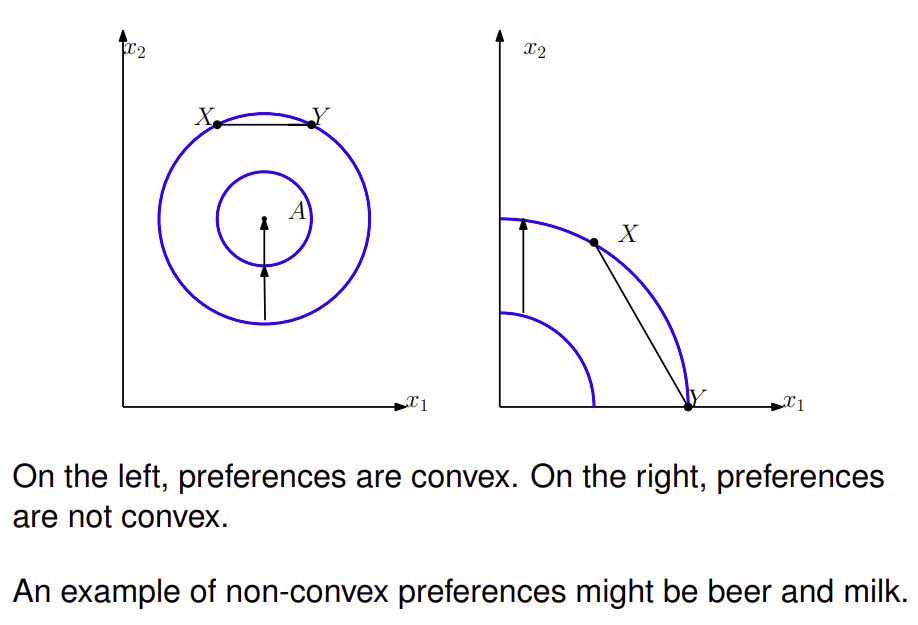

**Strictly Convex Preferences**

Preferences are convex, if for any two equivalent bundles, (x1, x2) ∼ (y1, y2)

And for any weight t between 0 and 1: (tx1 + (1 − t)y1, tx2 + (1 − t)y2) ≻ (x1, x2)

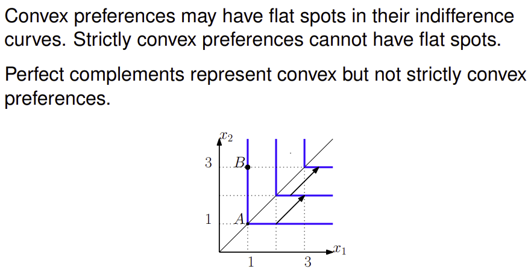

Here consider the midpoint of A and B. This lies on the same indifference curve but were strict convex preferences to hold then the midpoint would lie on a higher indifference curve.

If such comparisons are repeated infinite times we get the result that. Strictly convex preferences ⇒ unique best bundle in B

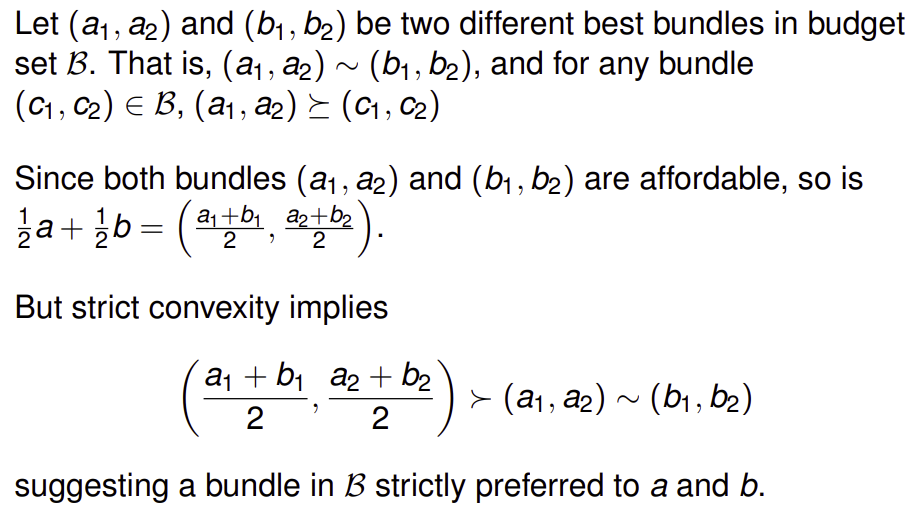

Well-behaved preferences

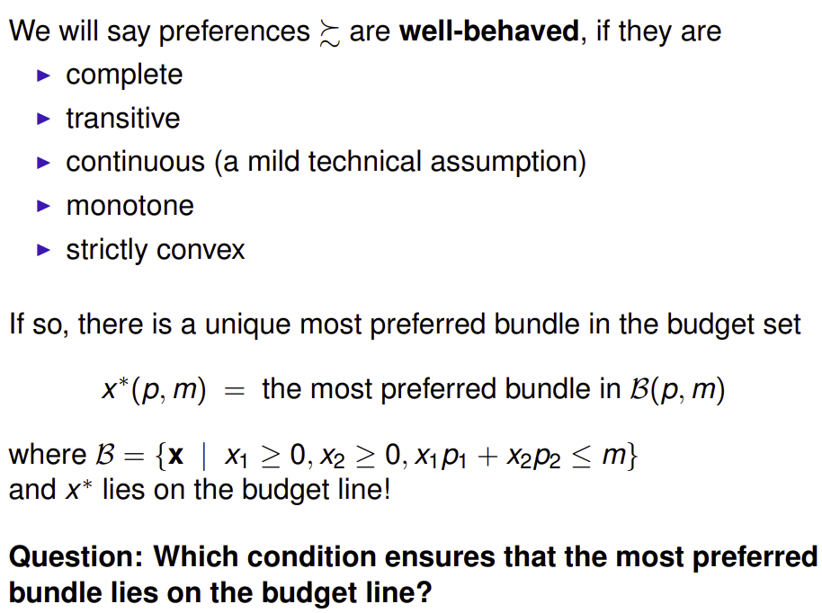

NOTE: It is the condition of monotonic preferences that ensure the most preferred budget lies ON not below the budget line.

Utility Function

A utility function is a way of assigning a number to every possible consumption bundle such that more-preferred bundles get assigned larger numbers than less-preferred bundles. A utility function exists if for a preference relation over a finite set A of alternatives is complete and transitive.

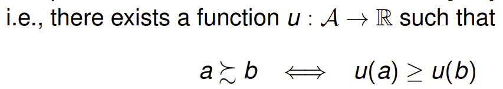

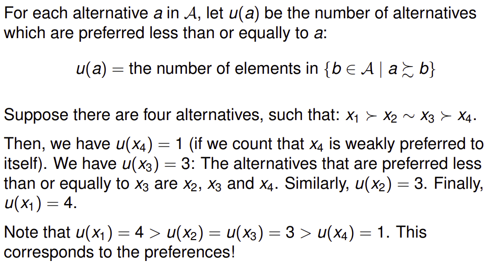

E.g.

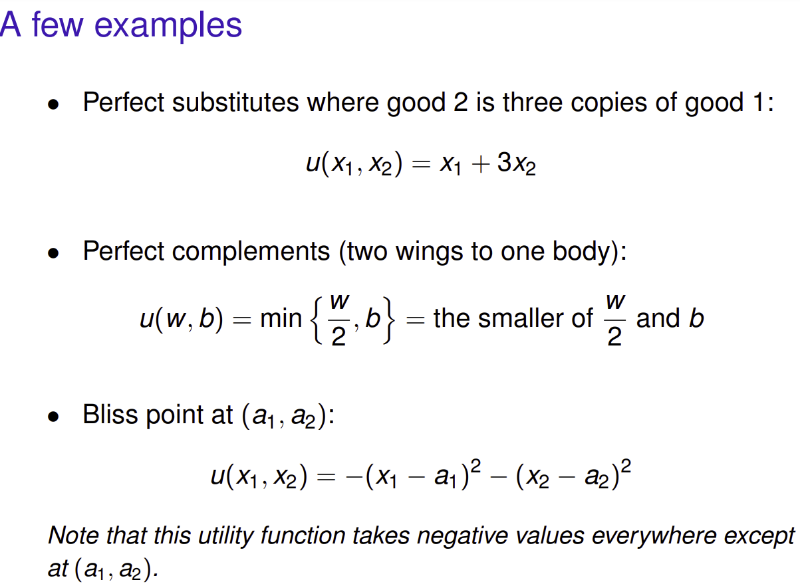

Perfect Substitutes:
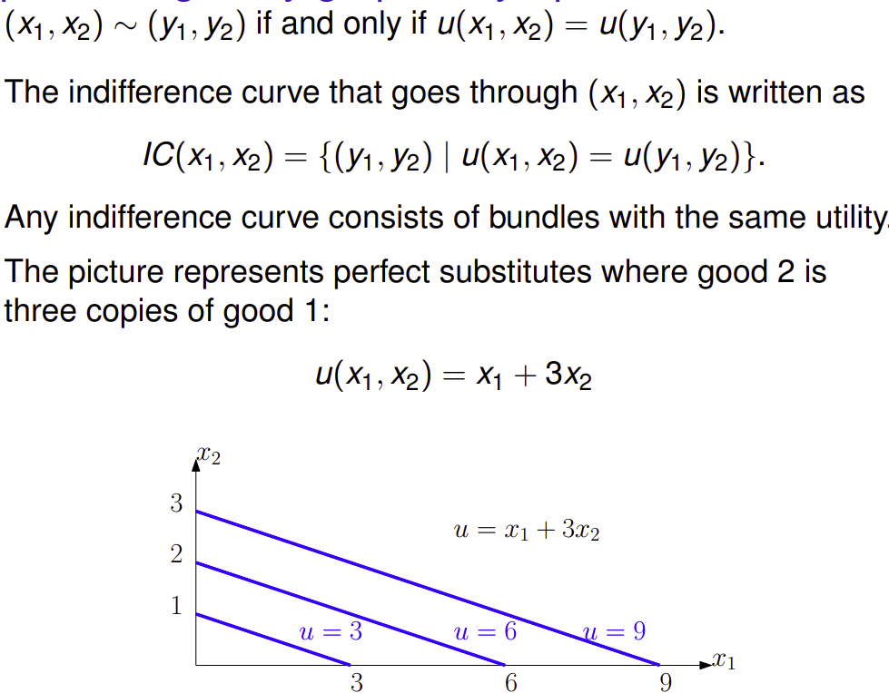

Perfect Complements:
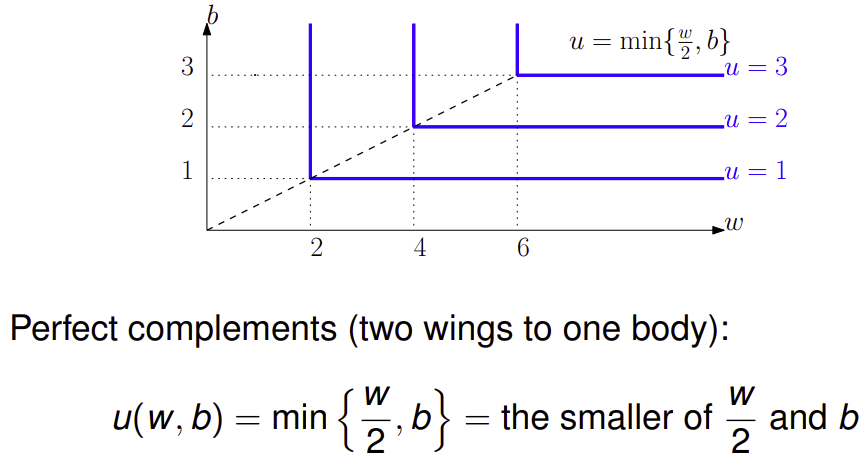

Exercise skipped as is trivial.

**Past Exam Questions**:
	Exam 2020-21, Q1
	Exam 2017-18 Q3 (a), (b)
