Lecture slides at: [L4-notes-Micro-2023-24.pdf (cam.ac.uk)](https://www.vle.cam.ac.uk/pluginfile.php/15849931/mod_resource/content/6/L4-notes-Micro-2023-24.pdf)

**Understanding Substitution:**
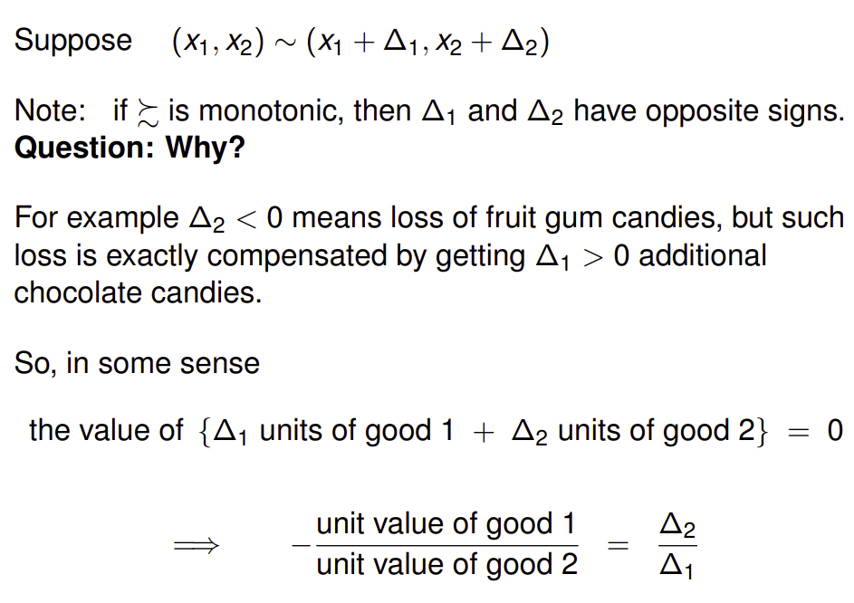

Taking the limit we can now define MRS:

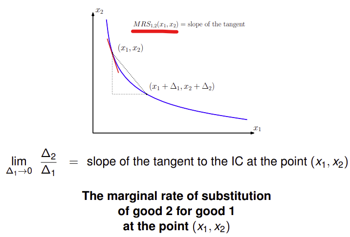

As the value of MRS gets larger, the more important good 1 is relative to good 2. The gradient gets steeper implying the consumer is willing to give up greater quantities of good 2 for a unit of good 1.

**Deriving MRS**

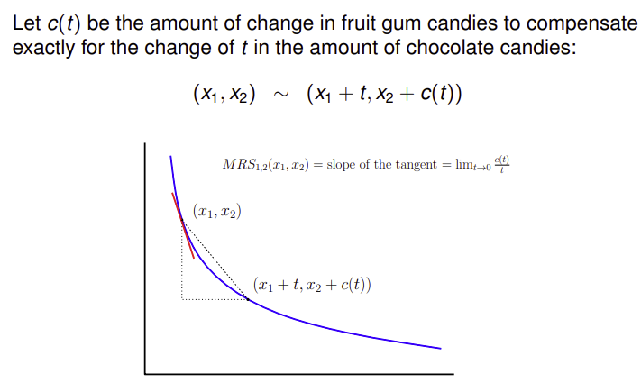

NOTE: As t increases, good 2 becomes more valuable

(x1, x2) ∼ (x1 + t, x2 + c(t)) means as t changes, c(t) adjusts to keep the new bundle on the IC of (x1, x2). Clearly c(0) = 0, *because no change in chocolate requires no change in fruit gum candies*.

Hence, 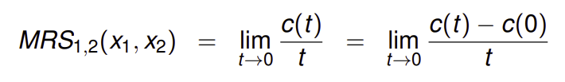
	We defined MRS = slope of tangent as t->0 for first equation. Then for second equation we used result c(0) = 0. This then tells us that the MRS = c'(t) at the point t=0.

Next we try to compute this value of c'(0) using the function *u*. 
NOTE: u depends on x1, x2, which depend on t. Then consider the following:

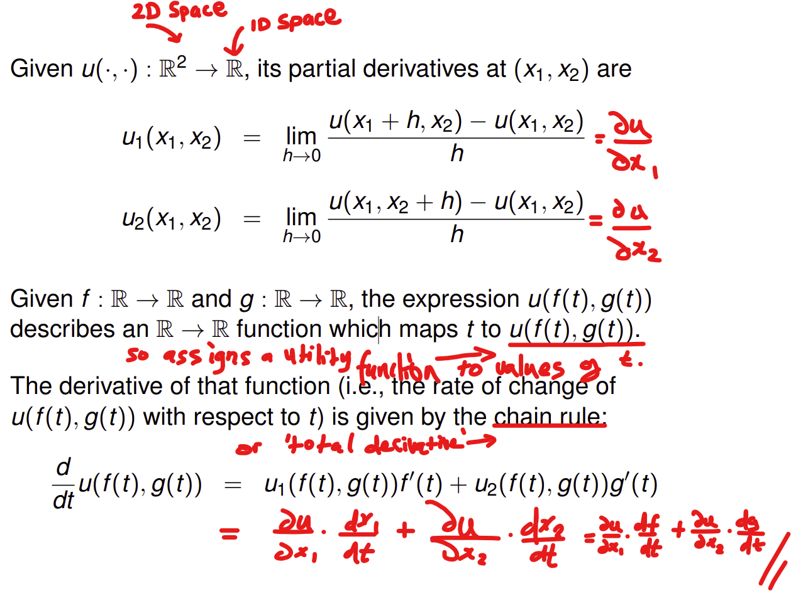
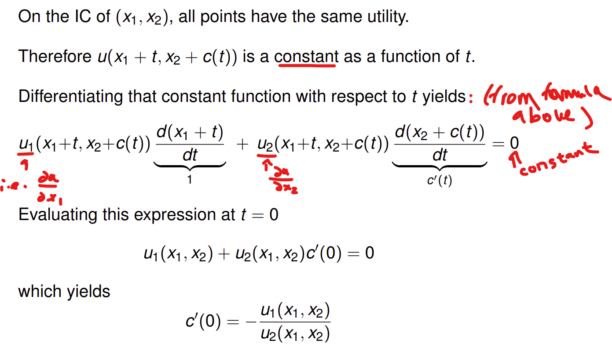
  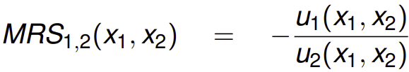
  This is an alternative definition of the MRS. It is the ratio of "importance" of each good in terms of their utility.

**Defining MU (recalling partial derivatives):**
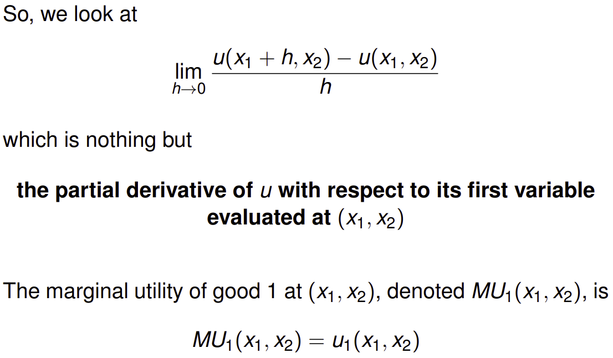
E.g.
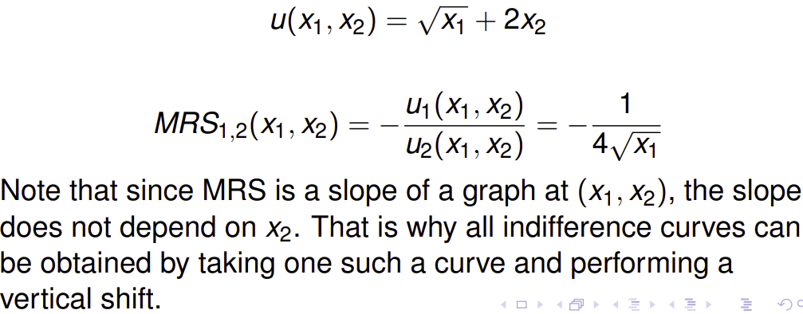

**MRS and Convexity**
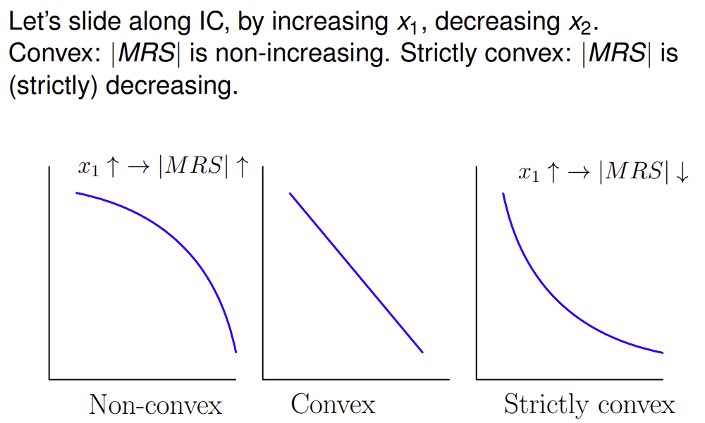

**Exercise**:
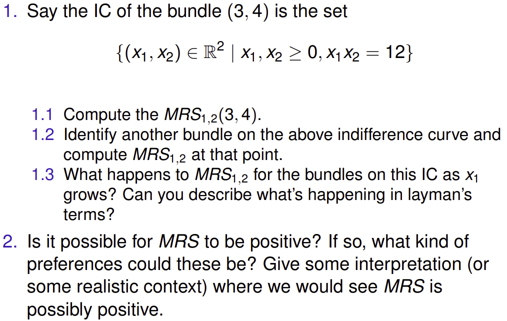
Q1.1) The IC is: $$x_2 = 12 / x_1$$So the slope of the tangent is given by $$dx_2/dx_1 = -6/x_1^2$$So substituting x1 = 3, gives us MRS(3,4) = -2/3

Q1.2) Consider the point (1,12):

So substituting x1 = 1, gives us MRS(1,12) = -6

Q1.3) The function $$ MRS = -6/x_1^2$$Tends to zero as x_1 tends to infinity. That is to say that the absolute value of the MRS declines as further goods of x_1 are consumed. 

(Steep gradient for low x1, shallow gradient for large x1)

In layman's terms, the fewer goods of x1 being consumed the more willing the consumer is to trade their consumption of x2 for a singular unit of x1. 

Q2) For MRS to be positive preferences must be non-monotonic to enable an upward sloping indifference curve. An example can be the case of *saturation* where there is a *bliss point* and the further a point is away from it, the less utility derived from it. E.g/ beer and milk consumption.

**Reading:** 
Varian, chapters 3,4.

**Past exam question:** 
Exam 2009-10 Q6.
