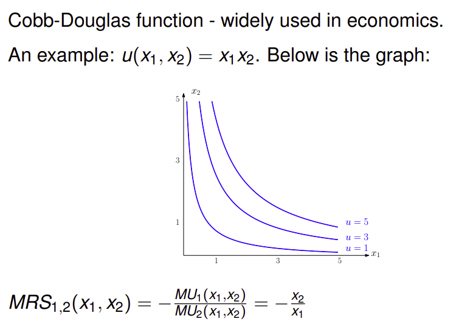
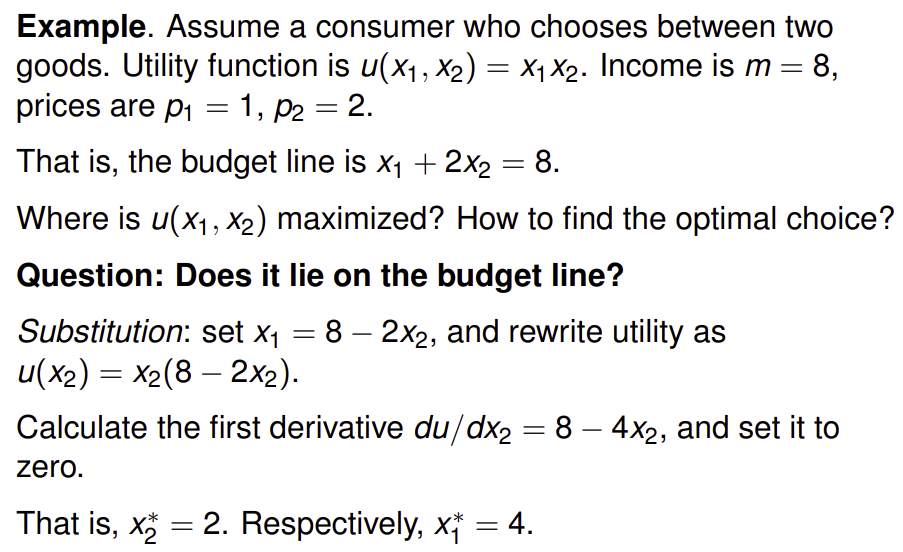
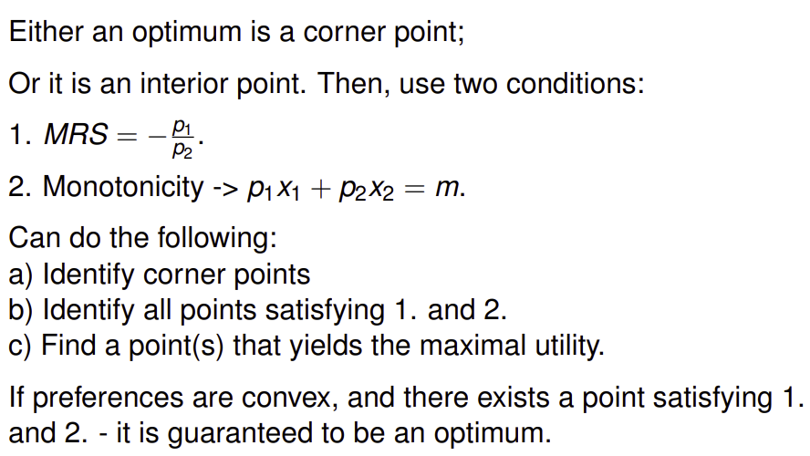
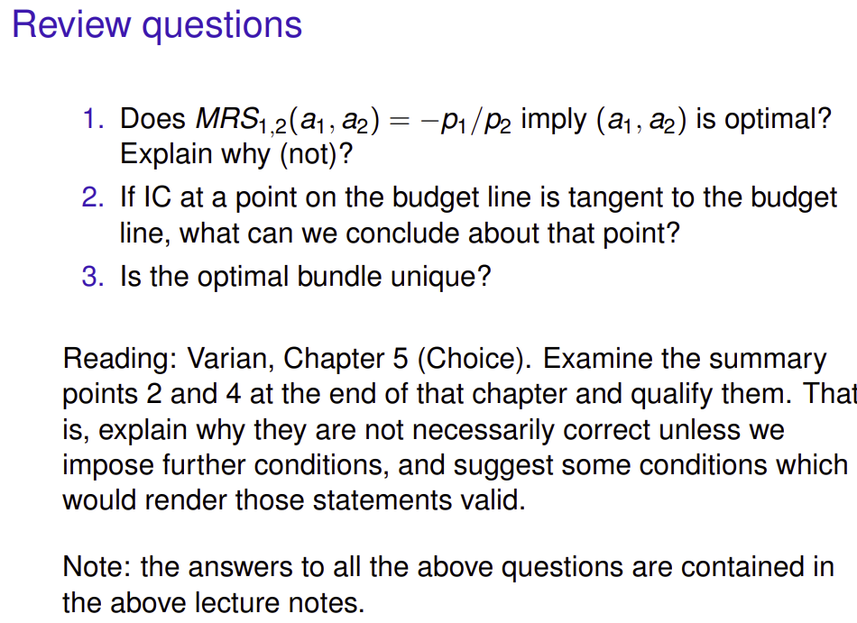
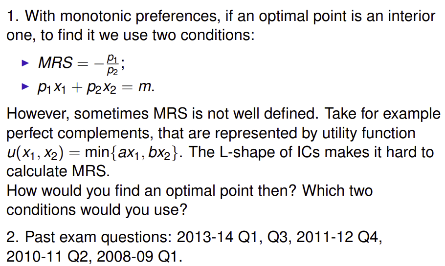

Solving optimality questions (the universal way):

Another method that works is to use the tangency condition to see if it yields an optimum. NOTE: this does not work if not convex etc.

Exercises:

