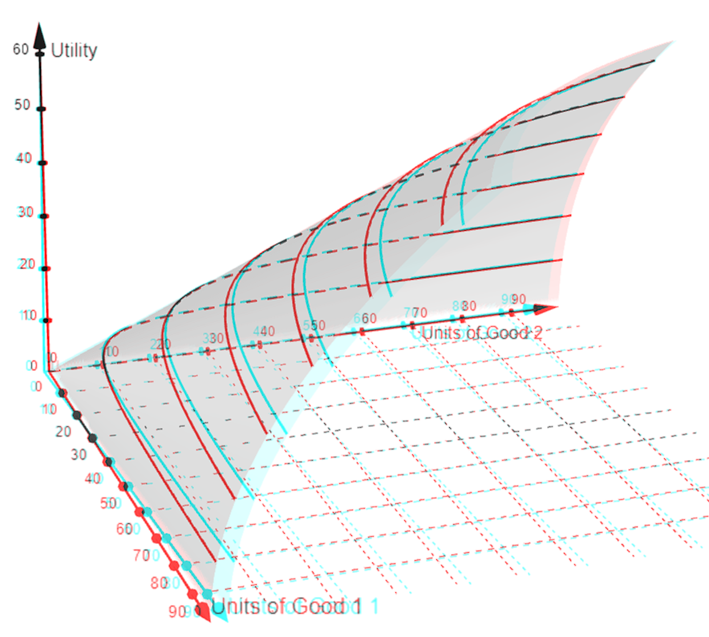

Reading: Varian, *Intermediate Microeconomics*, Chapters 3–4. The supervision questions are the supervisor's; the working and notes are the author's.

Understanding utility functions. Note: u = f(x,y) <--- 3d-relation

NOTE: This open dome shape i.e. the actual function is concave, but the indifference curves by holding u constant (i.e. the preferences) are convex.

Then fixing u we take a slice. This slice is an indifference curve. (An indifference curve is a 2d relation)

Q1 a) NOTE: The point (0,100) is also on the budget set as she could just not buy a membership

Reflection extensions:
Why must a change in the budget line around P lead to consumer being better off:

1. Strict convexity means that the point P can only ever be the tangent point to one line so under a new budget line the point P is no longer tangent to the curve.
2. From a logiccal perspective

When will the consumer always stick to point P?
*In case of perfect complements, where  corner of the indifference curve touches budget*

b) *That preferences are unchanged period to period OR preferences are complete & transitive*

Q2) d) The way to solve this:

i.e. first assume there exists a price p* that coincides with both corner points under an indifference curve. That means both corner points are viable. (if above p*, then x2 corner is consumed and if below p* then x1 corner is consumed)

Now to find p* (the point when only x is consumed) let's say:
$$u(only\ x) > u(only\ y)$$
=> from utility function: $$x>y^2$$
=> from recalling budgets that px = m and y =m then we get: $$m/p > m^2$$
=> $$p < 1/m \ i.e. \  p^* = 1/m$$ 
NOTE: An intuitive explanation for concave preferences, on the margin the value of a good increases. i.e. like an addictive good

Q3) The key to this question was understanding that marginal utilties reveal nothing about preferences. This is because MU is measured in utils i.e. an aribtrary measure.

Instead MRS is a better way of valuing the worth of a good (in terms of another good). As show by part 2, the monotonic transformation has no effect on the MRS as one ought to expect from the fact that monotonic transformations preserve preferences.
