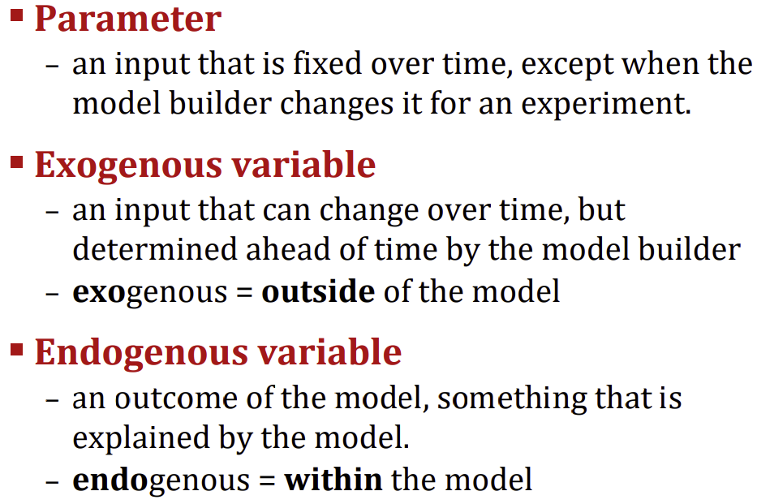
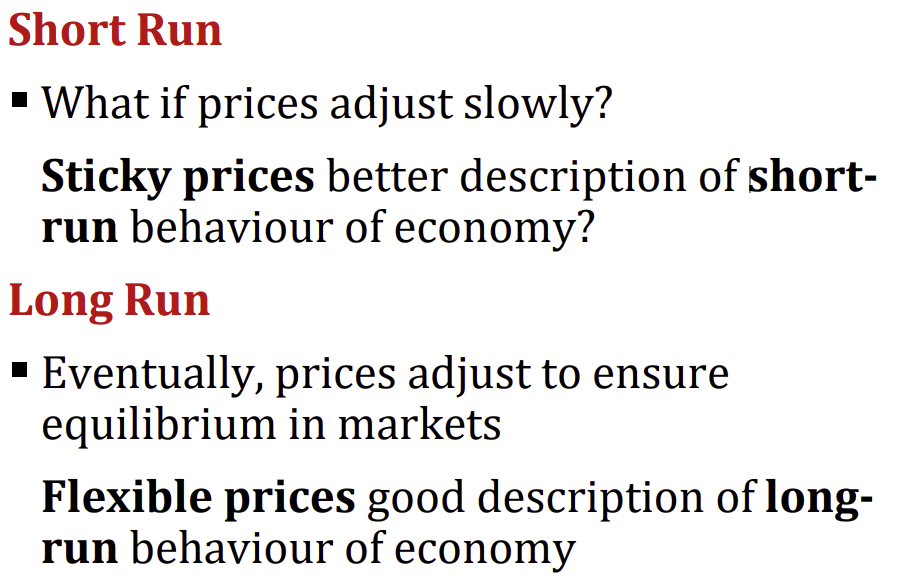

Lecture notes and slide extracts: [Chryssi Giannitsarou](https://sites.google.com/site/giannitsarou/), University of Cambridge.

Slides at: [Microsoft PowerPoint - PIP2 Lecture 01 - Introduction (cam.ac.uk)](https://www.vle.cam.ac.uk/pluginfile.php/27904968/mod_resource/content/0/PIP2%20Lecture%2001%20-%20Introduction%20-%20%28Slides%29.pdf)

Main readings:
- Charles I. Jones, *Macroeconomics*, International Student Edition, 5th Edition. [R]
- N. Gregory Mankiw & Mark P. Taylor, *Macroeconomics*, European Edition, 2nd Edition. [R]

**Macroeconomics is the study of the economy as a whole**
- Studies collections of people and firms, and how their interactions through markets determine the overall economic activity in a country or region
- Difference to micro? Deals with aggregate phenomena such as: inflation, unemployment, or economic growth

## Key Concepts

### Positive Normative Terminology
Understand economy = positive question

- Why does an economy behave in a certain way?

Policy prescriptions = normative question

- How should an economy behave?

## Models
An economic model is a mathematical representation of a hypothetical world that we use to study economic phenomena. A model is defined by its parts:

A model is used by:

- Setting up counterfactual “what-if” situations
- Changing parameters and exogenous variables to see how they affect endogenous variables (comparative statics)
- Predicting costs and benefits of new government policies

## Short run vs Long run

Readings:
- Jones: Chapter 1. [R]
- Mankiw & Taylor: Chapter 1. [R]
