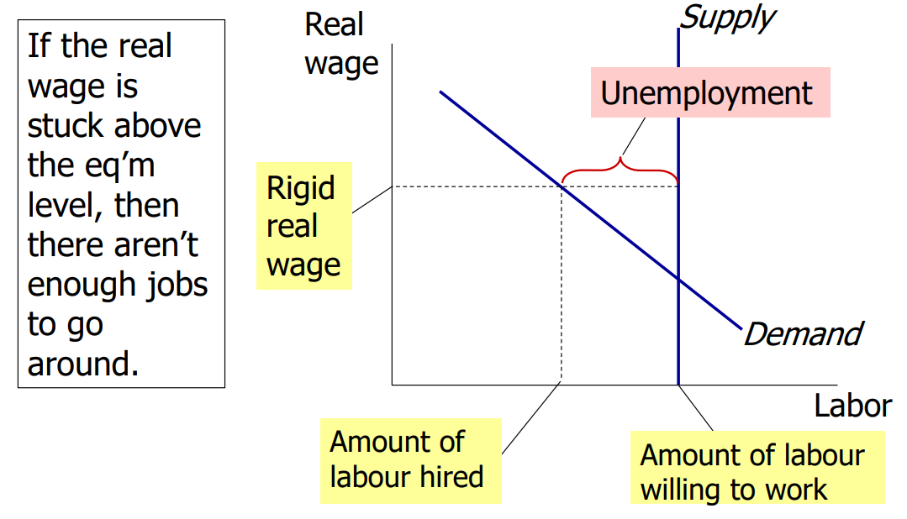
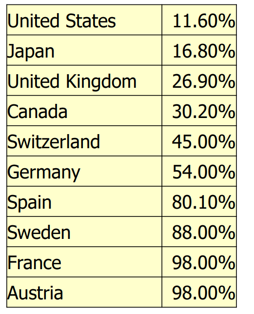
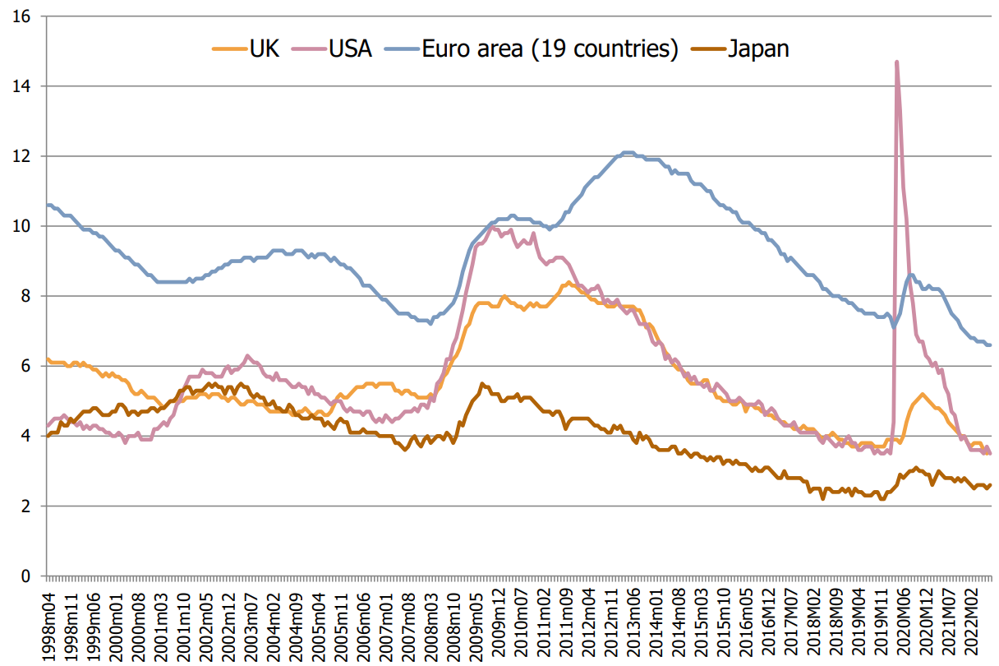

Lecture notes and slide extracts: [Chryssi Giannitsarou](https://sites.google.com/site/giannitsarou/), University of Cambridge, Part I Macroeconomics. Teaching examples and values in slide extracts are reported from the course material [R]. Several diagrams are textbook extracts from N. Gregory Mankiw, *Macroeconomics*, and C. I. Jones, *Macroeconomics*, as cited in the readings below.

Recall from lecture 9 that:

$$\frac UL = \frac s{s+f}$$

- A policy will reduce the natural rate of unemployment only if it lowers s or increases f.
- If job finding were instantaneous (f = 1), then all spells of unemployment would be brief and the natural rate would be near zero.
- There are two reasons why f < 1 
  1. job search 
  2. wage rigidity  <--- covering below

**Structural Unemployment** - Unemployment from **wage rigidity** (wage controls, or phenomena that act as wage controls) and **job rationing**.

## Wage Rigidity

The remaining scarce amount of jobs have to be rationed, **3 main reasons for rigidity** are minimum wage, labor unions and effective wages:

1. The mimimum wage - the minimum wage may exceed the eq’m wage of certain low-earning groups, *e.g. part-time workers, teenagers, generally unskilled workers.*

   

2. Labour Unions - exercise of monopoly power by members to secure higher wages.

   Insider-Outsider theory:
   - Employed union workers are *insiders* whose interest is to keep wages high
   - Unemployed non-union workers are *outsiders* and would prefer lower wages (so that labour demand would be high enough for them to get employed).

   European countries in general have higher rates of unionisation than other countries:

   

3. Efficiency Wages - Instances in which **worker productivity is a function of wage**. Reasons for this include:
   - Attract higher quality job applicants 
   - Increase worker effort and reduce shirking 
   - Reduce turnover, which is costly 
   - Improve health of workers *(in developing countries)*

   To the firm, the increased productivity justifies the cost of paying above-equilibrium wages. The result in the labour is still diseq'm and structural unemployment.

## European Unemployment

*why is unemployment in EU so much higher than in other economies?*

Eurosclerosis: is a term used to express that labour market rigidities have had important negative effects on EU economic performance

Throughout the entire period barring 2020 anomaly, the EU 19 have a higher unemployment rate than the UK, US and JPN.

There are many reasons for this pattern:

1. **Hysteresis** - *the view that u\* depends on an economy's history*
   - a) Unemployed workers for extended period => skill deterioration
   - b) Less skills => workers become more unemployable => worked discouraged
   - c) Discouraged workers are permanently unemployed (i.e. exit the labor force).
2. **Technological Change** - *the fact that technological shocks shift demand from unskilled to skilled workers*
   - *This demand shift occurred in the U.S. too. **The U.S. has less wage rigidity, so instead of causing higher unemployment, the shift caused an increase in the gap between skilled and unskilled wage***
3. **Strong welfare states/Unions** - leading to 'reservation wages' above eq'm:
   - a. Generous social insurance programme
   - b. Unemployment benefits
   - c. Collective bargaining (unionisation)
4. **Labor Mobility** differences 
   - a. Arising from the language and cultural barriers that reduce the mobility of labour. 
5. **Black Economy** - *particularly important for **Southern Europe***
   - a. Many unskilled workers hired on the black market – thus appearing as “unemployed”
6. **Cultural differences** (less important)
   - a) Peter Pan' syndrome - More likely to live with parents 
   - b) More leisure less work - **Europeans work less than US**

     Theories for this: 
     - **Higher income taxes in Europe**, distort the labor-lesiure tradeoff and the incentives to work.
     - **Europeans have different tastes** to US workers; **more pre-disposed to leisure than work**.
7. **Legislation** (strong employment protections)
   - a) Strict labour laws on hiring/firing workers, probation periods
   - b) Tenures of work that reduce 'liquidity' of the labor market
   - *e.g. consider France 2006 youth protests against the removal of employment protections*

## UK Unemployment (ex-EU)

Pattern quite different from the rest of continental Europe  

- Similarities with US, 
- e.g. Sectoral shifts in 70s/80s 
- Decrease in Union membership after 80s – Etc

## Readings

Jones: 7.1-7.5 (focuses more on US labour market) 
Mankiw: Chapters 7 and 10.1
