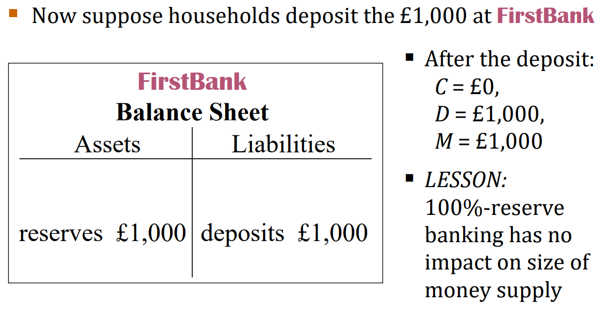
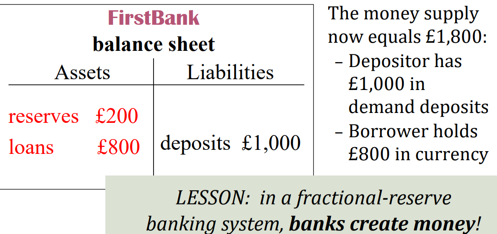
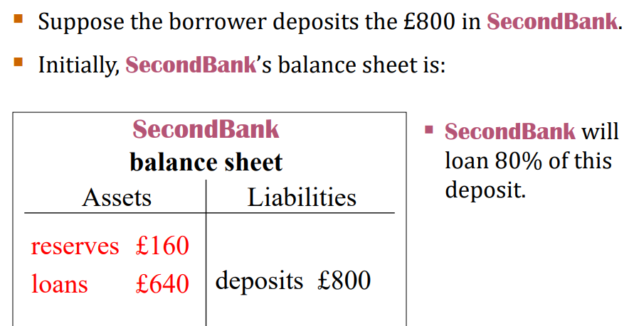
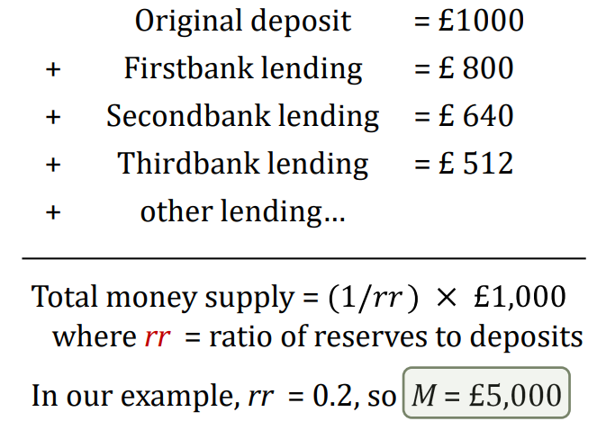
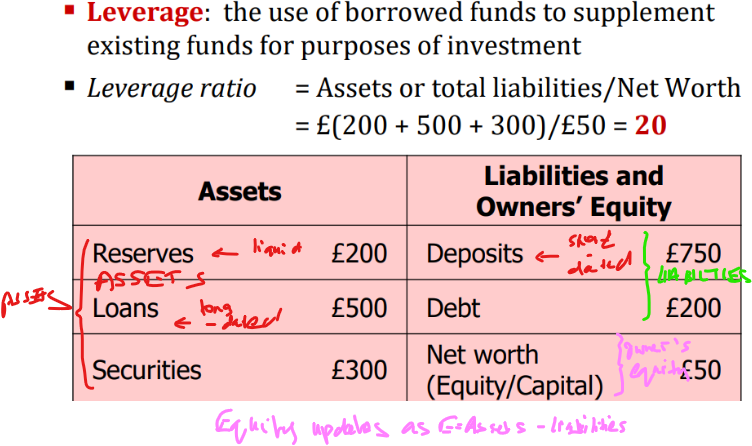

Lecture notes and slide extracts: [Chryssi Giannitsarou](https://sites.google.com/site/giannitsarou/), University of Cambridge, Part I Macroeconomics. Teaching examples and values in slide extracts are reported from the course material [R]. Several diagrams are textbook extracts from N. Gregory Mankiw, *Macroeconomics*, and C. I. Jones, *Macroeconomics*, as cited in the readings below.

Prices are determined in terms of money, hence the relevance of its supply.

Money - Stock of assets that can be readily used to make transaction. (E.g. in a single-commodity world of corn if corn is used for payments, corn is money)

## Functions of Money

1. **Medium of exchange:** we use it to buy stuff 
2. **Store of value:** transfers purchasing power from the present to the future 
3. **Unit of account:** the common unit by which all measure prices and values 
4. **Liquidity**: easy access to funds, facilitates markets.

## Types of Money

- Commodity Money  - Has intirnisc value e.g. gold ingots
- Fiat Money - has no intrinsic value e.g. paper curerncy in use today
  - This is based on all of us coordinating that we will honour the “agreement” of accepting paper bills 
  - For this reason, it is important who controls the production of the money bills

## Measures of Money

Monetary base or Legal Tender: 

- M0 = currency (notes and coins) + reserves 

Bank money: 

- M1 = M0 + demand deposits, travelers’ cheques, other checkable deposits 
- M2 = M1 + small time deposits, small savings deposits
- M3 = M2 + large time deposits 
- M4 = M3 + least liquid assets, e.g., long term bonds 

EURO zone: M1 – M3 measures mostly in use 
UK: M0 not published after 2006, from 2009 M4 mostly

## Role of the Central Bank

The Bank of England is the central bank of the UK. 

- It controls **the money supply** via control of **monetary policy**
- Central banks are typically partially **independent** in setting monetary policy

## How CB influences money supply

Money supply can be controlled by the central bank:

- Directly (open market operations) 
- Indirectly (controlling banks reserves, lending rates, etc.) 

Central bank or government cannot control individuals’ behaviour and preferences, e.g. burning banknotes or keeping money under the mattress.

## How commercial banks influence money supply

Let money supply (M) equal currency (C) + deposites in current accounts (D):

$$M = C + D$$

Let reserves (R) be the portion of deposits that banks have not lent out. 

- **100% reserve banking** - A system in which banks holds all deposits as reserves. Total liquidity requirement.
- **Fractional reserve banking** - Banks hold only a fraction of deposits as reserves (the rest is lent out to purchase securities, lend out etc.)

Creating a model for three scenarios off of the balance sheets of banks. (Noting fundamental principle of accounting: **ASSETS = LIABILITIES + EQUITY**)

Initial conditions, C = 1000 then:

**Scenario I** - No Banks

With no banks, D = 0 => M = C = 1000

**Scenario II** - 100% reserve banking system

- The entirety of C is deposited in the bank so C = 0. Under full reserve banking, the bank simply keeps the deposit in its reserves:

  

- None of this is lent out (in this model reserves are neither C nor D)

**Scenario III** - Fractional reserve banking system 

- Suppose the bank lends out 80% of the deposit it receives
- Assuming again that the entirety of C is deposited in the bank we create £1000 of liabilities to the bank in the form of demand deposits
- Then £800 are as loans on the asset side and £200 are reserves.
- Loans are made in *cash* this means after the process. C = 800, D = 1000
- Thus, M = C +D = 1800 <--- money creation

  

- Now consider the person who took out the loan and say they put all the money in the bank again. This process can be extended *ad infinitum*:

  

- This is a geometric series where initial value is 1000, common ratio is 0.8 (because bank loans out 80%). So sum = £1000/1-0.8 = £5000:

  

NOTE: This is *money* creation not *wealth* creation

## Leverage and Bank Capital

Noting that, Bank Capital = Assets - Liabilities.

## Vulnerability of Leverage

Leverage increases the return on equity but it has a downside effect tooL
Consider a negative shock to the assets side, so that it declines by 5% i.e. £50
The equity is wiped out in this case where the leverage ratio is 20.

## Readings

Jones, Chapter 8.1, 10.4 
Mankiw, Chapters 4.1-4.4 and 5.1-5.
