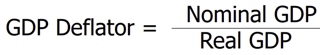
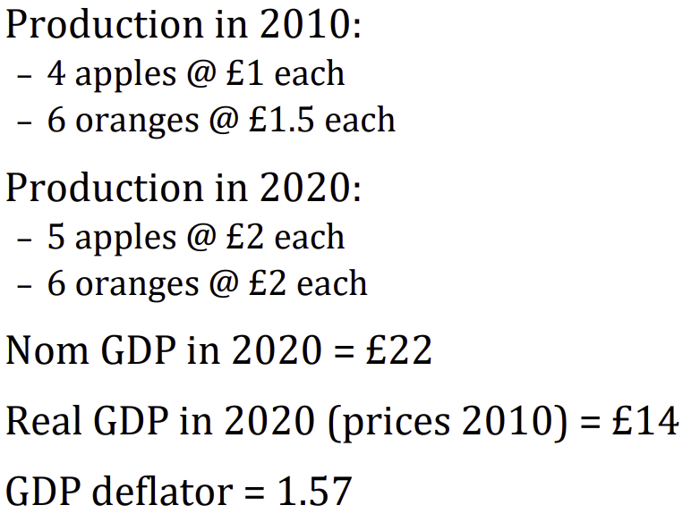
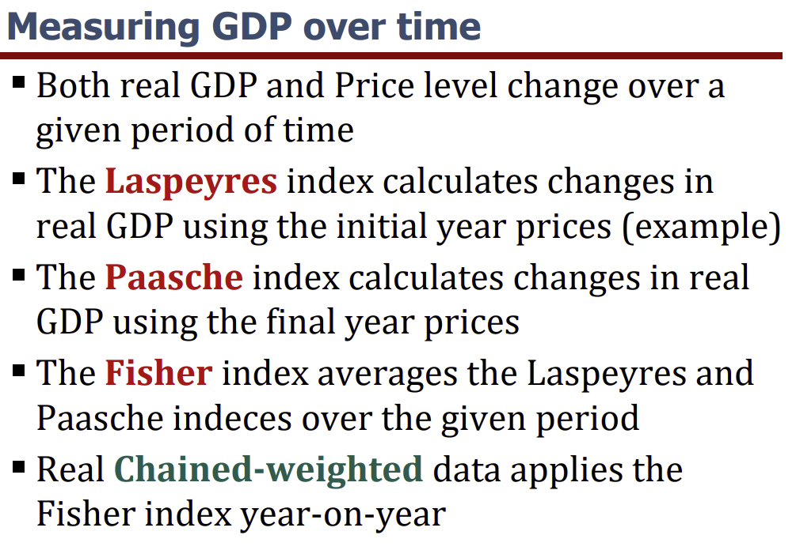
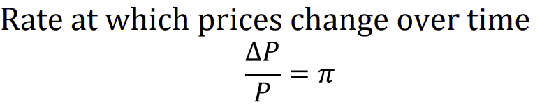
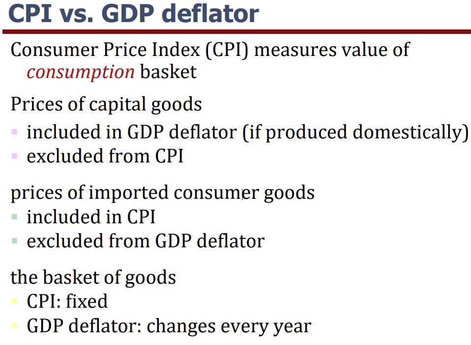
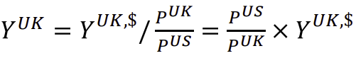

Lecture notes and slide extracts: [Chryssi Giannitsarou](https://sites.google.com/site/giannitsarou/), University of Cambridge, Part I Macroeconomics. Teaching examples and values in slide extracts are reported from the course material [R].

## GDP

### Production measure of GDP

The market value of all final goods and services produced in the economy over a given period.
- We do this by summing up *value added* at all stages of production;
- Value added - The value of a firm's output minus the value of the intermediate goods the firm used to produce that output.
- Miller produces flour for 50p [R], baker buys flour, bakes bread and sells it for £1 [R]. The miller added value of 50p [C], the baker added value of £1-50p = 50p [C]. Summing up, 50p+50p = £1 [C]
- Alternatively, could have just recognised GDP = value of *final goods produced*.

*NOTE: value of the final goods already includes the value of the intermediate goods, so including intermediate goods in GDP would be double-counting*

### Expenditure measure

The total expenditure on final goods and services produced in the economy.

$$
Y = C + I + G + NX
$$

C = the value of all goods and services bought by households, excluding housing investment

Includes:

- Durable goods last a long time, e.g. cars, home appliances
- Non‐durable goods last a short time, e.g. food, clothing
- Services work done for consumers, e.g. dry cleaning, air travel, lawyers

I = private spending on newly produced capital goods *OR* spending on goods bought for future use

Includes:

- business fixed investment spending on plant and equipment that firms will use to produce other goods & services
- residential fixed investment spending on new housing units by consumers and landlords
- inventory investment the change in firms’ inventories, excluding holding gains from price changes

NOTE: Private gross fixed investment = business + residential fixed investment *includes major improvements, not routine repairs*. Gross Fixed Capital Formation (GFCF) also includes government fixed investment.

For the economy as a whole; **Investment = Gross Capital Formation = GFCF + Inventory Changes** (abstracting from net acquisitions of valuables).

G = Government purchases of goods and services, including government investment; count that investment only once in $Y=C+I+G+NX$.

Excludes:

- Transfer Payments

NX = the value of total exports (EX) minus the value of total imports (IM)

$$
NX = EX -IM
$$

### Income measure

Sum of all the incomes earned in the economy.

Historical lecture approximation; country, period and series are unspecified [U].

The major income shares are capital (+depreciation) and labour.
- Share of GDP to Labour: approx. 2/3 [U]
- Share of GDP to Capital: approx. 1/3 [U]
- Labour’s share of GDP has remained roughly constant over time, but has declined a bit in more recent times.

## Issues with GDP

- GDP misses much production that does not involve a recorded transaction, though some non-market output is included.
- Does not measure inequality, happiness, environment
- Gets harder to measure with rise of digitisation, intangibles, sharing and gig economy.

## Measuring GDP across time

GDP is the value of all final goods and services produced:
- The Nominal GDP measures these values using current prices
- The Real GDP values quantities at constant prices (or uses a chained volume measure)
- Nominal GDP = Price level x Real GDP

## GDP Deflator

E.g., using 2010 prices [R]:

Note the following indexes, particularly real chained-weighted:

Real chained-weighted data updates the price weights for each individual index calculation. This means that you are not using something ridiculous like 1960 prices for 2020 [R] (this has issues of incomplete data, not all products in 2020 have a price in 1960 [R], and of changes in quality).

E.g., using previous-year prices, chain each growth ratio onto the previous index level. Let $Q_t$ be the chained index and $V_t^{(t-1)}$ be year $t$ output valued at year $t-1$ prices. [C]

$$
Q_0=100,\qquad Q_t=Q_{t-1}\frac{V_t^{(t-1)}}{V_{t-1}^{(t-1)}}
$$

The Fisher index in the slide uses the **geometric mean** of Laspeyres and Paasche; it is not the previous-year-price example above. See the BEA definitions of [Fisher indexes](https://www.bea.gov/help/glossary/fisher-index) and [chain-type indexes](https://www.bea.gov/help/glossary/chain-type-indexes).

## Measuring inflation

GDP deflator

- Consumer Price Index (CPI): measures the prices of a typical basket of goods
- Harmonised Index of Consumer Prices (HICP): A measure of the overall level of prices for countries in the European Union (published by Eurostat)

## Measuring GDP across countries

To make comparisons of GDP across countries we must take the following steps:
1. GDP must be expressed in a common currency by *first adjusting it by the exchange rate*.
2. This value of nominal GDP must be *multiplied by the reference-country price level divided by the domestic price level*, with both price levels expressed in the common currency.
The final number adjusts for differences in prices across countries.

## Readings

- Charles I. Jones, *Macroeconomics*: Chapter 2. [R]
- N. Gregory Mankiw & Mark P. Taylor, *Macroeconomics*: Chapters 2.1–2.2. [R]
- [ONS: gross fixed capital formation](https://www.ons.gov.uk/economy/grossdomesticproductgdp/compendium/unitedkingdomnationalaccountsthebluebook/2016edition/grossfixedcapitalformationsupplementarytables) — definition and major improvements.
