Lecture notes and slide extracts: [Chryssi Giannitsarou](https://sites.google.com/site/giannitsarou/), University of Cambridge, Part I Macroeconomics. Teaching examples and values in slide extracts are reported from the course material [R].

## Assumptions

### Constant Returns to Scale

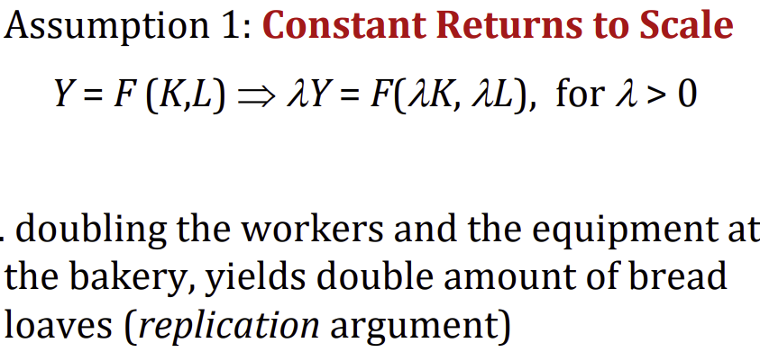
*Digression (other returns to scale):*
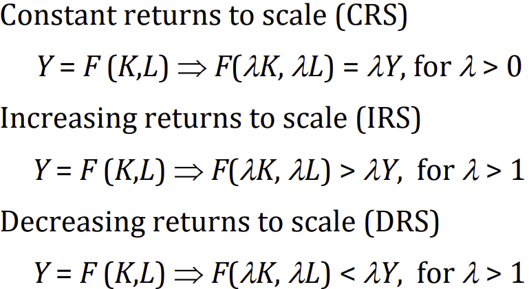
### Diminishing Marginal Returns

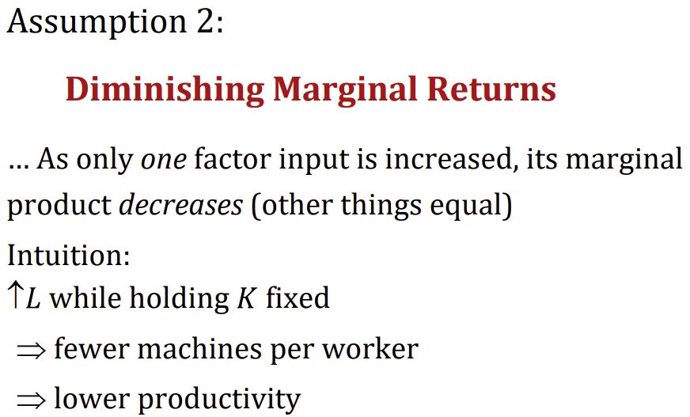
Holds for both factors. We can now use the classic Cobb-Douglas production function.
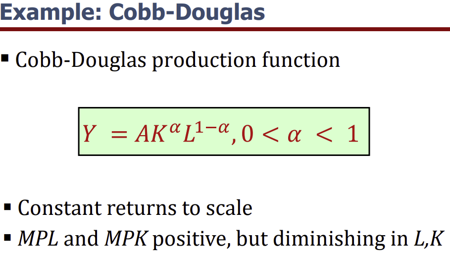

### Market for factors of production

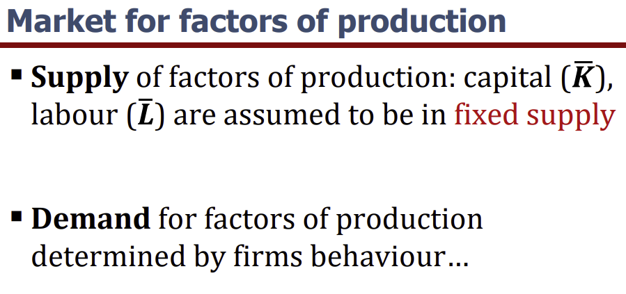

### Competitive firms

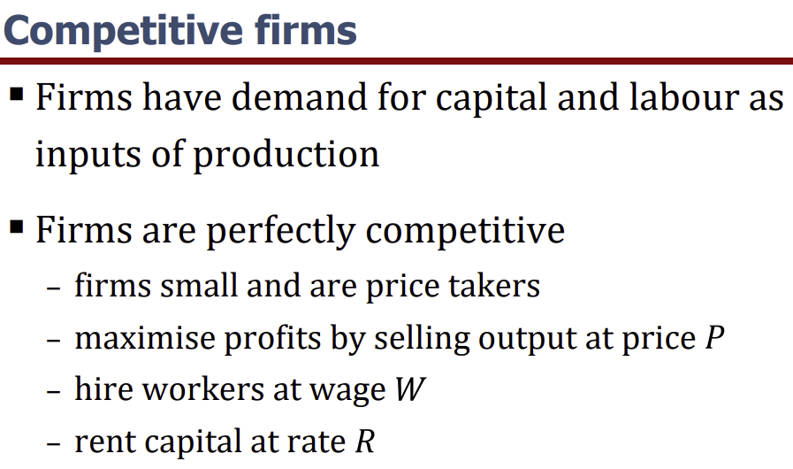
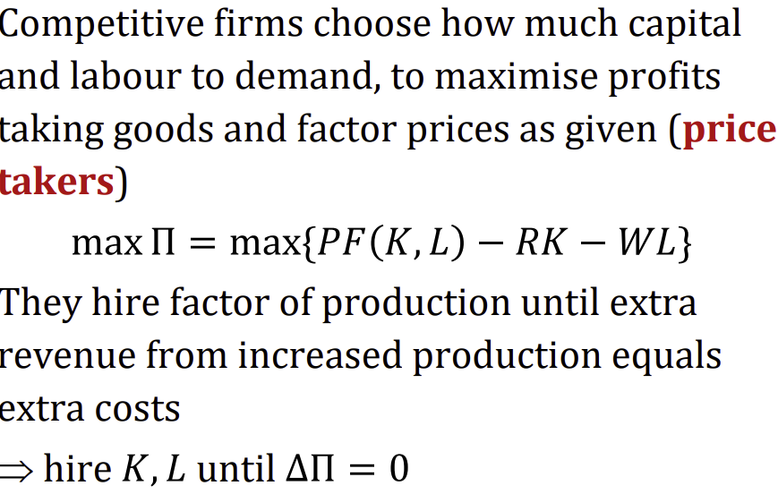
From this we can arrive at values for MPL and MPK by considering the:
### Firm's demand for labour

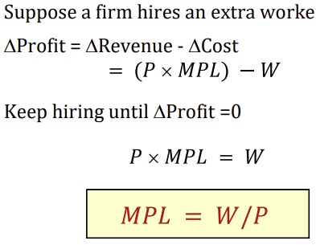
So the real wage of labour equals the marginal product of labour.
### Firm's demand for capital

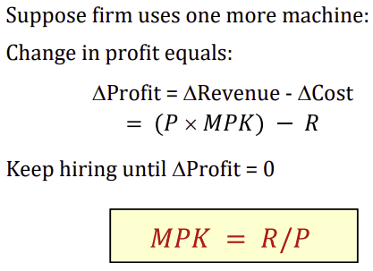
So the real rent of capital equals the marginal product of capital

## Altogether then

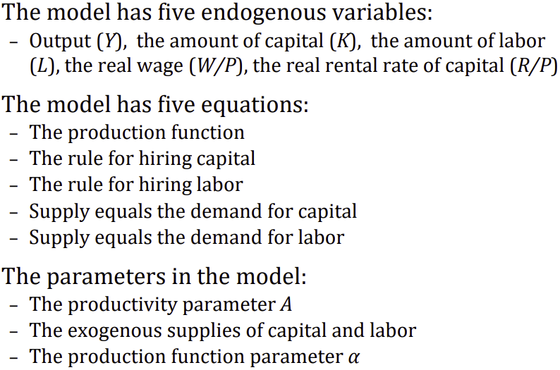
The factor-market clearing equations can be solved for
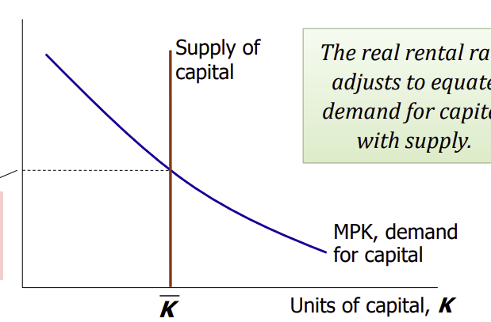
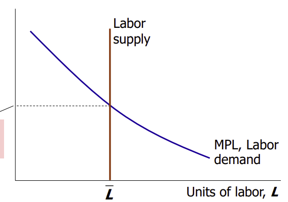
Yielding:
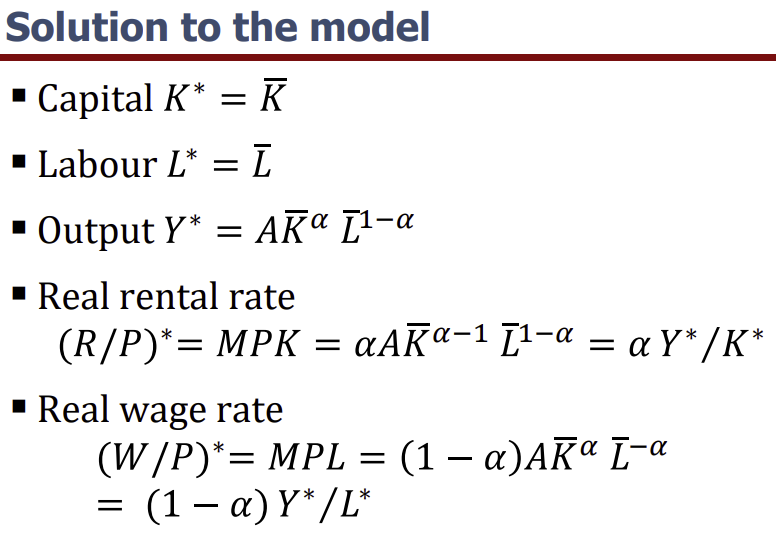

This leads to interesting result that:
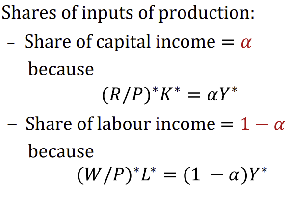

## Interpretations

If an economy is endowed with more machines or people, it will produce more.
- The equilibrium wage is proportional to output per worker
  - Output per worker = $Y/L$
- The equilibrium rental rate is proportional to output per capital
  - Output per capital = $Y/K$

## Profit

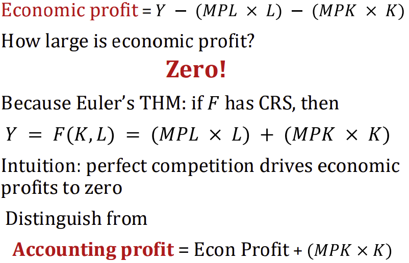
