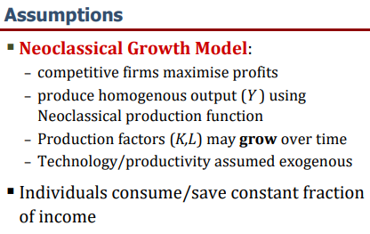
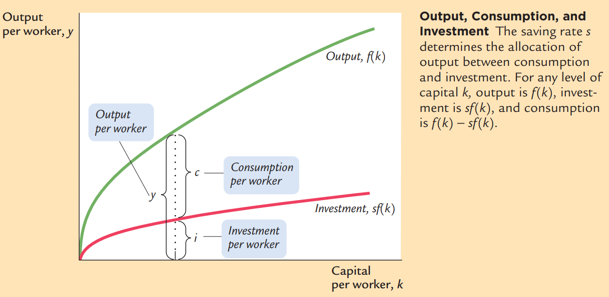
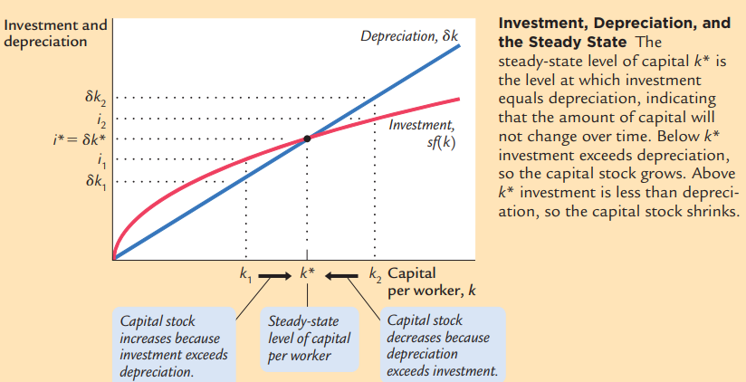
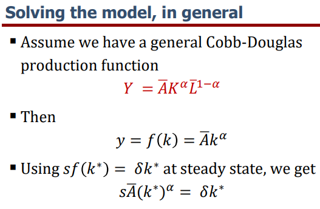
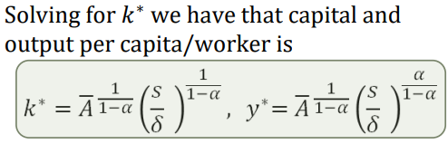
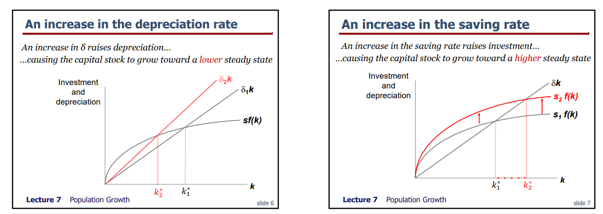

Lecture notes and slide extracts: [Chryssi Giannitsarou](https://sites.google.com/site/giannitsarou/), University of Cambridge, Part I Macroeconomics. Teaching examples and values in slide extracts are reported from the course material [R]. The output/consumption/investment and convergence diagrams are textbook extracts from N. Gregory Mankiw, *Macroeconomics*, as cited in the original readings.

## Assumptions

The Solow growth model makes use of these equations, $s$ and $\delta$ are exogenous variables, all variables are defined in per worker terms hence the lower case symbols. Here labour and productivity are constant; population growth is introduced in the next lecture.

## Capital accumulation

Production function

$$
y = f(k)
$$

Resource constraint

$$
y = c + i
$$

Investment equals saving

$$
i = sf(k)
$$

Now defining the change in capital:

$$
\Delta k = sf(k) - \delta k
$$

The steady state is defined as the level of capital per worker $(k^*)$ that ensures that $\Delta k = 0$

All these variables are functions of time, so $t$ subscripts can be added.

Investment per period

Note how there is convergence to $k^*$ for any positive initial $k$, with positive saving and depreciation.

## Solving for the steady state

## Intuition

- The economy reaches a steady state because investment has diminishing returns — The rate at which production and investment rise is smaller as the capital stock is larger
- Also, a constant fraction of the capital stock depreciates every period — Depreciation is not diminishing as capital increases.
- Eventually, net investment is zero and the economy rests in steady state

In the depreciation diagram, “grow toward a lower steady state” means capital **falls** towards the lower steady state when starting at the original equilibrium.

## Readings

- Charles I. Jones, *Macroeconomics*: Chapter 3 and Sections 5.1–5.7. [R]
- N. Gregory Mankiw, *Macroeconomics*: Section 8.1. [R]
