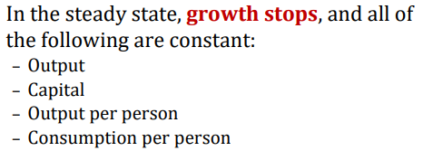
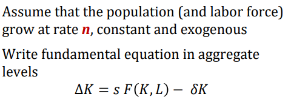
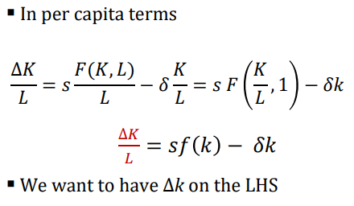
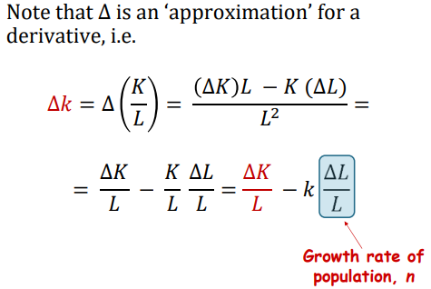
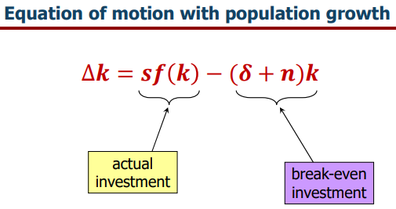
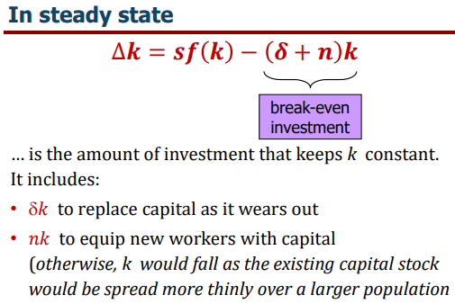
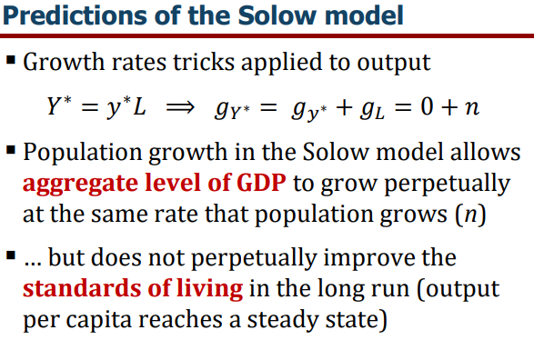

Lecture notes and slide extracts: [Chryssi Giannitsarou](https://sites.google.com/site/giannitsarou/), University of Cambridge, Part I Macroeconomics. Teaching examples and values in slide extracts are reported from the course material [R]. Several diagrams are textbook extracts from N. Gregory Mankiw, *Macroeconomics*, and C. I. Jones, *Macroeconomics*, as cited in the readings below.

If we are assuming the labour supply is fixed that is.

When solving such questions always begin with the **fundamental equation**:

So that (by making use of the constant returns of C-D production):

## Intuition

## Implications

## Readings

- Jones Chapter 8
- Mankiw Chapter 5
