Lecture notes and slide extracts: [Chryssi Giannitsarou](https://sites.google.com/site/giannitsarou/), University of Cambridge, Part I Macroeconomics. Teaching examples and values in slide extracts are reported from the course material [R]. Several diagrams are textbook extracts from N. Gregory Mankiw, *Macroeconomics*, and C. I. Jones, *Macroeconomics*.

Topics:
- The Golden rule 
- Transition 
- Absolute and conditional convergence 
- Where do we go from here? 
- Exogenous technological progress

**The Golden Rule**
There are multiple different steady states under the Solow model. The 'best' steady state under the golden rule is the one that maximises consumption per person. **THAT IS WE ARE PICKING THE SAVING RATE THAT CORREPONDS TO THE GOLDEN RULE (NOT CAPITAL STOCK)** 

In the Solow Model the exogenous variables are s and n. As such these are the variables that change.

In the steady state consumption is:
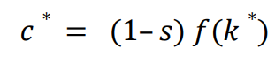
Recognising that savings rate influences both (1-s) and k* then we end up with a function of c* against s that looks like:
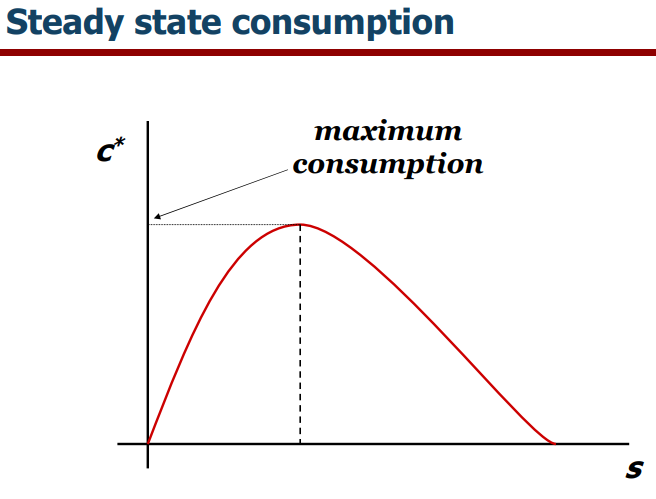

The golden rule level of capital is found by considering consumption:
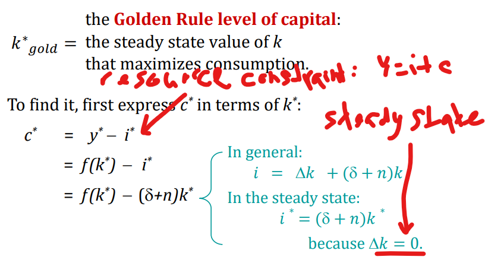
The largest c visually represented as the largest gap between the two curves:
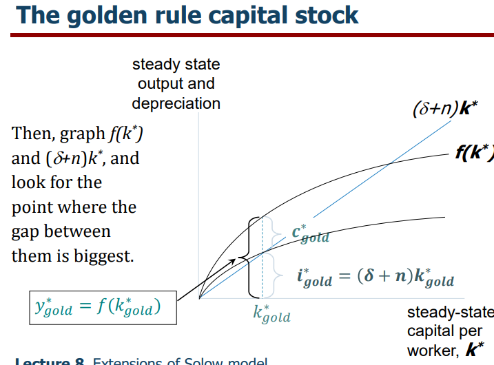
**NOTE: MPK = Investment, at where c* is maximised. That is to say investment is continued until the contribution of capital(per worker) to product is equal to the costs of investment**. See:
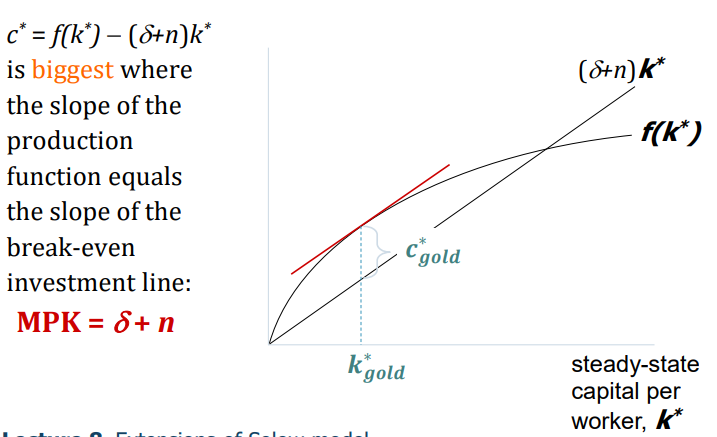
**Very important to note that K* gold is not where depreciation and production intersect. The k* at that point is what you would arrive at if you were to save as max as possible without having more depreciation than production.**

**See that k* gold is achieved where the slope of the production function equals tha tof the depreciation curve i.e. where there is the largest gap between production and depreciation arising from the equation that: $$c^* = f(k^*) - (d+n)k^*$$** Also via calculus:
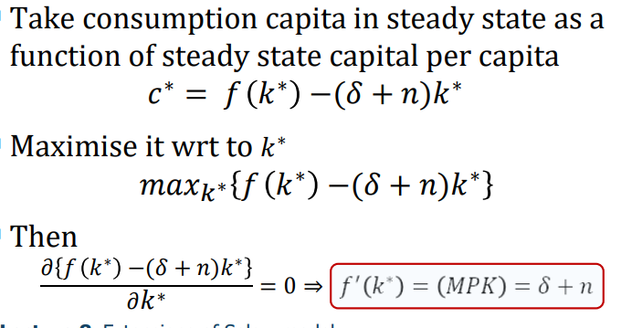

**Transition to the GR steady state:**
The economy does NOT have a tendency to move toward the Golden Rule steady state. Achieving the Golden Rule requires that policymakers adjust savings rate s. This adjustment leads to a new steady state with higher consumption

Economy with too much capital:
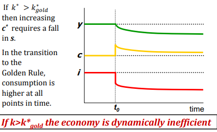

Economy with too little capital:
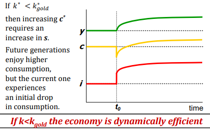

**Solow model and Convergence**
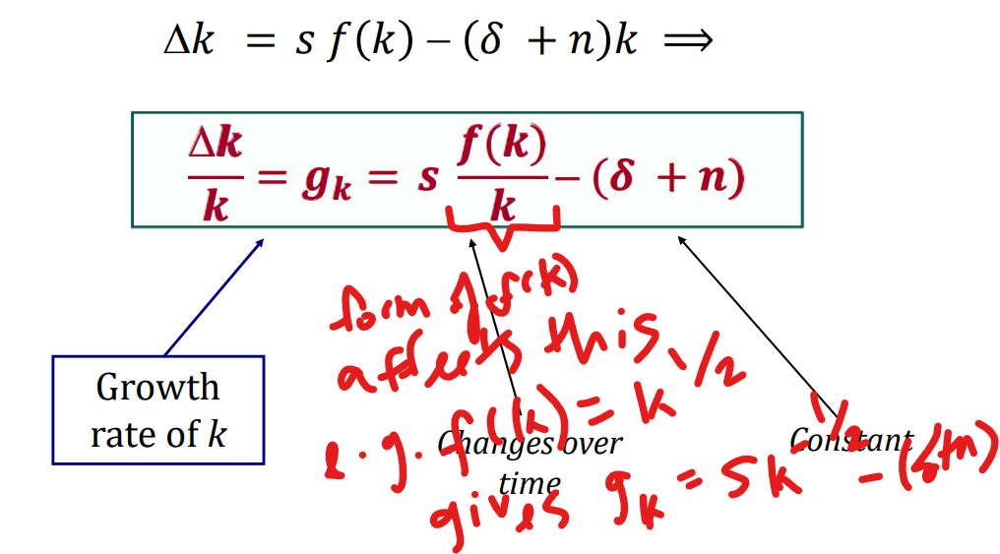
In the above case using a sort of cobb-douglas production function shows that growth reduces as capital stock per person increases (the implicatation is there is convergence between capital rich and capital poor countries). Visually:
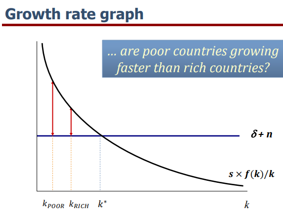
If the world behaves like the Solow model, we should observe convergence if countries differ only with respect to initial capital and share same s, n, δ. Then poor countries should grow faster and we would expect a negative relationship between initial income and growth.

Such convergence is observed when we consider only the cluster of developed economies there is a clear negative relation between GDP/capita and growth:
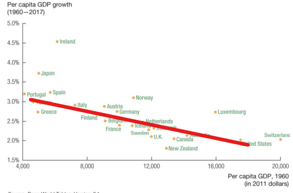
E.g./ The great divergence:

This doesn't mean the Solow model fails.

- In samples of countries with similar savings & pop. growth rates, income gaps shrink about 2%/year
- In larger samples, if one controls for differences in saving, population growth, and human capital, incomes converge by about 2%/year

Consider for example a country being poor due to its low saving rate:
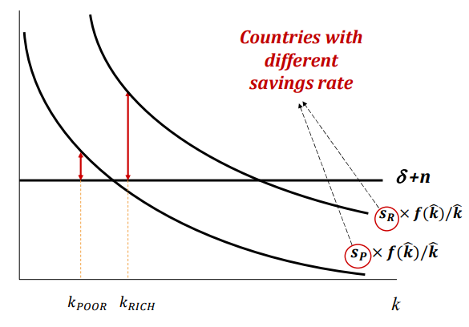
What the Solow model really predicts is conditional convergence - **countries converge to their own steady states, which are determined by saving, population growth, and productivity**. And this prediction comes true in the real world and is consistent with the great divergence.

**EVALUATING THE SOLOW MODEL**
*Strengths*
1. Gives us: **long run = steady state**
2. The principle of **transition dynamics** – allows for understanding of differences in growth rates across countries – a country further from k* grows faster
*Weaknesses*
1. It focuses on investment and capital and so does not provide a theory of sustained long‐run economic growth.
2. The much more important factor of productivity A is still unexplained 
3. Doesn't explain why countries have different investment and productivity rates 
4. A more complicated model could endogenise the investment rate

These weaknesses are the precursor to introducing technology in the production function. Either through *exogeneous growth theory* or *endogenous growth theory*. 

**Romer's Augmented Solow Growth Model**
Augmented Solow growth model: 
- A new variable: E = labour efficiency 
- Technological progress is labour‐augmenting. (hence the indice is same)
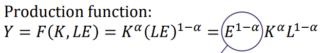
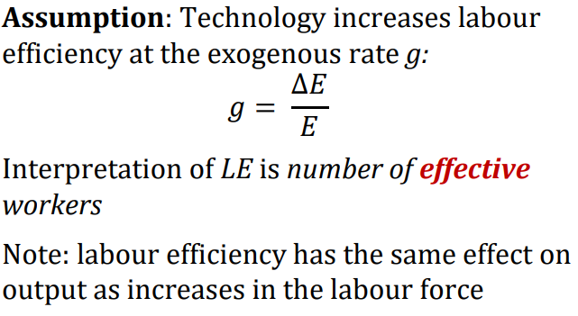
**NOTE: Working in terms of the effective worker then we get:**
y = Y / LE and k = K / LE. (Intuitively, the effective worker is thought of as 'the worker with tools and jacket' as opposed to just worker)
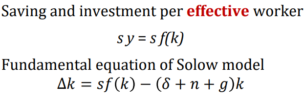
NOTE: The 'break-even investment' term that is tacked on. It consists of:
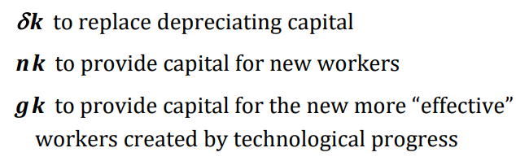
Using differentiation wrt to k* for the golden rule steady state again:
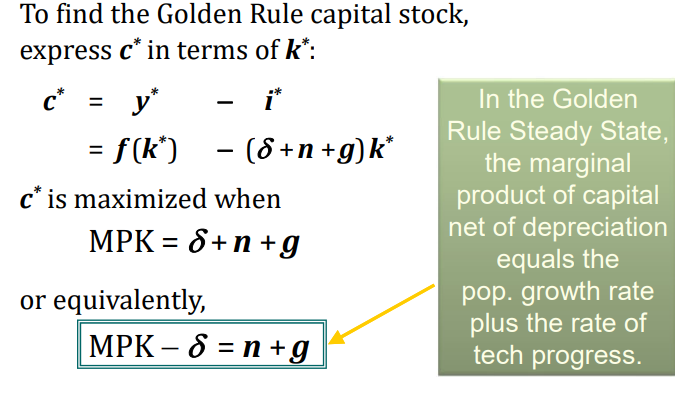
Importantly this leads to a new long run growth rate that is non-zero:
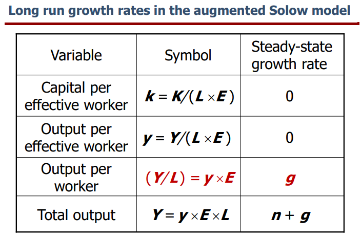

Important takeaways:
1. Per capita variables grow at rate of exogenous technological progress g 
2. Policy changes have *level*, but not growth effects
3. We have not explained where technological growth comes from

**POLICY**
Policy can be used to determine the correct saving rate by considering how:
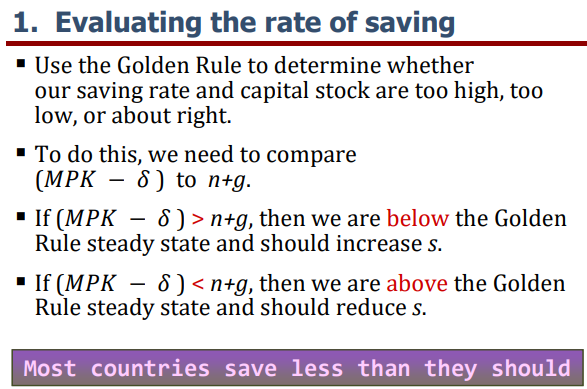
