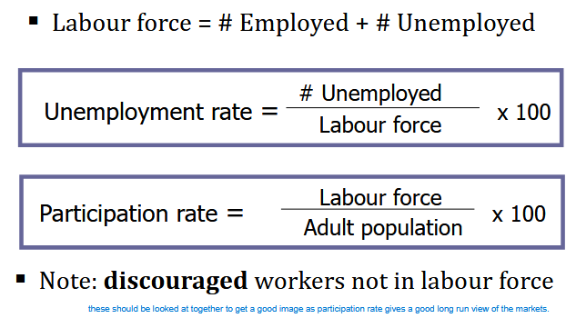
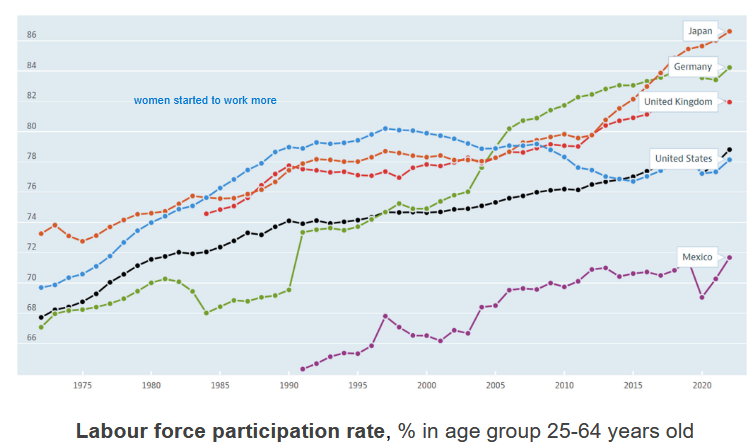
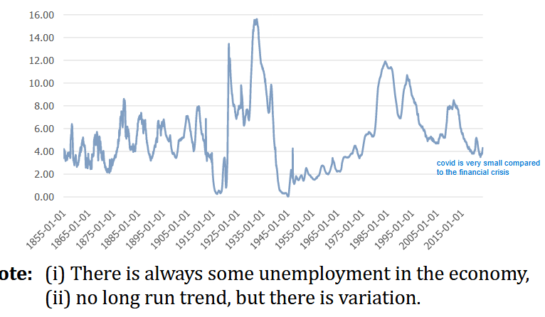
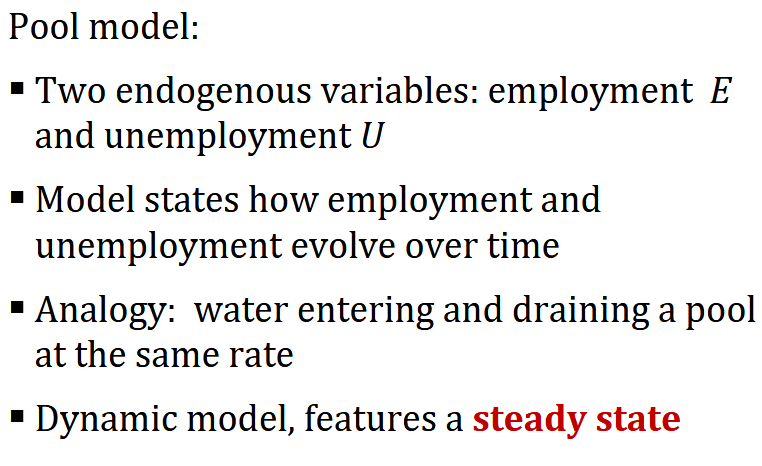
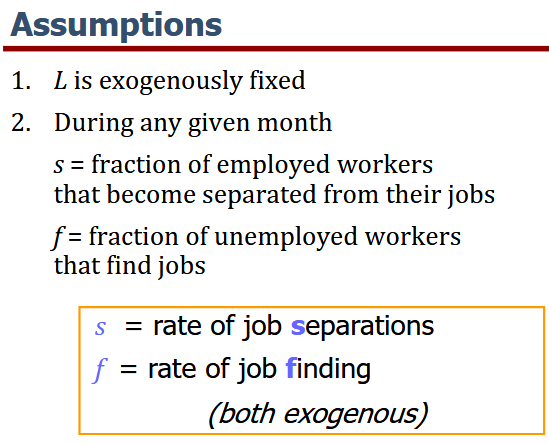
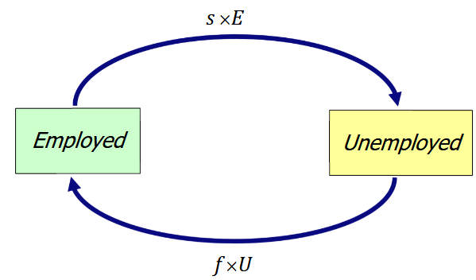
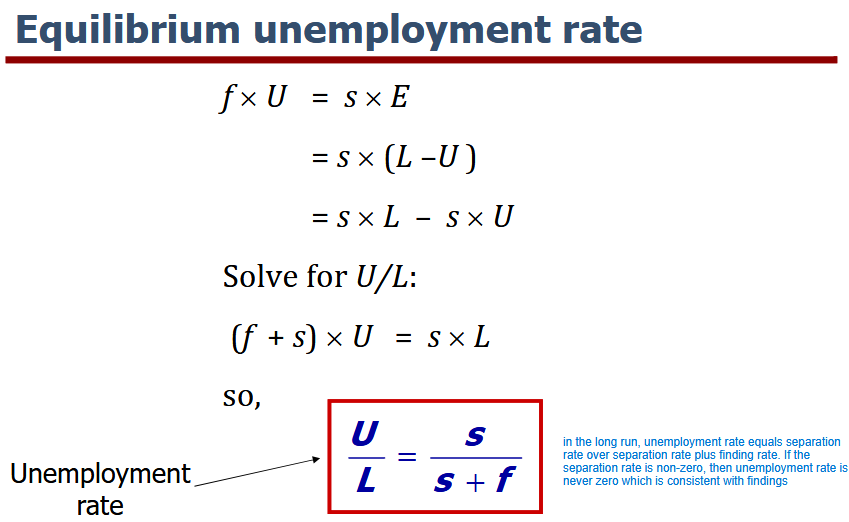

Lecture notes and slide extracts: [Chryssi Giannitsarou](https://sites.google.com/site/giannitsarou/), University of Cambridge, Part I Macroeconomics. Teaching examples and values in slide extracts are reported from the course material [R]. Several diagrams are textbook extracts from N. Gregory Mankiw, *Macroeconomics*, and C. I. Jones, *Macroeconomics*, as cited in the readings below.

Natural rate of unemployment: - the average rate of unemployment around
which the economy fluctuates:

- In a recession, the actual unemployment rate rises above the natural rate 
- In a boom, the actual unemployment rate falls below the natural rate

In the steady state then sxE = fxU

## Issues

- This model gives a way to calculate the natural rate of unemployment in the long run. BUT it does not explain why and how there was unemployment in the first place
- Assumes job finding is not instantaneous, BUT it does not explain why.

A policy will reduce the natural rate of unemployment only if it lowers s or increases f

- If job finding were instantaneous (f = 1), then all spells of unemployment would be brief and the natural rate would be near zero
- There are two reasons why f < 1
  1. job search
  2. wage rigidity

## Job Search

Job search times are essentially equivalent to frictional unemployment which occurs:

1. workers have different abilities, preferences
2. jobs have different skill requirements
3. geographic mobility of workers not instantaneous
4. flow of information about vacancies and job candidates is imperfect

1. Sectoral shifts - changes in the composition of demand among industries or regions (e.g. in the 80s secretaries who can use computers being preferred to typewriters). It takes time for workers to change sectors, so sectoral shifts cause frictional unemployment.

   E.g./ 
   - Late 1800s: decline of agriculture, increase in manufacturing
   - Late 1900s: relative decline of manufacturing, increase in service sector
   - 1970s: energy crisis caused shift in demand away from gas guzzlers to smaller cars
   - 2020s: shifts due to Covid pandemic? Energy crisis?

2. Unemployment insurance - UI pays part of a worker’s former wages for a limited time after losing his/her job (unemployment benefit).

   UI increases natural rate, because it:
   - reduces the opportunity cost of being unemployed
   - reduces the urgency of finding work
   - hence, reduces f

   NOTE: There is a benefit to this; it may lead to better matches between jobs and workers. Which would lead to higher productivity and incoems.

3. Public policy such as:
   1. Govt employment agencies: disseminate info about job openings to better match workers & jobs
   2. Public job training programs: help workers displaced from declining industries get skills needed for jobs in growing industries

## Readings

Jones: 7.1-7.5 (focuses more on US labour market)
Mankiw: Chapters 7 and 10.1
