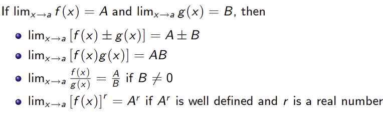
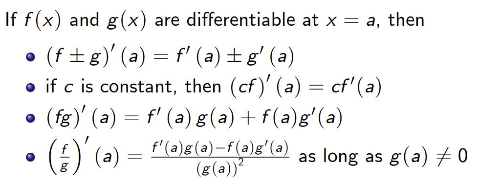
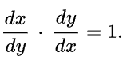
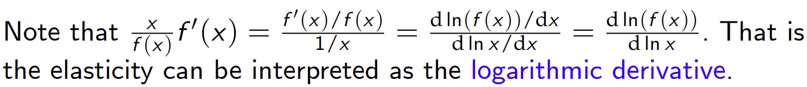

Slide extracts: University of Cambridge, Part I Paper 3 (Quantitative Methods), Mathematics. Worked examples in the slide extracts are reported from the course material [R]. Textbook results follow K. Sydsæter, P. Hammond, A. Strøm and A. Carvajal, *Essential Mathematics for Economic Analysis* (5th edn). Handwritten derivations are the author's own.

Basic rules for limits:

Basic rules for derivatives:

Derivative of inverse function:
From leibniz notation

So if function is f(x). And we let inverse equal g(x). Then, **g'(x) = 1/f'(g(x))**

E.g/
![Handwritten worked example: f(x) = sin(x) on [−π/2, π/2] with inverse g(y) = arcsin(y); differentiating gives g'(y) = 1/cos(arcsin y) = 1/√(1 − y²).](../../assets/notes/year1/65e06358d1ebf1c6dfa3.png)

Implicit Function

Elasticity of f wrt x

Conveniently this is equivalent to the logarithmic derivative of f(x) at x:

e.g. Consider finding the elasticity of quantity demanded with respect to price (PED):
1.  PED = dD/dP * (P/D)
2.  PED = d ln(D) / d ln(P) i.e. derivative of ln(D) over derivative of ln(P) both wrt price.
