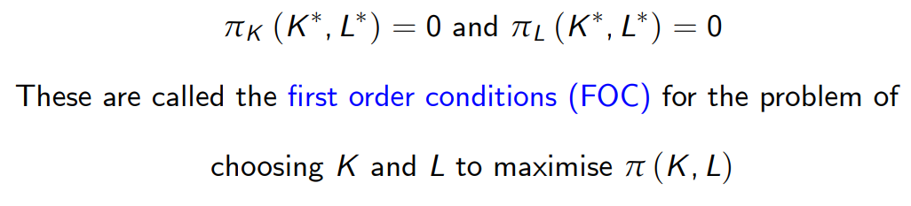
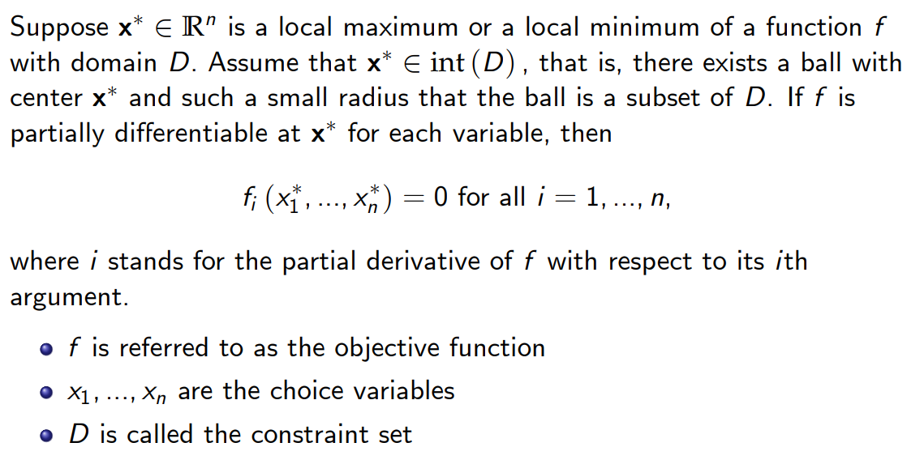
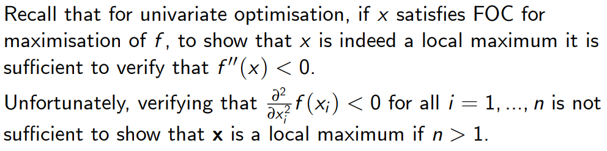
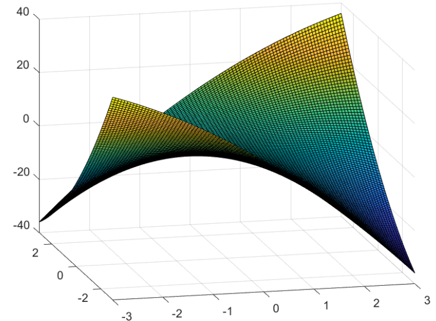
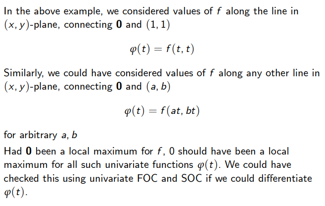
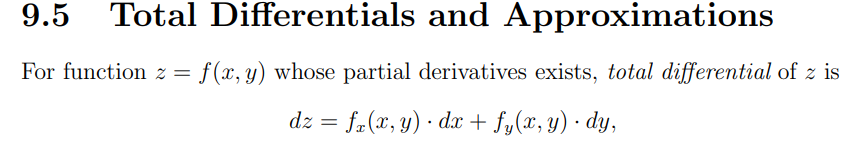
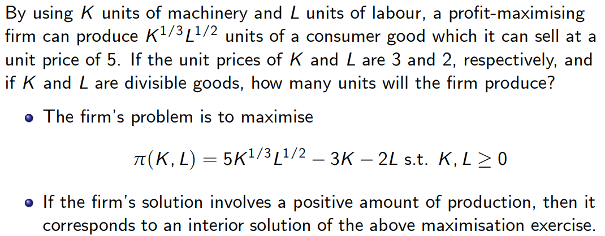
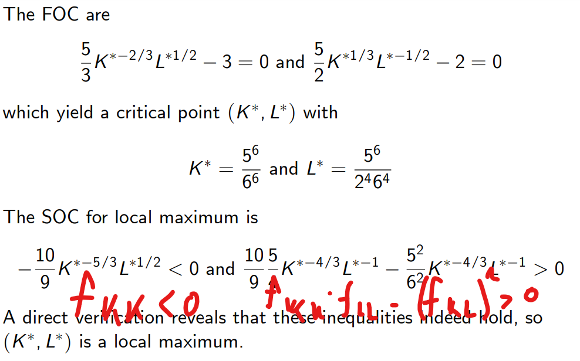
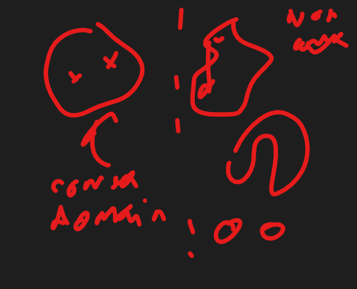

Slide extracts: University of Cambridge, Part I Paper 3 (Quantitative Methods), Mathematics. Worked examples in the slide extracts are reported from the course material [R]. Textbook results follow K. Sydsæter, P. Hammond, A. Strøm and A. Carvajal, *Essential Mathematics for Economic Analysis* (5th edn). Handwritten derivations and annotations are the author's own.

Readings from the textbook: 13.1-3 
Suggested exercises (ex.) from the textbook: 13.1 Ex.1-3; 13.2 Ex. 2-4, 13.3 Ex. 1,2,5,6.

In this case profit is the objective function, under inputs capital and labour. 

**First-order conditions for problem of maximising profit**
The partial derivatives wrt to K,L are equal to zero:

So that in genereal we have the following:

**Second order conditions**
In 2-D there are saddle points which mean that the second order condition is no longer as simple for checking its a maximium.

This is because partial derivatives check how the changes occur along an axis - consider moving 45 degrees ish in both axes then:

Graphically this looks like:

The issue is that we are considering changes assuming the other is constant. Instead, we should consider x and y being variable and differentiate in that way. i.e. in the above example check the second derivative is < 0 for all *combos* of a,b. That requires taking **the total derivative**.

**The chain rule in two dimensions**

(recall the formula): 

Let's consider checking whether there is an extremum at zero:

Now completing the square, then checking what is needed for the SOC:![Lecture slide with the author's annotations: completing the square in φ''(0) gives f_xx(0)·(a + b·f_xy(0)/f_xx(0))² + b²·[(f_xx(0)f_yy(0) − f_xy(0)²)/f_xx(0)]; this is negative for all (a, b) ≠ 0 iff f_xx(0) < 0 and f_xx(0)f_yy(0) − f_xy(0)² > 0, which also forces f_yy(0) < 0, so the Hessian is negative definite.](../../assets/notes/year1/d3ce8ffadcd4cc69484c.png)
Consider the following logic:
1. On the one hand if we let the second term be zero then the first term has to be negative which implies fxx(0) < 0.
2. we select a and b such that the the first term turns to zero. In that case the second term has to be negative. For that to hold the second fraction has to be negative, yet we already defined fxx(0) as negative thus the numerator must be positive. 
3. Looking closer at the numerator we can also deduce fyy(0)<0
Together this means the Hessian matrix is **negative-definite**. 
*NOTE: All 3 forms of the conditions are equivalent and can also be used see: *

So in summary:

Here the inequalities are strict because only considering x*.

For example  consider the following maximisation problem:

Then, 1. using the FOC to find the point and  2. checking the SOC if it's a maximum

This is a global maximum in the instance that the function is **concave**. It is a global minimum in the instance that the function is **convex**. *NOTE: convexity and concavity are defined on only convex domains.*

(NOTE: That we are considering this for any point, x in the domain)

Recall **convex domain** can be considered visually

