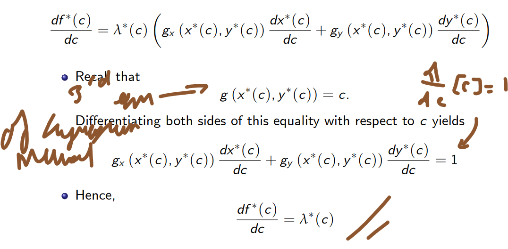
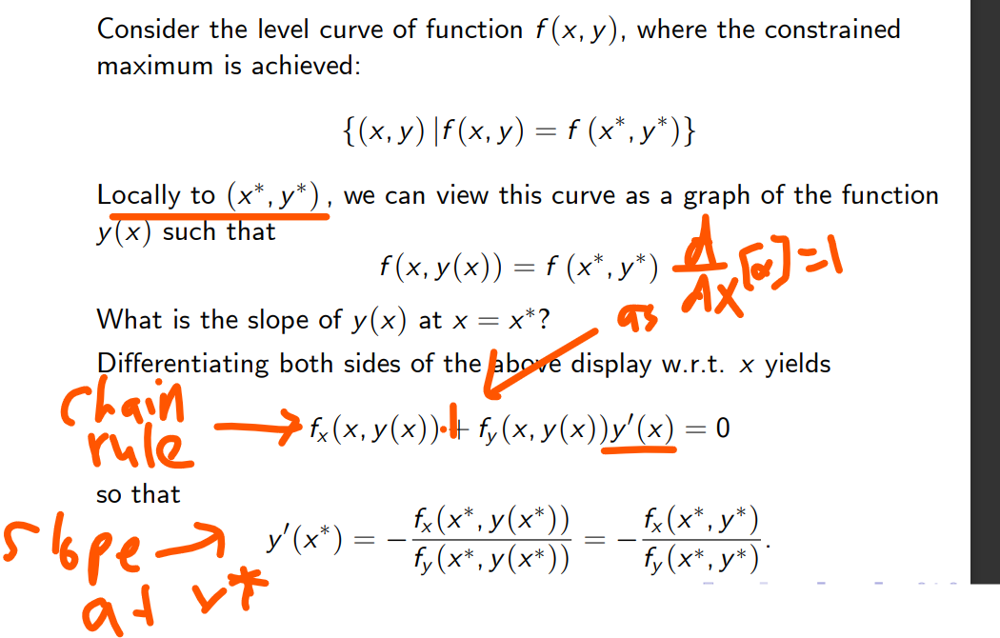

Slide extracts: University of Cambridge, Part I Paper 3 (Quantitative Methods), Mathematics. Worked examples in the slide extracts are reported from the course material [R]. Textbook results and diagrams (Figures 14.4.1–14.4.2) follow K. Sydsæter, P. Hammond, A. Strøm and A. Carvajal, *Essential Mathematics for Economic Analysis* (5th edn). Handwritten derivations and annotations are the author's own.

Readings from the textbook:14.1-5 
Suggested exercises (ex.) from the textbook:14.1 ex. 1,2,5,8; 14.2 ex. 4,5; 14.3 ex.3,4; 14.4 ex. 1,3; 14.5 ex. 4
![Lecture slide with the author's annotations: a constrained problem max/min f(x, y) s.t. g(x, y) = c is solved by the Lagrange multiplier method — (1) form the Lagrangian L(x, y) = f(x, y) − λ[g(x, y) − c]; (2) set ∂L/∂x and ∂L/∂y to zero, which with the constraint give the first-order conditions f_x − λg_x = 0, f_y − λg_y = 0, g(x, y) − c = 0; (3) solve for x, y, λ to get the solution candidates.](../../assets/notes/year1/4336d5b2a239ed57f109.png)

**Interpretation of the Lagrange multiplier**

Then substituting for all the partial derivatives not in terms of c:

The Lagrange multiplier is the rate at which the optimal value of the objective function changes with respect to changes in the constraint constant. This means if the constraint changes by small amount (differential dc) then:

**Necessary and Sufficient conditions for method  to work**:

![Lecture slide with the author's annotation "from the theorem": if (x₀, y₀) satisfies the FOC and is a global maximum of the Lagrangian L(x, y), then for any (x, y) satisfying the constraint the inequality f(x, y) − λ(g − c) ≤ f(x₀, y₀) − λ(g₀ − c) reduces to f(x, y) ≤ f(x₀, y₀), so (x₀, y₀) solves the constrained problem. Theorem (concave/convex Lagrangian): if (x₀, y₀) satisfy the FOC and the Lagrangian is concave, (x₀, y₀) solves the maximisation problem; if it is convex, they solve the minimisation problem.](../../assets/notes/year1/8148022e3ff6a85ca02f.png)
The concavity check of the Lagrangean (see previous lecture)

