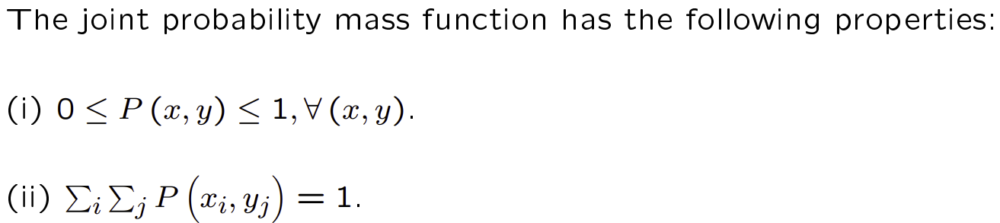
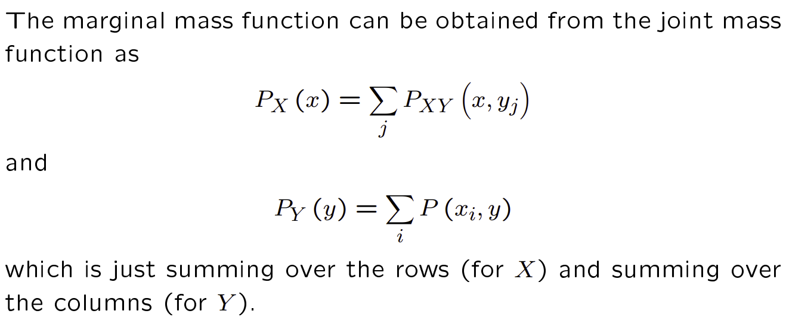
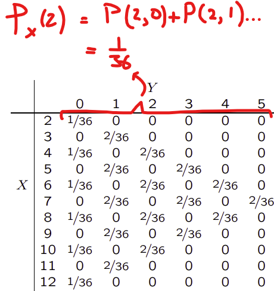
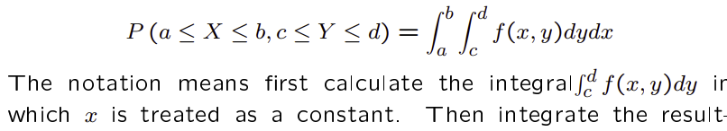
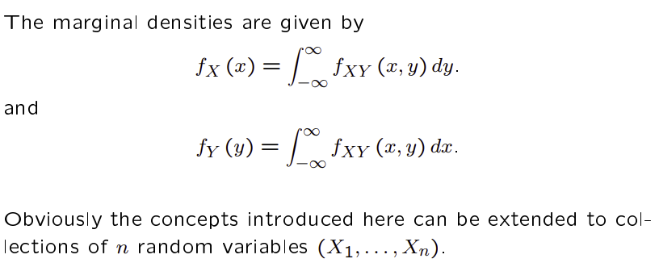
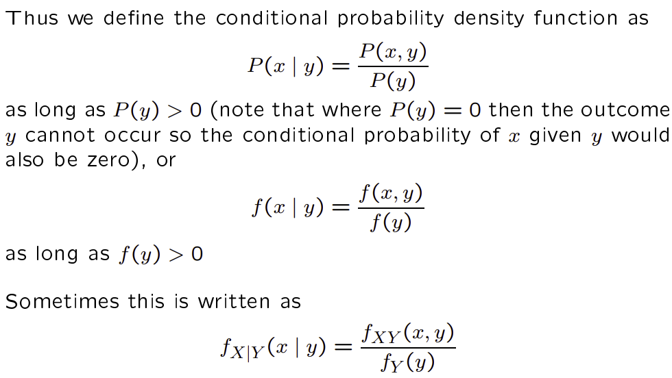
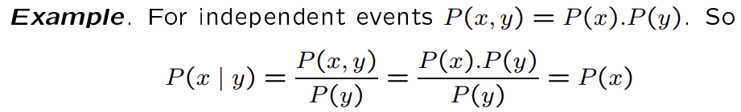

Slide extracts: University of Cambridge, Part I Paper 3 (Quantitative Methods), Statistics. Worked examples and numerical values in the slide extracts are reported from the course material [R]. Handwritten derivations are the author's own.

**DISCRETE**
If we have two random variables we can consider their joint behaviour. In the discrete case that is:

When working with several random variables we sometimes need to consider the probability distribution or the density of a single component, e.g. P(x) or f(x). 

Discrete Marginals:
In this context we refer to P(x) as the marginal probability mass function of X and to f(x) as the marginal density of X. Sometimes people write P_XY as the joint and P_X and P_Y (equivalently f_XY (x, y) and f_X(x) and f_Y(y)) as the joint and marginals.

see the example here; P(x=2) = P(x=2|y=0) + P(x=2|y=1) + ... :

**CONTINUOUS**
For continuous random variables the joint probability density function is now a function of two (or more) variables f(x, y). Again we have f(x, y) ≥ 0 for all x and y. Where in the discrete case we have double summations in the continuous case we have to use integrals. So to evaluate probabilities we have the joint probability density function satisfies the double integral:

[NOTE: You will not be required to evaluate double integrals as part of this course].

Continuous Marginals:

The marginal for x assumes that x is a constant. That means y is variable and so we intgrate f(x,y) with respect to y while treating x as a constant. [Finally yielding a function solely in terms of x as expected]. 

The limits when integrating wrt to y will be y1 and y2. Corresponding to the values of x1 and x2.

NOTE: whenever you define a function don't forget to define its domain.

NOTE: It is possible to find marginals from a joint distribution, but you cannot find a joint distribution from the marginals (unless the two events are independent).

Conditional density functions:

Naturally for independent events that means:

