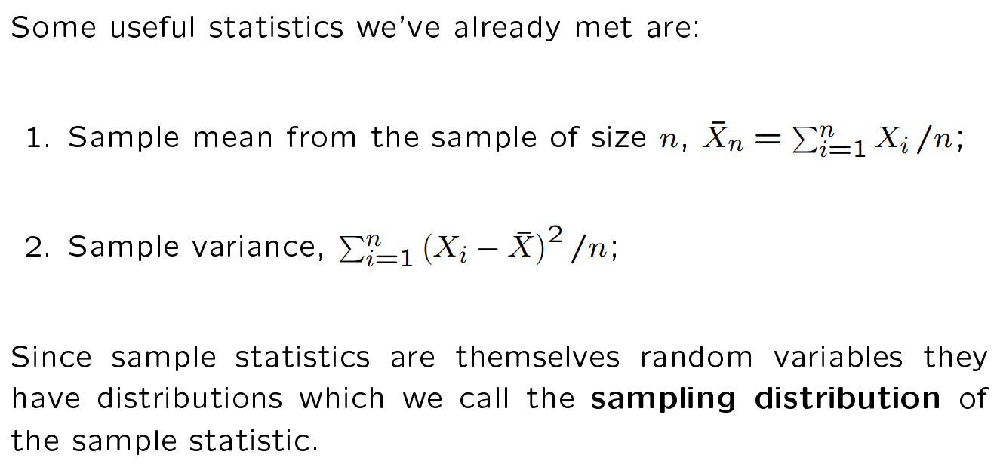
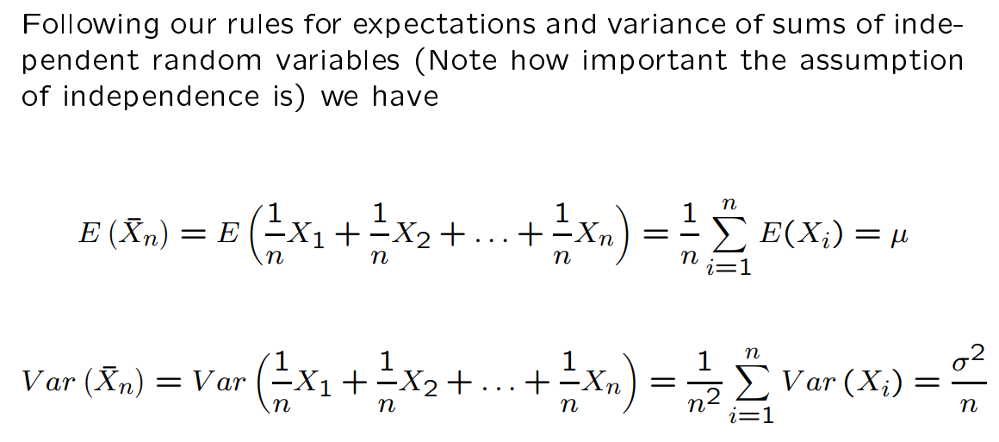
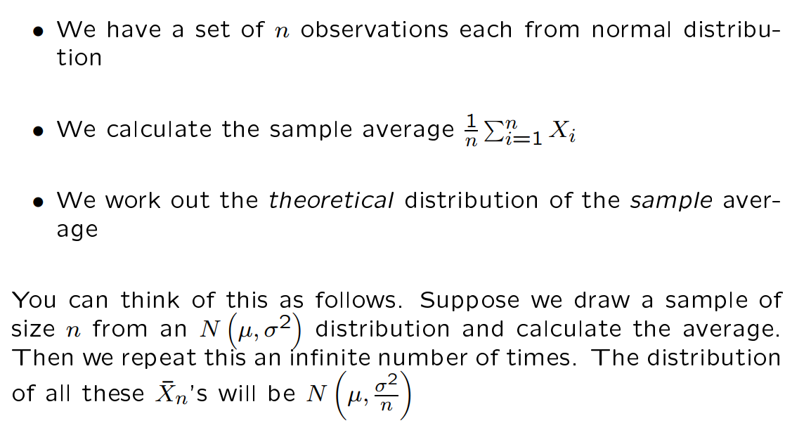
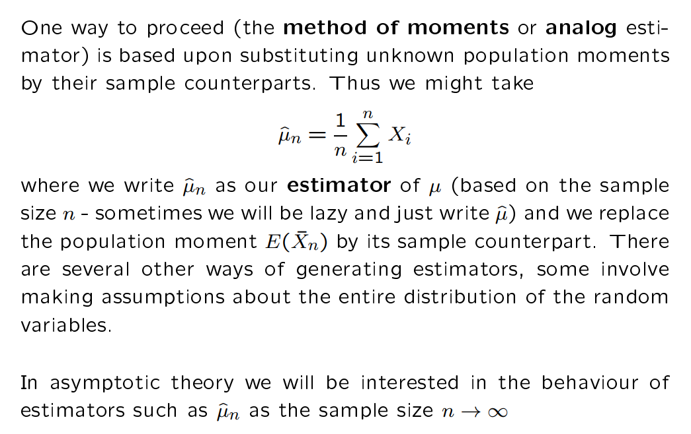
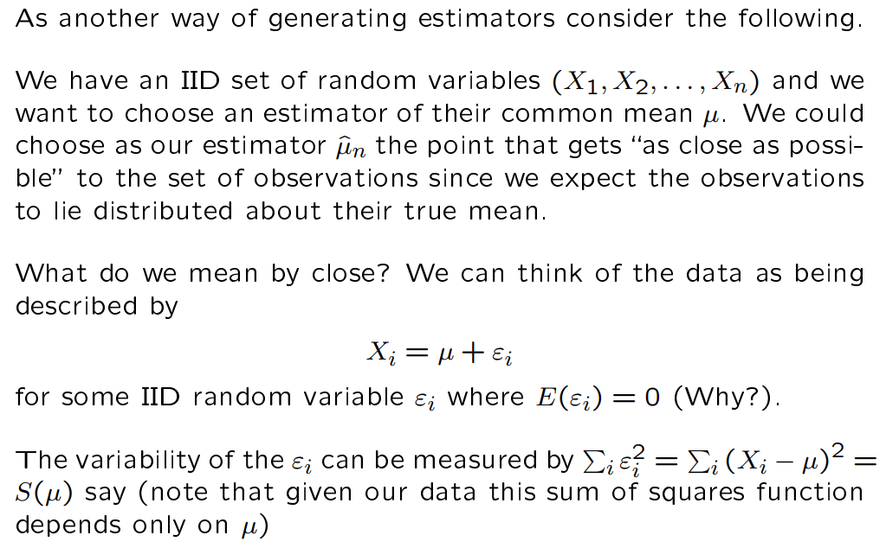
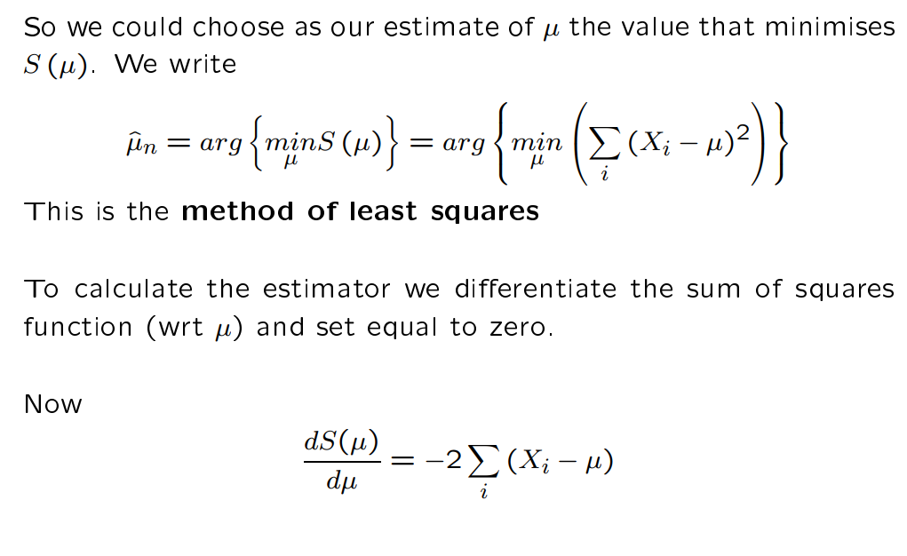
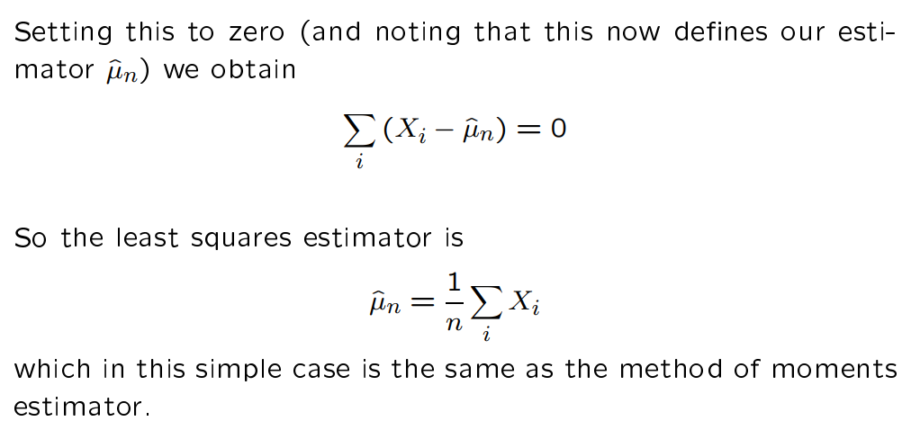
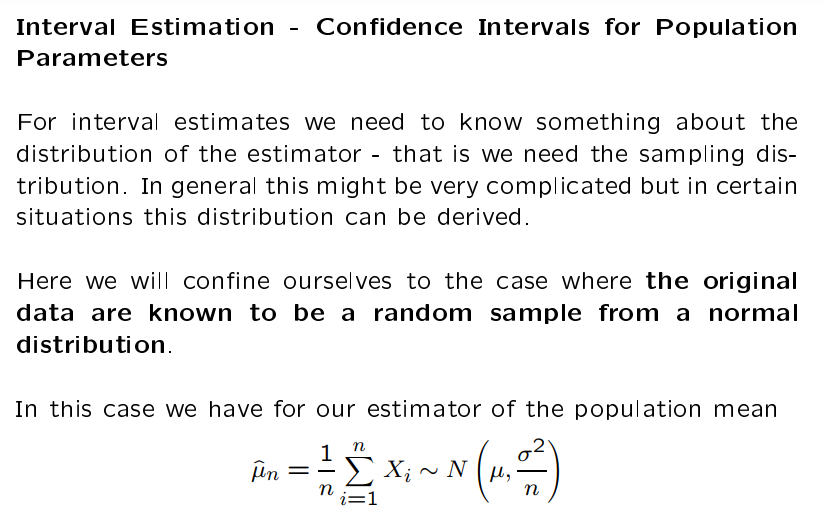

Slide extracts: University of Cambridge, Part I Paper 3 (Quantitative Methods), Statistics. Worked examples and numerical values in the slide extracts are reported from the course material [R]. Handwritten derivations are the author's own.

1. A sample (of size n) is a collection of random variables (say X_1, X_2,... , X_n) from the population. If the random variables constituting the sample are independently and identically distributed (abbreviated IID), then the sample is said to be **random**.

2. An observation is the known value that each collected random variable assumes (say X 1 = x 1, X 2 = x 2, . . . , X n = x n)

3. A statistic is a function of the sample (say θˆ = θˆ ( X 1, X 2, . . . , X n )). **Therefore, a statistic is itself a random variable.**

This is important, it means that statistics (such as the mean and variance (the sample ones, not the actual ones)) are random variables with moments too

Consider the distribution of the sample mean:

This is calculated from using the definitions of expectaiton and variance. Crucially it requires the assumption of *independence* to hold:

**Estimation and inference**
Statistical inference can be classified into point estimation and interval estimation: in the former case we are interested in assigning a value to an unknown parameter; in the latter case we define an interval within which we have some confidence that the true value of the unknown parameter falls.

Suppose we know (or are prepared to assume as a model) that the random variables X i satisfy E ( X i ) = µ and we are interested in producing an estimate of the parameter µ. Now we know that E ( X¯ n) = µ

**Method of moments estimation, analog estimator (i.e. subbing in the sample value (an observed quantity) for the population moment (a random variable)).**

**method of least squares estimation**

E is deviation from mean, the variability is measured by summing squares (resolves negative problem). Then we aim to minimize the sum of the error squares below:

The **quantity that minimizes the distance to the random variable u** is the **estimator** for u. We can calculate it from calculus and set it to zero:

Some convenient tips:
1. Can take a montone transformation of S(u) and finding the value of u that minimizes the transformed function can be easier.
2. Different choices of the objective function i.e. S(u) are possible e.g. instead of summing squares could simply sum the absolute values. This would give a different estimator.

**Interval Estimation**

Transforming back to the z-normal distribution i.e. the pivotal quantity:

The expression on the left depends on things we know µˆ n, and things we do not µ, σ. But the expression on the right is completely specified. We call a function of the data and unknown parameters whose distribution is known a pivotal quantity.

This is similar to the standardisation of a normal variable, but this time we are accounting for the fact that we are using an estimate of the mean from a sample of size n. Hence not x-u over sigma. But sqrtn (uest - u) over sigma.
![Lecture slide: since 95% of an N(0, 1) mass lies in [−1.96, 1.96], a 95% interval for √n(µ̂ₙ − µ)/σ is [−1.96, 1.96], hence a 95% confidence interval for the population mean is µ ∈ [µ̂ₙ − 1.96 σ/√n, µ̂ₙ + 1.96 σ/√n].](../../assets/notes/year1/adb21633a161cc2d6ef2.png)

NOTE: As n->infinity, the estimate tends to u

And note that in order to calculate this confidence interval we have assumed

- Random (i.e. independent) sampling
- The data are generated as N(µ, σ^2)
- We know σ

If we don't know sigma, then we can use the t-distribution. If we don't have a normal variable we can take a large enough sample such that it can be approximated by a normal distribution. If we don't have random sampling then there is a fundamental of the problem.
