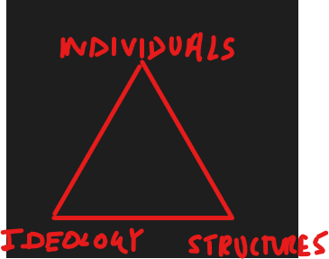

Notes on Ragkousis’s essay-writing guidance, with revision shorthand on ideology and economic theory. [R] records the source note; [U] marks essay lengths and timings not checked against current exam guidance.

## Read the question carefully

- Read the question carefully, see the source of ambiguity that is the two concepts of 'coherence' and 'political order'. 
- Going through this in an essay requires picking definitions of said concepts, after critically analysing the best definition either from readings (or picking one's own definition).
- Consider facts as dots, the causal links being the lines that join the dots. We collect causal links under *titles*, then join titles to form a *narrative*. 
- A narrative takes a *strong opinion* to answer the question. Do consider opposing narratives *but punch them down quickly*. 
- Within these titles facts are assembled via *causal links* to form the argument within each title. ***THAT MEANS WE DO NOT LIST FACTS***

## Interest, ideology, structure

- For consistency an essay can only be answered from 2 of 3 [R]:

*Diagram from the original supervision notes.*

- Individuals being the interests that govern them (so approaching this essay, we could consider Churchill's interests as vote-seeker being cause for the CON party to adopt X policy)
- Ideology (consider Churchill's *ideology as a CONSERVATIVE* this ideology informs his views on adopting policy X) NOTE: This is a mix of individual and ideology. 
- Structure (consider how the shifts in social class led to adoption of policy X)
- (GOING FORWARD USE **INTEREST, IDEOLOGY**)

***NOTE: It is far easier to argue about the existence of something than the absence of it. Always presuppose that something exists when writing.***

## Essay writing tips

Typed 1500 words [U].

Reference fully, e.g. if quoting word for word then do a proper page number reference. If simply using their idea just say (author,date).

1. Consider essay **structure** in terms of titles, I,II etc.
2. Now by joining the titles we form the argumentation (everything flows from the structure)
3. Write the introduction - this is a brief outline of the argument i.e. if we are using titles then simply connecting the titles together sets out the structure of the argument. 
4. I Title - Choosing definitions for rest of the essay, discuss why you chose that one as opposed to the others (be fair, evidence your critical thinking behind picking a definition).
5. II Title - First point of the argument, under this are the facts. **DO NOT LIST FACTS** instead draw causal links between them to provide a structure to the point
6. III Title - Same as above
7. IV Title - Same as above
8. V Conclusion - Final blow

## Causal Links

Causal Links take the form of:

- Point, Evidence, Explain how answers Q.
- OR Evidence, Point, Explain, how answers Q.

In practice in the exam you have 15 mins [U] to prepare for the question. That means spending 10 mins [U] just on the structure.

## A note on ideology

- CONSERVATIVE - That society and all its workings are a single 'body' or organic whole. The role of the state then is to maintain the social cohesion i.e. the functioning of the body. This is not necessarily an exclusionary concept but *consider far-right, the 'body' then becomes exclusionary what parts are in or not in the body at least under Hitler would be determined by genetics...*
- LIBERAL - There are only individuals. The state should provide options to individuals (not make decisions as to what choices are made)
- LABOUR/SOCIALIST - There is only eternal struggle of class conflict; *of bourgeoisie hoodwinking the electorate (proletariat) into thinking their interests are aligned under the capitalist system*

NOTE: Both liberals and socialist tend to show universalist/internationalist tendencies as they take the narrow view of the individual/broad view of social class. Both of these are concepts that are irrespective of nationality, genetics etc.

## A note on economic theory

| STRUCTURAL ANALYSIS | INDIVIDUAL ANALYSIS | 
| -------- | -------- |
| Marxism | Monetarist | 
| Classical (Smith,Ricardo) | Neoclassical |
| In other words the most basic unit of analysis is CLASS, the workers, landowners, capital owners. Respectively receiving wage,rent,profit | The neoclassical revolution saw the INDIVIDUAL as the unit of analysis. That is individual transactions aggregating together to form demand,supply and equilibrium.|

- It was the Great Depression that saw a paradigm shift from neoclassical -> Keynesian. 
- It was the [1970s](https://www.bankofengland.co.uk/working-paper/2000/uk-monetary-policy-1972-1997-a-guide-using-taylor-rules) [R] stagflation that saw a paradigm shift from Keynesian -> monetarist
