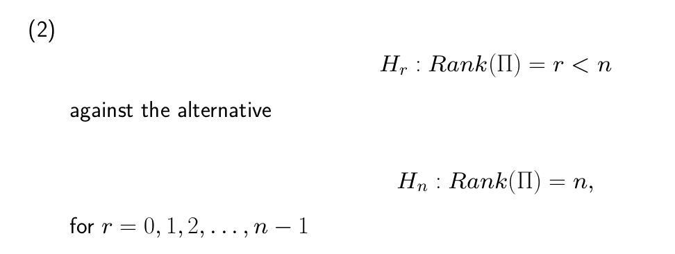
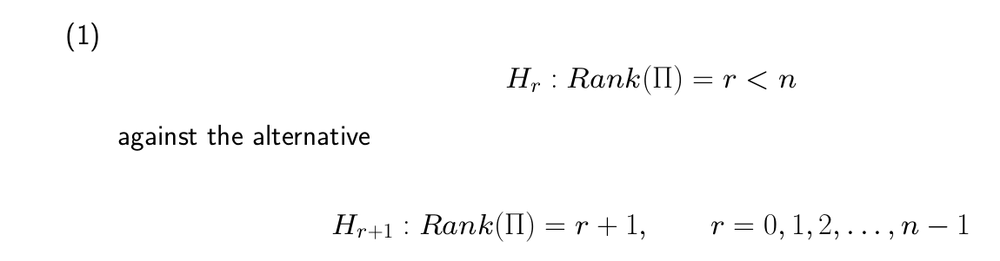

Part IIB Econometrics (Paper 10), Time Series. Reading: Pesaran, *Time Series and Panel Data Econometrics*, Ch. 22. The numbered hypothesis panels are extracts from the course lecture notes and the multi-part worked question below is Cambridge Economics Tripos Paper 10, 2016; the dark-background screenshot is the author's own notes. The derivations otherwise follow the lectures.

## Lecture Notes

### Motivation

We assume that the variables are I(1) for this analysis. In general many economic variables are considered I(1) (think GDP, Price level etc.)

If your variables $x_t$ are $I(1)$, you have two "wrong" ways to estimate a standard VAR:
- **VAR in Levels:** Estimating $x_t$ directly. 
    - While it might work in very large samples, it is **inefficient** because it ignores the specific mathematical constraints that cointegration imposes on the relationships between variables.
- **VAR in First Differences (**$\Delta x_t$**):** Estimating only the changes. 
    - This is **misspecified** (wrong) if the variables are cointegrated, because you throw away the "long-run" information. You are missing the "error correction" that pulls variables back together when they drift apart.** **
**The Solution: The Vector Error Correction Model (VECM)** The VECM is the "best of both worlds." It uses **first differences** (to handle the non-stationarity) but adds back the **cointegrating residuals** as right-hand-side variables.

### VECM

#### Derivation of VECM

Let $\bold x_t$ be a n x 1 vector of variables. We assume it follows a VAR(p) in levels so: 
$$
x_t = a_0 + a_1 x_{t-1} + a_2 x_{t-2} + \dots + a_p x_{t-p} + e_t
$$
Subtracting $x_{t-1}$ from both sides we get that: 
$$
\Delta x_t = a_0 + \zeta_0 x_{t-1} + \zeta_1 \Delta x_{t-1} + \zeta_2 \Delta x_{t-2} + \dots + \zeta_{p-1} \Delta x_{t-p+1} + e_t
$$
- $\Delta x_t$: The **Short-Run** dynamics (I(0) variables)
- $\zeta_0 x_{t-1}$: The **Long-Run** relationship. This is the most important term.
- $\zeta_1 \dots \zeta_{p-1}$: The lagged differences (also I(0)).

#### Cointegration and the Rank of $\zeta_0$

The matix $\zeta_0$ is the key to understanding how many long-run relationships exist. If there are $r$ cointegrating vectors, we can decompose this into two matrices: 
$$
\zeta_0 = \underbrace{\alpha}_{n\times r} \underbrace{\beta '}_{r\times n} 
$$
- Notice that $\zeta_0$ is an n × n matrix of rank r. 
$\beta'$** (The Cointegrating Vectors / The "Target")**
 $\beta$ contains the weights of the long-run equilibrium.
- When you multiply $\beta'$ by the variables $x_t$, the result is $\beta' x_t$.
- Even though $x_t$ is $I(1)$ (trending), the combination $\beta' x_t$ is $I(0)$ (stationary).
- **Intuition:** Think of $x_1$ and $x_2$ as two drunk walkers. They move randomly ($I(1)$), but they are connected by a leash ($\beta$). The length of the leash ($\beta' x_t$) is stable ($I(0)$).

$\alpha$** (The Adjustment Coefficients / The "Correction")** 
$\alpha$ tells the system how to react to the "leash." • If $\beta' x_{t-1}$ is not zero, it means the variables are "out of balance" (the leash is stretched). •$\alpha$ determines the **speed** at which each variable in $\Delta x_t$changes to pull the system back to the long-run equilibrium.

Visually if n =3, r = 1, for r = 1 only one unique LR equilbrium that makes the 3 variables stationary. 
$$
\underbrace{\zeta_0}_{(3 \times 3)} = 
\underbrace{\begin{bmatrix} \alpha_{11} \\ \alpha_{21} \\ \alpha_{31} \end{bmatrix}}_{\alpha \ (3 \times 1)}
\underbrace{\begin{bmatrix} \beta_{11} & \beta_{21} & \beta_{31} \end{bmatrix}}_{\beta' \ (1 \times 3)}
$$
The VECM model is now expressed solely in terms of I(0) variables. 
$$
\Delta x_t = a_0 + \underbrace{\alpha}_{\text{constant}} \underbrace{(\beta' x_{t-1})}_{I(0)} + \underbrace{\zeta_1 \Delta x_{t-1}}_{I(0)} + \dots + e_t
$$
Of course you need to know what the true number of cointegrating vectors, r, is.

### Johansen Procedure (for testing r, and estimation)

To use the VECM, we must determine the exact number of cointegrating vectors ($r$). 
Johansen provides: 
- A Maximum Likelihood method to estimate these vectors, s.t. r cointegrating vectors.
- Before that, also methods to test the rank of $\Pi$ (which we called $\zeta_0$) i.e. the hypothesis of there being exactly r cointegrating vectors .

#### Testing the rank of $\Pi$

We test the null hypothesis ($H_r$) sequentially starting from $r=0$.

**The Eigenvalues (**$\lambda_i$**)** The procedure calculates $n$ eigenvalues ($\lambda_1, \lambda_2, \dots, \lambda_n$), ranked from largest to smallest. These $\lambda$ values represent the "strength" of the cointegrating links.
- If $\lambda_i = 0$, that specific combination is just random noise $I(1)$).
- If $\lambda_i > 0$, there is a stationary "bridge" ($I(0)$) between the variables.

Johansen uses these eigenvalues to build two specific Likelihood Ratio (LR) tests.** **
**A. The Trace Test (**$\lambda_{trace}$**)** This is a joint test. It checks if the "remaining" eigenvalues are all zero. 
- **Null (**$H_r$**):** There are $r$ or fewer cointegrating vectors.
- **Alternative (**$H_n$**):** There are n cointegrating vectors.
$$
L_{trace}(r) = -T \sum_{i=r+1}^{n} \ln(1 - \hat{\lambda}_i)
$$
**Strategy:** 
- You start at $r=0$. 
- If you reject, you move to $r=1$. 
- You keep going and then stop the first time you **fail to reject**.

B. The Maximum Eigenvalue Test ($\lambda_{max}$)
This is a specific test. It checks only the very next eigenvalue. 
$$
L_{max}(r, r+1) = -T \ln(1 - \hat{\lambda}_{r+1})
$$
- **Null (**$H_0$**):** There are exactly $r$ cointegrating vectors.
- **Alternative (**$H_1$**):** There are exactly $r+1$ vectors.
    

The "Critical Values" for the tests above change depending on whether you assume the data has a trend or an intercept.

| **Case** | **What's in Cointegrating Vector (β)?** | **What's in the VECM (Δx)?** | **When to use it?** |
| --- | --- | --- | --- |
| **Case 1** | No Intercept | No Intercept | Data has zero mean (Rare in Macro). |
| **Case 2** | **Intercept** | No Intercept | Data has no trend, but the mean is not zero. |
| **Case 3** | Intercept | **Intercept** | Data has a linear trend (e.g., GDP). |
| **Case 4** | **Linear Trend** | Intercept | Cointegrating relationship changes over time. |
| **Case 5** | Linear Trend | **Quadratic Trend** | Data has accelerating trends (Very Rare). |

- Case 3 is the most common for macroeconomic data (GDP, Consumption, etc.) because it allows for linear growth in the levels of the variables.

#### Estimating the cointegrating vectors

Once r is chosen, VECM allows us to see the dynamics. 
$$
\Delta x_t = a_0 + \underbrace{\alpha}_{\text{Speed}} \underbrace{(\beta' x_{t-1})}_{\text{Error}} + \sum \zeta_i \Delta x_{t-i} + e_t
$$
But what is the exact form of beta? 

Beta is the matrix of co-integrating vectors, this can be non unique but we only know what it is in theory. We need to test if the estimate that we get from our software yields a beta that is close to what we theorised.

This test essentially asks: *"If I force the model to behave exactly as my theory predicts, does the model's ability to fit the data get significantly worse?"*

#### **1. The Hypotheses**

- **Null Hypothesis (**$H_0$**):** The restrictions are valid. 
- The true $\beta$ is exactly $\begin{pmatrix} 1 & 1 \\ -1 & 0 \\ 0 & -1 \end{pmatrix}$.
- **Alternative Hypothesis (**$H_1$**):** The restrictions are not valid. The $\beta$ matrix is free to be whatever the data wants.

#### **2. The Test Procedure**

Step 1: Estimate the Unrestricted Model
You run the Johansen VECM procedure without forcing any specific numbers on $\beta$ (other than the bare minimum math constraints to make it solvable).
- The software calculates the "Unrestricted Log-Likelihood" ($L_U$).
- This represents the **best possible fit** the data can achieve.

Step 2: Estimate the Restricted Model
You re-run the VECM, but this time you hard-code the matrix $\beta$ to be your theoretical matrix.
- The software optimizes the *other* parameters ($\alpha$, $\Gamma$, etc.) around this fixed $\beta$.
- It calculates the "Restricted Log-Likelihood" ($L_R$).
- *Note: Since you constrained the model, *$L_R$* will always be lower (worse) than *$L_U$*. The question is: how much worse?*

Step 3: Calculate the LR Statistic
The formula is:
$LR = -2 (L_R - L_U)$ (Or equivalently: $2(L_U - L_R)$).
- This statistic measures the "distance" between the unrestricted fit and the restricted fit.
- If the restriction is harmless (the theory is right), $L_R \approx L_U$, so the statistic is close to **0**.
- If the restriction is wrong (the theory contradicts the data), $L_R \ll L_U$, so the statistic is **large**.

#### **3. The Decision Rule (Degrees of Freedom)**

You compare your calculated LR statistic to a **Chi-Squared (**$\chi^2$**)** distribution.
- **Degrees of Freedom (**$df$**):** This is the number of "constraints" you added.
- In your case, a free $\beta$ matrix has many free parameters.
- Your theoretical $\beta$ has **zero** free parameters (you fixed every single number: 1, -1, 0...).
- The $df$ is the count of those specific numbers you forced upon the model (minus the normalisation constraints required anyway).
- **Conclusion:**
- **If **$LR > \text{Critical Value}$**:** Reject $H_0$. The restriction is too strict. The tea markets are **not** perfectly integrated as you thought.
- **If **$LR < \text{Critical Value}$**:** Fail to reject $H_0$. The drop in likelihood was minor. The data is consistent with the Law of One Price.

#### **Summary**

The LR test is a "penalty check." It calculates how much accuracy you lose by forcing the tea prices to follow your theoretical rules ($T_1 = T_2$ and $T_1 = T_3$). If you lose too much accuracy, the test fails, and your theory is rejected.

#### **The "Granger Causal" Requirement**

For the system to be "Error Correcting," at least one variable must respond to the error. We must have (at least some) Granger Causal relationships between the cointegrating variables, for the relations to eventually be obeyed.

This creates a **Granger Causality** chain:
1. If $\beta' x_{t-1} \neq 0$, the system is "out of equilibrium." 2. The $\alpha$ coefficient acts as a **weight**. If large, the variable $x$ moves quickly to fix the error. 3. If $\alpha_i = 0$, variable $i$ is **Weakly Exogenous**. 
- It doesn't care about the long-run error; other variables must do the work to move toward *it*.

**Example: dividend-price ratio should be I(0)**

If Prices ($p$) and Dividends ($d$) drift apart, the "dividend yield" $(d-p)$ becomes the error term.
- If $\alpha_p$is significant, it means **Prices** adjust to meet Dividends.
- If $\alpha_d$ is significant, it means **Dividends** adjust to meet Prices.
**At least one must be non-zero**, or they aren't actually cointegrated!

### Identification **(Non-Uniqueness of **$\beta$**)**

The Johansen test tells us the *rank* $r$, but it doesn't give us a unique $\beta$. 
**If **$\beta$** is a set of cointegrating vectors, then any linear combination of them (multiplying by an invertible matrix **$R$**) is also a valid set of cointegrating vectors. **

**The Mathematical Proof:**
If we have an invertible $r \times r$ matrix $R$, we can insert it into our long-run matrix:
$$
\zeta_0 = \alpha \beta' = (\alpha R^{-1})(R \beta') = \tilde{\alpha} \tilde{\beta}'
$$
This shows that since the sum of any two cointegrating vectors will itself be a cointegrating vector, the cointegrating vectors are only identified up to arbitrary linear transforms. In particular it may be very difficult to give any sensible structural interpretation to the estimated cointegrating vectors.

**The Problem:** The computer might output a $\tilde \beta$ that is statistically correct but economically gibberish.

**The Rule:** To identify "structural" cointegrating vectors, we must impose $r^2$ restrictions.

### Interpreting the estimated VECM

Really what we care about are the **common stochastic trends** and the **impulse response functions. **

#### Define: Common Stochastic Trends

There is a beautiful symmetry between cointegration and trends:
- In a system of $n$ variables with **no** cointegration, there are $n$ independent "random walks" (permanent shocks) driving the system.
- If there are **$r$** cointegrating vectors (bonds), they "tie" the variables together.
- This leaves only $k = n - r$ independent permanent shocks, known as **Common Stochastic Trends**.

**Example:** If you have 3 interest rates ($n=3$) that are all tied to 2 long-run spreads ($r=2$), then there is only $3 - 2 = \mathbf{1}$ common trend (e.g., the general level of market volatility) driving all of them.

#### Turning VECM into a MA process

This procedure explains how we move from a model that looks at **short-run changes** back to a model that shows the **long-run levels and trends**.
 **Can’t do typical matrix inversion**
In a stationary VAR, we just flip the lags to the other side to see how shocks $\varepsilon$) create the data. But in our simplest case a VAR(1): 
$$
x_t = (I + \alpha\beta')x_{t-1} + \varepsilon_t
$$
The term $(I + \alpha\beta')$ has a unit root [literally the ‘1’ i.e. I]. If you try to invert it, the math "breaks" because the shocks never die out—they accumulate forever into a trend. 

*Where is this term from? Expand to see*

This term comes from a simple derivation, beginning with a VAR in levels

$$
x_t = A x_{t-1} + \varepsilon_t
$$

Subtract by $x_{t-1}$ on both sides and you get

$$
\Delta x_t =  (A-I) x_{t-1} + \varepsilon_t
$$

And recall that we defined the coefficient on $x_{t-1} = \alpha \beta ' \implies A - I = a\beta '$

**Use a stacking trick again**
To fix this, we stop looking at $x_t$ (the "exploding" level) and look at two things that are I(0)
- $\Delta x_t$: The changes (always stationary for $I(1)$ data).
- $\beta x_t'$: The cointegrating relation (the "leash" which is stationary by definition).

We stack them into a new vector: $z_t = \begin{bmatrix} \Delta x_t \\ \beta' x_t \end{bmatrix}$

We have the differenced $x_t$ also from the VAR(1) form, we just subtracted so 
$$
\Delta x_t = \alpha\beta' x_{t-1} + \varepsilon_t
$$
We have the stationary AR representation for the cointegrating relations as below (just multiply the VAR(1) by $\beta'$ and you get:
$$
\beta' x_t = (I + \beta'\alpha) \beta' x_{t-1} + \beta' \varepsilon_t
$$
So putting those together gives our ability to write the stacked vector as: 
$$
\begin{bmatrix} \Delta x_t \\ \beta' x_t \end{bmatrix} = z_t = 
\underbrace{\begin{bmatrix} 0 & \alpha \\ 0 & I + \beta'\alpha \end{bmatrix}}_{D} 
\begin{bmatrix} \Delta x_{t-1} \\ \beta' x_{t-1} \end{bmatrix} + 
\underbrace{\begin{bmatrix} I \\ \beta' \end{bmatrix} \varepsilon_t}_{v_t}
$$
- we explicitly did this in a way that we have $z_{t-1}$ on the other side

**Perform the inversion**
This is now a stationary process, which we can directly invert:
$$
z_t = D z_{t-1} + v_t
$$
So we get 
$$
z_t = (I - DL)^{-1} v_t
$$

**Extract the VMA process**
We only want the top half of $z_t$ (the $\Delta x_t$  part). We use J, a  "Selection Matrix" to get it: 
$$
J = \begin{bmatrix} I_n & 0_{n \times r} \end{bmatrix}
$$
So if you multiply $z_t$ by J you get: 
$$
\Delta x_t = J z_t = J(I - DL)^{-1} \underbrace{\begin{bmatrix} I \\ \beta' \end{bmatrix} \varepsilon_t}_{v_t}
$$
This gives us the **VMA Representation**: $\Delta x_t = C(L)\varepsilon_t$

**Find the LR trend**
The matrix $C(1)$ represents the Cumulative Impact of a shock, this is because when you set the lag operator to 1, you are adding up all the coefficients of the lag polynomial.
$$
\text{Permanent Impact = Trend = }C(1) = J(I - D)^{-1} \begin{bmatrix} I \\ \beta' \end{bmatrix}
$$
Looking into this better, we see that: 
$$
(I - D) = 
\begin{bmatrix} 
I & -\alpha \\ 
0 & -\beta'\alpha 
\end{bmatrix}
$$
Use the partitioned inverse formula on it:

$$
\begin{bmatrix} A & B \\ 0 & D \end{bmatrix}^{-1} = \begin{bmatrix} A^{-1} & -A^{-1}BD^{-1} \\ 0 & D^{-1} \end{bmatrix}
$$

So 
$$
C(1) = J \begin{bmatrix} I_n & -\alpha(\beta'\alpha)^{-1} \\ 0 & -(\beta'\alpha)^{-1} \end{bmatrix} \begin{bmatrix} I \\ \beta' \end{bmatrix} \\ \ \\ \implies C(1) = I_n - \alpha(\beta'\alpha)^{-1}\beta'
$$
So substitute this into the delta equation
$$
\Delta x_t^{trend} = [I_n - \alpha(\beta'\alpha)^{-1}\beta'] \varepsilon_t
$$
So the level equation is 
$$
x_t^{trend} = \underbrace{[I_n - \alpha(\beta'\alpha)^{-1}\beta']}_{C(1)} \sum \varepsilon_t
$$
**Interpretation**
The equation you found for the "Permanent" (Trend) part of the level of $x$ is:  Think of $\sum \varepsilon_t$ as a "pile" of every shock that has ever hit the economy. 
- Usually, in a random walk, that pile just grows and grows. 
- The matrix $C(1)$is a **filter** that sits in front of that pile.

Note here, the matrix $C(1)$ has **Reduced Rank** ($n-r$).
- **The Math:** If you have 3 variables (n=3) and 2 leashes (r=2), the rank is 1.
- **The Significance:** This means the matrix $C(1)$ takes 3 independent shocks and collapses them into **one single direction**.
- **The Result:** Even if you hit the system with 3 different surprises, in the long run, all 3 variables end up moving along the exact same path. They are mathematically forbidden from drifting apart.

**Also note that **$\beta' C(1) = 0$** ← stability proof**

**The Mechanics:** $\beta'$ represents the combination of variables that is supposed to be stable (e.g., the gap between Consumption and Income).

**The Result:** When you multiply the "Trend" by the "Leash" ($\beta'$), you get zero.

**The Significance:** This proves that the **Trend never enters the Leash.**
- If the trend pushes Income up by US\$1,000, the $C(1)$ matrix ensures it also pushes Consumption up by exactly the amount needed to keep the ratio identical.
- The "Trend" moves the variables, but it **cannot move the relationship between them.**

## Past Paper

### Q3 – 2016

Oil and grass prices can just drift arbitrarily forever, no correction mechanism to bring them to some equilibrium as there is no LR equilibrium.

Okay, so we already did the first half of the Johansen’s procedure and thankfully found that $\det \Pi=0$ i.e. $Rank(\Pi) = 1$, this is a restriction we can impose. Next we impose some restriction on our hypothesis of the nature of $\beta'$

